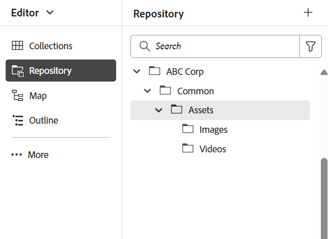
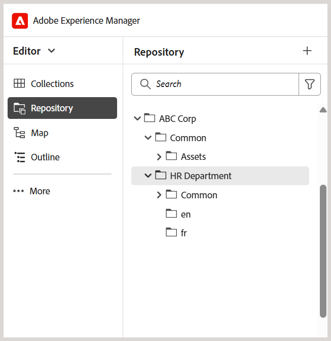
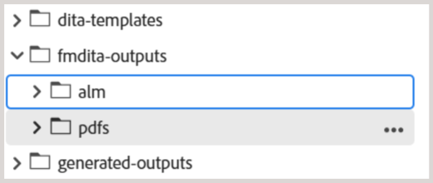

# 設定資料夾結構的最佳實務

本文提供管理員在Adobe Experience Manager Guides中設定檔案夾結構的基本步驟和最佳實務。 井然有序的資料夾階層可確保學習與培訓內容的撰寫、發佈和翻譯工作流程順暢無礙。

## 設定檔案夾結構

若要允許存取Experience Manager Guides的各種編寫、發佈和翻譯功能，請務必在正確的階層中設定資料夾，如下所述。

**建立根層級資料夾**

首先，請為您的組織建立根資料夾。 這是所有部門層級資料夾和常用共用資產的基礎。

範例：`/content/dam/ABC-Corp/`

在此根資料夾中，建立專用資料夾以管理跨多個部門使用的資產。 例如，建立&#x200B;**通用**&#x200B;資料夾以包含共用的資源，例如影像、影片等。

**建立部門層級資料夾**

為每個部門建立個別的資料夾，例如HR、財務、法律，以便他們管理自己的內容。

*Caption：在根資料夾*&#x200B;中為HR部門建立單獨的資料夾結構

**設定部門層級資料夾的最佳實務**

- 在每個部門下建立部門層級通用資產的專用&#x200B;**通用** > **資產**&#x200B;資料夾（如有需要）。
- 如果您想要共用內容以進行翻譯，請建立特定語言的資料夾（例如en、de、fr）。 作者應僅在來源語言資料夾（例如en）中建立或更新內容，因為翻譯工作流程中不包含來源語言資料夾以外的內容。 其他語言資料夾可以保留空白作為預留位置。 深入瞭解[內容翻譯](../user-guide/translation.md)。
- 可以運用許可權來限制特定部門或使用者對新建立檔案夾結構的存取權。 例如，指派許可權以確保只有HR部門使用者可以在指定的檔案夾中建立或修改內容。

對財務、法律等其他部門重複相同的結構。

## 設定輸出資料夾結構

`fm-ditaoutputs`資料夾是從「學習與訓練」內容產生輸出的預設儲存位置。 這些輸出通常包括&#x200B;**alm**&#x200B;資料夾中的SCORM套件（ZIP檔案）和&#x200B;**pdf**&#x200B;資料夾中的PDF。如有需要，您可以從&#x200B;**地圖主控台**&#x200B;在預設層級變更此預設輸出路徑。

使用多個部門時，請考慮在`fm-ditaoutputs`資料夾結構內建立部門特定的資料夾，以確保特定部門內的使用者可以存取相關的輸出資料夾。

## 建立使用者並將其指派給適當的群組

建立資料夾階層後，您就可以開始建立使用者，並將他們新增至群組，讓他們能存取Experience Manager Guides中的相關功能。 Experience Manager Guides提供三個現成可用的群組：作者、檢閱者和發佈者。 根據使用者相關聯的群組，允許他們執行特定工作。 例如，發佈工作只能由發佈者執行，不能由作者執行。

若要建立新使用者並將其新增至群組，請瀏覽至&#x200B;**工具** > **安全性** > **使用者**。

在[使用者管理]頁面上，選取[建立] ****&#x200B;以建立新使用者。 新增使用者詳細資料並將它們指派給群組。

如需詳細資訊，請檢視[使用者管理與安全性](../cs-install-guide/user-admin-sec.md)

## 為每個使用者群組指派許可權

將使用者新增至適當的群組後，請在群組層級設定許可權，以確保他們有權存取存放庫中的正確製作和輸出資料夾。

若要指派許可權，請瀏覽至&#x200B;**工具** > **安全性** > **許可權**。

這些許可權可確保使用者只能在其指定的資料夾中建立或修改內容。

如需更多詳細資料，請在AEM[中檢視](https://experienceleague.adobe.com/en/docs/experience-manager-65/content/security/security#permissions-in-aem)許可權。

