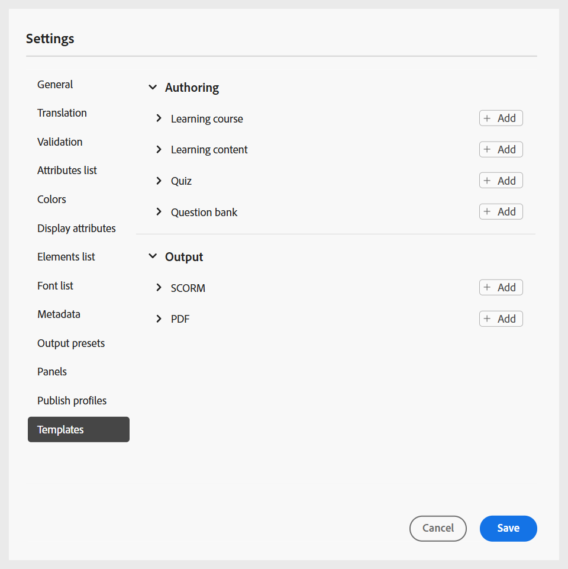
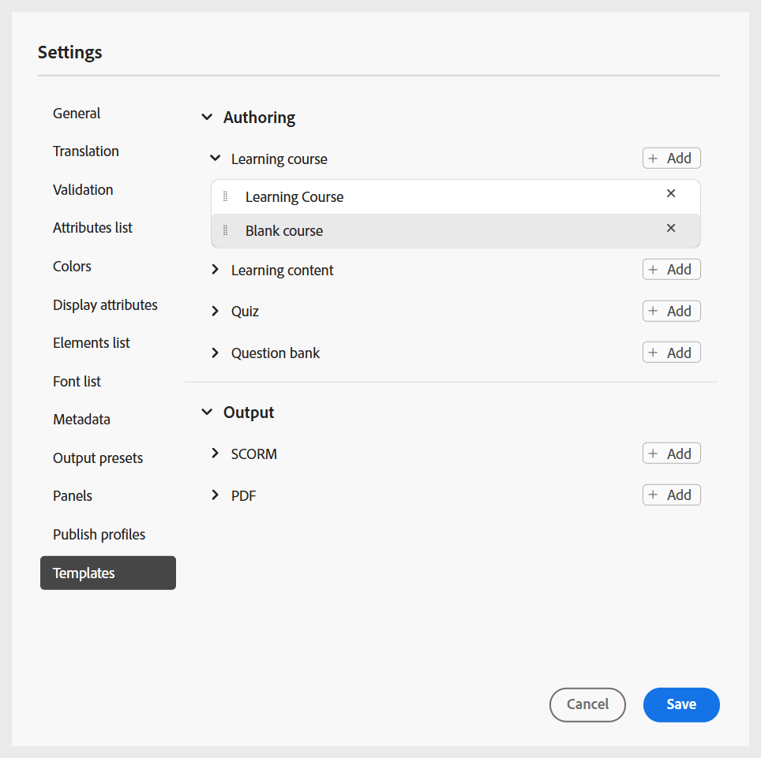
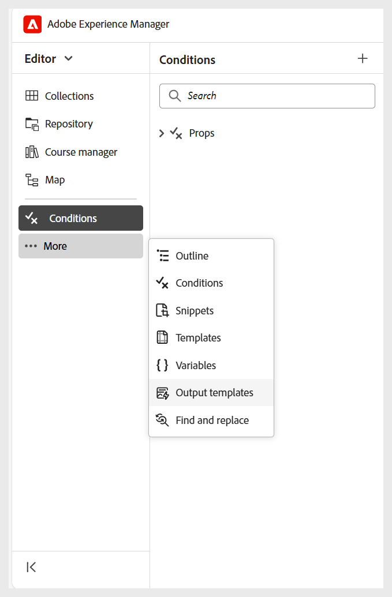
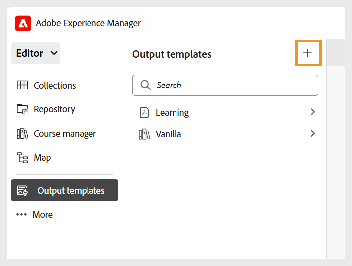
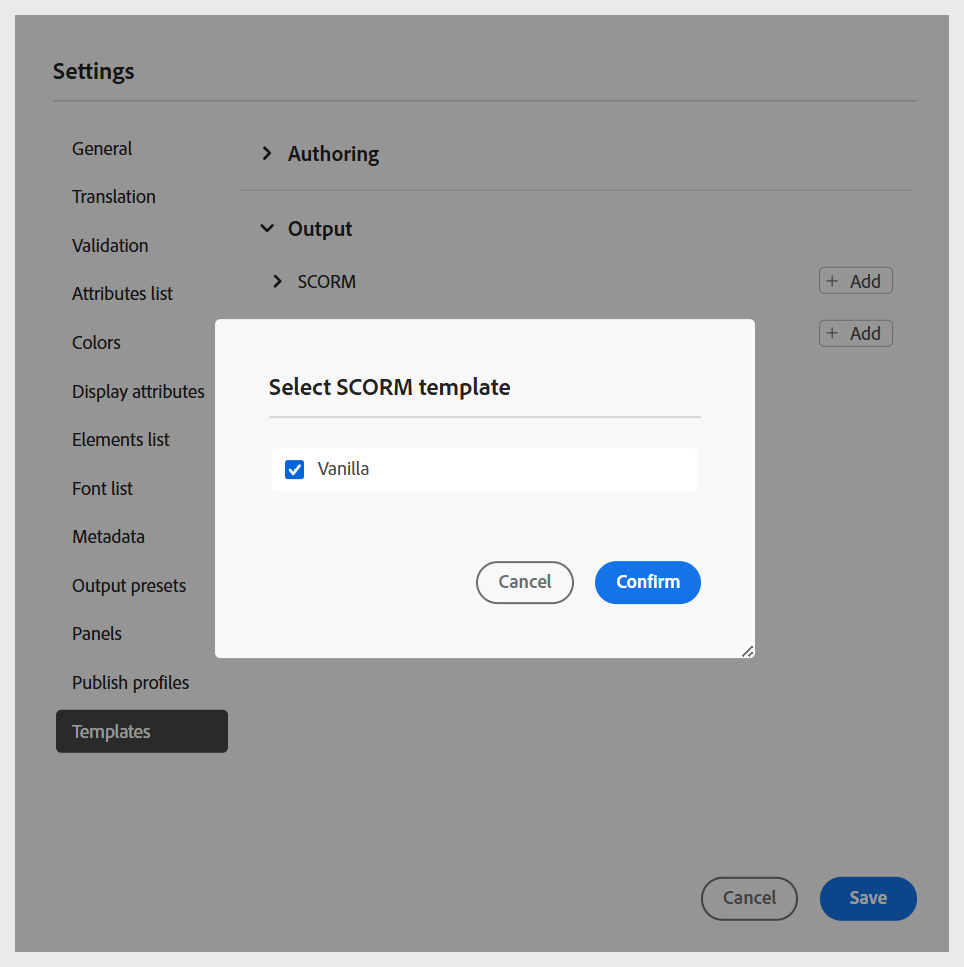
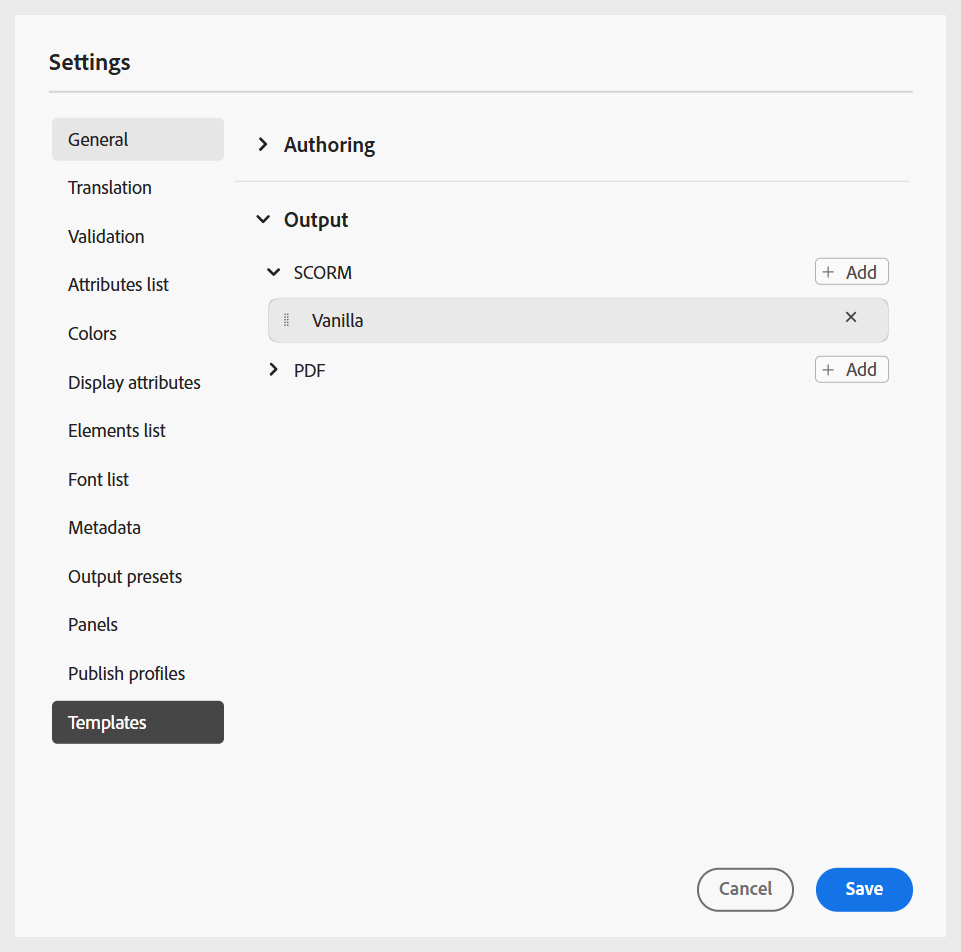
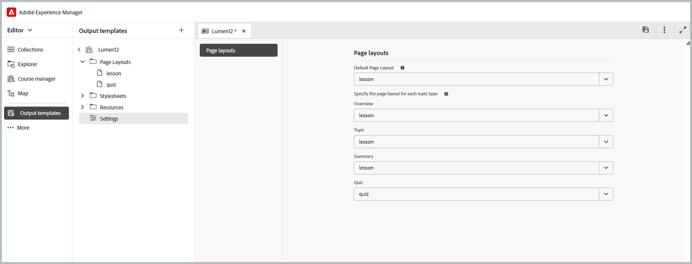

# 設定資料夾設定檔

需要資料夾設定檔來分隔企業中不同部門或產品的組態。 針對學習和訓練內容，您可以建立並設定檔案夾層級的設定檔，以管理撰寫範本、輸出範本、輸出預設集和其他檔案夾層級的設定。

瞭解[設定資料夾結構的最佳實務](best-practices-folder-structure.md)。

若要開始使用學習和訓練內容的資料夾設定檔設定，您需要：

1. **建立不同的資料夾以管理撰寫與輸出範本**：您可以為企業中不同部門或產品中工作的作者與發行者建立資料夾。 這些資料夾可以對應至特定的資料夾設定檔，每個設定檔都設定有不同的編寫和輸出範本，以支援部門特定的學習課程建立和分散式管理。

   您可以從「存放庫」面板中建立新資料夾。

   {width="350"}
2. **建立語言資料夾以管理翻譯**：如果您將內容翻譯成不同的語言，則必須建立與每種語言對應的資料夾。 每個語言資料夾都會包含對應於該語言的內容。

3. **建立資料夾以管理Assets**：與資料夾類似，您也可以建立不同的Assets資料夾以符合不同部門的需求。 如此一來，您也能確保作者和發佈者有權存取範本、影像和其他資產中設定的正確CSS。

   {width="350"}
4. [建立資料夾設定檔](../cs-install-guide/conf-folder-level.md#create-and-configure-a-folder-level-profile)以對應不同的資料夾。
5. **選取要設定的資料夾設定檔**：建立資料夾設定檔後，您必須在[使用者偏好設定](../user-guide/intro-home-page.md#user-preferences)頁面上選取資料夾設定檔，以確保作者和發佈者可以存取正確的範本。

   {width="650"}

6. **設定資料夾設定檔設定**：對於學習與訓練內容，可以在資料夾層級設定下列設定：
   - [一般](#general)
   - [面板](#configure-panels)
   - [內容範本](#configure-content-templates)
   - [輸出預設集](#configure-output-presets)
   - [HTML編輯器](#html-editor-settings)
   - [發佈設定檔](#manage-publish-profiles)

若要存取這些設定，請切換到編輯器檢視，然後從&#x200B;**選項**&#x200B;功能表選取&#x200B;**Workspace設定**，如下所示：

## 一般

在一般索引標籤中，您可以設定以下產品培訓和學習內容功能的特定設定：

{width="350"}

- **學習內容**：使用&#x200B;**啟用學習內容**&#x200B;切換功能，在資料夾設定檔層級啟用或停用此功能。
- **HTML編輯器**：此設定可讓您設定HTML式編寫的編輯器。 此設定中的主要組態選項如下：

   - **隱藏內嵌樣式**：啟用此選項可防止作者將內嵌格式套用至課程內容。 啟用時，編輯器的右側面板中出現的所有內嵌樣式選項（例如「字型」、「邊框」、「版面」、「背景」和「欄」）對「作者」而言仍為隱藏狀態。 不過，作者仍可使用&#x200B;**樣式**&#x200B;面板中可用的全域類別型樣式選項。 這有助於維持與貴組織風格指引的一致性。
   - **隱藏作者的Source檢視**：啟用此選項以限制對HTML原始碼的存取。 如果您想要簡化編輯體驗，或避免基礎程式碼意外變更，這個功能會很好用。

## 設定面板

此設定會控制顯示在Experience Manager Guides中&#x200B;**編輯器**&#x200B;和&#x200B;**地圖主控台**&#x200B;的左右面板中的面板。 您可以切換按鈕，以顯示或隱藏所需的面板。

如需學習和訓練內容，請確定編輯器和地圖主控台僅啟用下列功能。

{width="350"}

### 編輯器

**左側面板**

- **集合**：可讓您整理並儲存常用的檔案，或快速存取共用的檔案。
- **總管**：可讓您檢視並存取所有地圖、主題、影像以及儲存在內容存放庫中的其他資產。
- **課程經理**：提供建立和管理課程的專屬工作區。
- **對應**：提供目前開啟的對映檔案的對應檢視。
- **大綱**：顯示目前開啟之主題或地圖的結構階層，允許快速導覽和元素層級存取。
- **Workfront**：除了Experience Manager Guides核心CCMS功能之外，還提供對強大專案管理功能的存取。
- **可重複使用的內容**：可讓您管理並插入可重複使用的元素或主題，以確保內容的一致性並減少重複專案。
- **字彙表**：可讓您建立和管理字彙表術語，並將它們納入主題中，以維持術語的一致性。
- **片段**：可讓您在學習課程的各種主題中建立和重複使用小型內容片段。
- **條件**：可讓您設定全域和資料夾層級的條件屬性。
- **範本**：可讓您建立和管理課程範本。
- **引文**：可讓您使用支援的引文樣式，新增和管理引文至內容。
- **語言變數**：可讓您定義已發佈輸出的語言變數。
- **變數**：可讓您建立和管理要在學習內容中使用的變數。
- **輸出範本**：可讓您建立和管理輸出範本，以產生多種格式的輸出。
- **尋找和取代**：提供在地圖或存放庫內的資料夾中搜尋和取代檔案間文字的選項。 
- **資料來源**：可讓您連線外部資料來源，並在內容中重複使用資料。
- **檢閱**：可讓您在Experience Manager Guides中建立和管理檢閱工作流程。
- **系統報告**：可讓您建立和管理報告。

**右側面板**

- **內容屬性**：包含編輯器中目前選取之元素的型別和屬性相關資訊。
- **檔案屬性**：可讓您檢視和管理所選檔案的屬性。
- **樣式**：顯示全域類別樣式選項以用於您的學習內容。
- **篩選器**：可讓您根據主題預覽模式中套用的條件來篩選內容。

### 地圖主控台

**左側面板**

- **預設集**：可讓您設定用於發佈學習課程的輸出預設集。
- **翻譯**：提供將內容翻譯成多種語言的選項。
- **報告**：可讓您產生並管理報告，讓有用的insight瞭解課程內容的整體健康狀況。
- **條件預設集**：提供為不同的對象、部門等設定條件式輸出預設集的選項。

**右側面板**

- **篩選器**：可讓您在處理報告和翻譯時使用篩選器。

## 設定內容範本

>[!NOTE]
>
> 此設定只有在&#x200B;**Workspace設定** > **一般**&#x200B;中啟用學習內容功能時才能使用。

此設定可讓您管理編輯器](../user-guide/web-editor-left-panel.md)中[左側面板的製作和發佈範本。 您可以新增、移除或重新排序製作和輸出範本，然後作者和發佈者即可存取這些範本。

{width="350"}

「撰寫」範本分為四個類別：學習課程、學習內容、測驗和問題庫。 如果您的執行個體中設定了任何預先定義的範本，預設會顯示這些範本。

{width="350"}

### 新增範本

執行以下步驟來新增範本：

1. 瀏覽至您要新增範本的範本類別，並選取&#x200B;**新增**。
2. 在選取路徑對話方塊中，選取所需的範本。
3. 選擇&#x200B;**選取**。

   {width="350"}

範本會新增至「設定」面板的個別類別中。

同樣地，您可以新增其他製作和輸出範本。 新增後，作者和發佈者可在各自的課程對話方塊中取得這些範本。 例如，管理員新增的學習課程範本可供作者建立新課程時使用。

{width="350"}

### 使用新的撰寫和輸出範本

若要使用與&#x200B;**選取路徑**&#x200B;對話方塊中顯示的範本不同的範本，請建立自訂編寫或輸出範本。

**建立新的編寫範本**

若要使用不同的地圖或主題範本，請從編輯器的「範本」面板中建立新的編寫範本。 使用對應範本建立學習課程和學習內容、測驗或學習摘要的主題範本。

如需詳細資訊，請檢視[從編輯器建立自訂範本](../user-guide/create-maps-customized-templates.md)。

{width="350"}

**建立新的輸出範本**

執行以下步驟，為學習與訓練內容建立新的輸出範本：

1. 從編輯器的左側面板中，選取&#x200B;**更多** > **輸出範本**。

   隨即顯示「輸出範本」面板。

   {width="350" height=""}
2. 在「輸出範本」面板中，選取(+)以建立新的輸出範本。

   {width="350"}
3. 從下拉式選單中選取輸出範本。

   {width="650"}
4. 根據所選的「輸出」範本型別，會顯示一個對話方塊，您可以在其中根據可用的範本建立新範本。

   {width="350"}

5. 選取「**建立**」。

   已建立新的輸出範本。

6. 若要存取並新增發佈者的輸出範本，請瀏覽至&#x200B;**設定** > **範本** > **輸出範本**，然後選取&#x200B;**新增**。

   {width="350"}

   輸出範本會顯示在「選取路徑」對話方塊中。
7. 選取範本並選擇&#x200B;**確認**。

   {width="350"}

   選取的輸出範本現在會新增至「設定」面板。

   {width="350"}

### 設定SCORM輸出範本的頁面配置

SCORM輸出範本可讓您將不同的版面配置指派給課程中的不同主題型別。 這可讓您自訂在產生的SCORM套件中課程、測驗、概觀頁面和其他內容型別的呈現方式。

例如，課程頁面可使用包含頁首、內容區域和頁尾的版面，而測驗頁面可使用不含頁尾的簡化版面。 您也可以為概觀頁面或任何其他主題型別建立專用版面，並相應地加以對應。

配置指派是在&#x200B;**輸出範本**層級設定。任何使用已設定輸出範本的SCORM預設集，將在產生課程時套用選取的版面配置對應。
請依照下列步驟，設定範本的頁面配置：

1. 瀏覽至&#x200B;**輸出範本**&#x200B;並開啟必要的&#x200B;**SCORM輸出範本**。

2. 選取&#x200B;**設定**&#x200B;標籤。

3. 在&#x200B;**頁面配置**&#x200B;視窗中，找出可用的主題型別。

   {width="650"}

4. 針對每個主題型別，選取課程產生期間要使用的版面配置。

   **範例：**
   - **預設頁面配置**：課程
   - **測試**：測試
   - **概述**：課程

5. 若要使用新版面，請使用&#x200B;**輸出範本**&#x200B;面板的內容功能表中的&#x200B;**新版面**&#x200B;選項，在輸出範本中建立所需的版面。

   {width="650"}

6. 返回&#x200B;**設定**&#x200B;標籤，並將新建立的版面配置指派給適當的主題型別。

7. 使用索引標籤列右角的「儲存」圖示，儲存用於輸出範本的「頁面配置」 。

使用使用已設定輸出範本的SCORM預設集產生課程時，會使用指派給其主題型別的版面配置呈現每個主題。 如此一來，同一課程中不同的內容型別就能自訂頁面結構和視覺化簡報。

### 移除或重新排序範本

新增後，您可以從「設定」面板中移除或重新排序範本。

若要移除範本，請選取範本旁邊的&#x200B;**移除**&#x200B;圖示。

{width="350"}

您也可以定義類別中範本的顯示順序。 若要變更範本的顯示順序，請選取虛線並將範本拖曳到所需位置。

{width="350"}

## 設定輸出預設集

>[!NOTE]
>
> 此設定只有在&#x200B;**Workspace設定** > **一般**&#x200B;中啟用學習內容功能時才能使用。

「輸出預設集」標籤可讓您定義哪些輸出格式可用於發佈課程。 它包含兩個區段： **允許的輸出預設集型別**&#x200B;和&#x200B;**通用輸出預設集**。

{width="350"}

- **允許的輸出預設集型別**：此區段列出Experience Manager Guides執行個體支援的所有輸出預設集。 對於課程發佈，只有&#x200B;**SCORM**&#x200B;和&#x200B;**PDF**&#x200B;格式適用。 您可以選取一個或兩個選項。 產生課程輸出時，發佈者可使用選取的預設集。

  {width="350"}

- **常見輸出預設集**：此區段顯示Publishers經常建立並新增至特定資料夾設定檔的輸出預設集。 您也可以移除任何不再需要的預設集。

  {width="350"}

## 管理發佈設定檔

本節可讓您檢視、建立及管理用於發佈課程至SCORM Cloud或Adobe Learning Manager (ALM)的發佈設定檔。 每個設定檔會定義將學習課程發佈至選定發佈伺服器所需的連線設定和設定詳細資料。

您可以建立多個設定檔以將內容發佈至不同的SCORM Cloud帳戶或ALM執行個體，讓您靈活控制發佈工作流程。

若要設定發佈設定檔，請選取所需的發佈伺服器（SCORM Cloud或Adobe Learning Manager），並提供必要的連線詳細資料。 針對SCORM Cloud，請輸入伺服器資訊以及相關SCORM Cloud應用程式的使用者端ID和使用者端密碼。 針對Adobe Learning Manager，提供您ALM環境所需的對應伺服器和驗證詳細資訊。

{width="350"}
