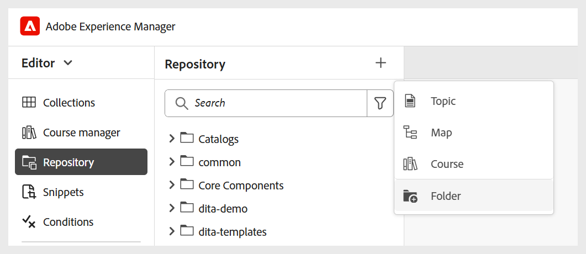
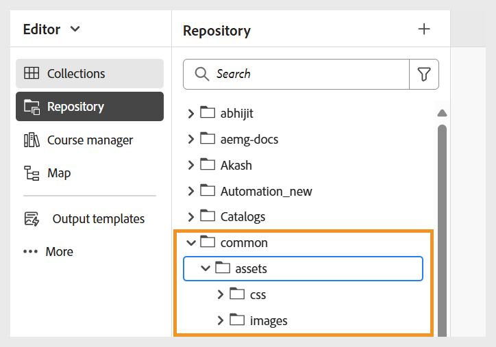
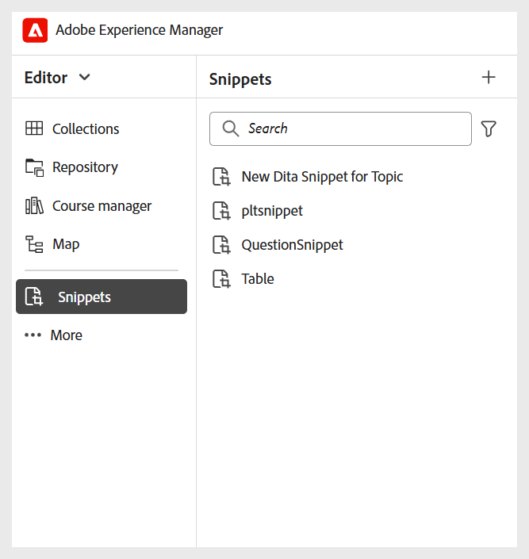
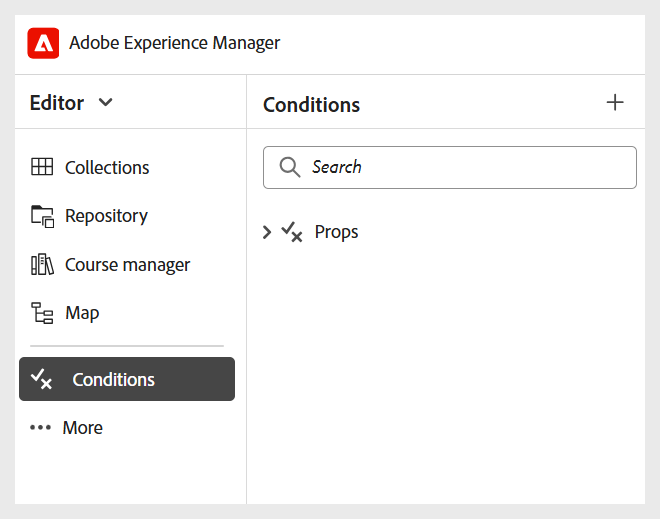

# 設定其他設定

身為管理員，您也可以為學習課程作者與發佈者設定下列設定：

- **資料夾設定**
   - **建立不同的資料夾**：您可以為企業中不同部門或產品中工作的作者與發行者建立資料夾。 這些資料夾可以對應至特定的資料夾設定檔，每個設定檔都設定有不同的編寫和輸出範本，以支援部門特定的學習課程建立和分散式管理。

     您可以從「存放庫」面板中建立新資料夾。

     {width="350" align="left"}
   - **建立語言資料夾**：如果您將內容翻譯成不同的語言，則必須建立與每種語言對應的資料夾。 每個語言資料夾都會包含對應於該語言的內容。

     如需詳細資訊，請檢視[內容翻譯的最佳實務](../user-guide/translation-first-time.md)。
   - **Assets管理**：與資料夾類似，您也可以建立不同的Assets資料夾，以符合不同部門的需求。 如此一來，您也能確保作者和發佈者有權存取範本、影像和其他資產中設定的正確CSS。

     {width="350" align="left"}
- **程式碼片段**：您可以在資料夾層級設定程式碼片段，以確保作者能夠存取正確的程式碼片段。 只有管理員可以在Experience Manager Guides中建立程式碼片段，然後作者可在編輯器中使用這些程式碼片段。

  您可以從編輯器的左側面板存取程式碼片段。

  {width="350" align="left"}
- **條件**：身為管理員，您可以在全域或資料夾層級設定標準DITA支援的條件屬性。 然後，作者只需將所需條件拖放至其內容上，即可使用已設定的條件。

  您可以從編輯器的左側面板存取條件。

  {width="350" align="left"}
- **變數**：您可以定義變數，讓您的內容更容易攜帶、一致且更容易更新。 在產生輸出期間，變數會取代為所選變數集的值，讓您有效率地產生自訂輸出。

  如需詳細資訊，請檢視[建立新變數](../native-pdf/native-pdf-variables.md#create-a-new-variable)

- **編輯器工具列**：您可以根據組織需求自訂編輯器工具列。 例如，您可能偏好變更工具列按鈕的名稱、變更其位置等等。

  如需詳細資訊，請檢視[設定和自訂XML編輯器](../cs-install-guide/conf-folder-level.md#configure-and-customize-the-xml-editor-id2065g300o5z)。
