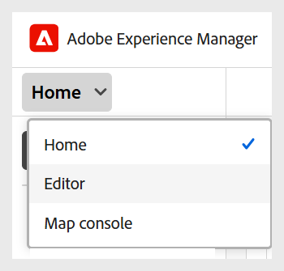
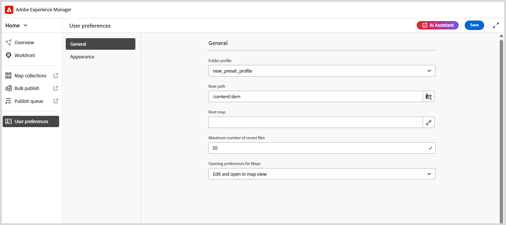

# 探索介面和先決條件

本文說明如何存取使用者介面，並為學習課程設定正確的資料夾設定檔和基本路徑。

## 存取並導覽介面

執行以下步驟來存取使用者介面：

1. 登入您的AEM執行個體。
2. 在AEM導覽頁面上，選取&#x200B;**指南**。
3. 您現在位於&#x200B;**Experience Manager Guides首頁**。 使用導覽切換器切換至下列檢視：

   - **首頁**：您登入Experience Manager Guides時檢視的預設頁面。 它可讓您設定各種資料夾層級設定。
   - **編輯器**：簡單易用的編輯器，可讓您在Experience Manager Guides中編寫課程內容。
   - **地圖主控台**：為您提供專屬的工作區，以處理課程發佈的各個層面。

   如需詳細資料，請檢視[Adobe Experience Manager Guides首頁體驗](../user-guide/intro-home-page.md)。

   {width="300" align="left"}

## 先決條件

若要開始使用使用者介面，您必須先在Experience Manager Guides首頁的「**使用者偏好設定**」設定中，設定正確的&#x200B;**資料夾設定檔**&#x200B;和&#x200B;**基底路徑**。

資料夾設定檔定義製作範本、輸出範本、輸出預設集和其他資料夾層級設定。 Experience Manager Guides支援多個資料夾設定檔，可讓管理員分隔企業內不同部門或產品的設定。 使用不正確的資料夾設定檔可能會導致缺少範本或功能受限。 如果您不確定要使用哪個資料夾設定檔，請先聯絡您的管理員，然後再繼續。

「使用者偏好設定」頁面包含兩個標籤：

- **一般**：可讓您選取資料夾設定檔、基本路徑、根對映等等。
- **外觀**：提供您選取應用程式主題和學習內容來源檢視的選項。

如需詳細資訊，請在Experience Manager Guides中檢視[使用者偏好設定](../user-guide/intro-home-page.md#user-preferences)。

