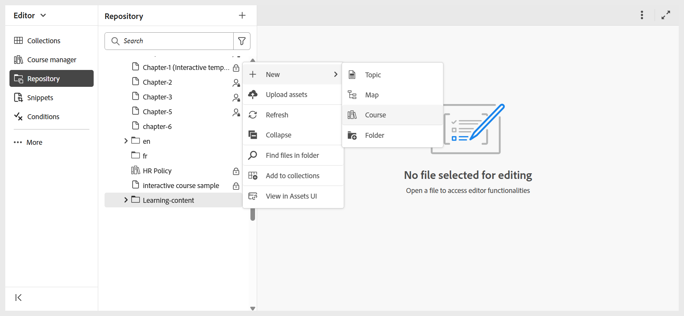

# 存取學習與訓練內容介面

執行以下步驟來存取學習與訓練內容介面：

1. 登入您的AEM執行個體。
2. 在AEM導覽頁面上，選取&#x200B;**指南**。
3. 您現在位於&#x200B;**Experience Manager Guides首頁**。 使用導覽切換器切換到編輯器檢視。

   {width="300" align="left"}

4. 開啟&#x200B;**存放庫**&#x200B;面板，並導覽至您要建立課程的資料夾，然後從&#x200B;**選項**&#x200B;功能表選取&#x200B;**新增>課程**。

   

