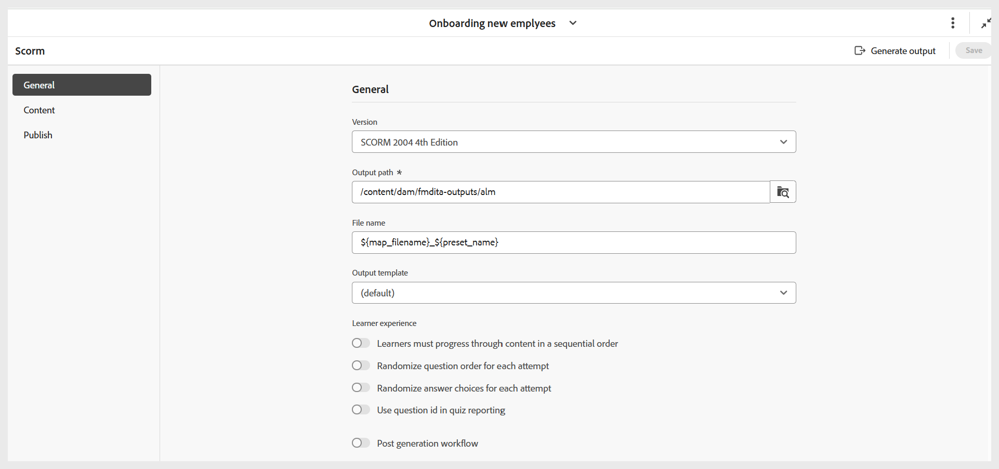
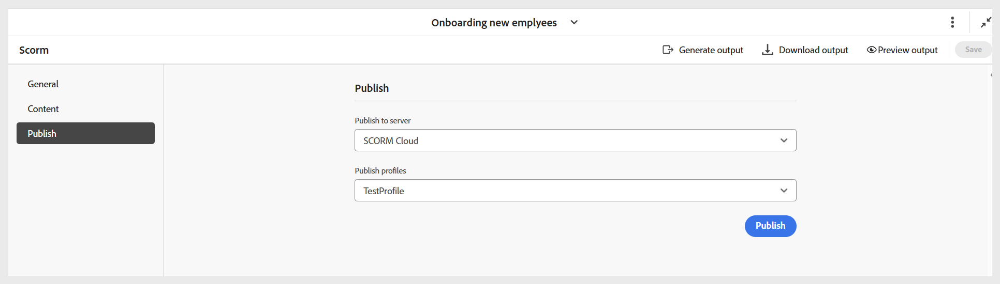

# 設定SCORM輸出預設集

建立預設集後，請配置SCORM預設集設定。 預設集組態選項會整理在「一般」、「內容」和「發佈」標籤下。

- **一般：**&#x200B;用於指定基本輸出設定，例如支援的版本、輸出路徑、ZIP檔案名稱、輸出範本等。

  {width="650" align="left"}

- **內容：**&#x200B;使用指定可用的條件篩選（使用DITAVAL或使用某些條件預設集）和變數集。

  {width="650" align="left"}

- **發佈：**&#x200B;只有當您想要發佈輸出到SCORM雲端以直接存取時，才使用此設定。

  {width="650" align="left"}

設定好所有變更後，請使用SCORM預設集頁面工具列右角的&#x200B;**儲存**，儲存SCORM預設集的變更。

