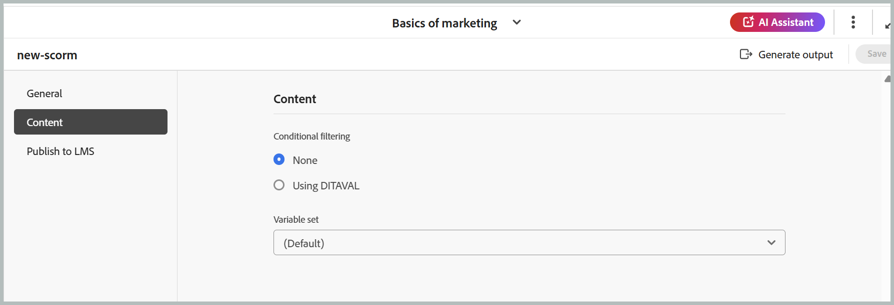
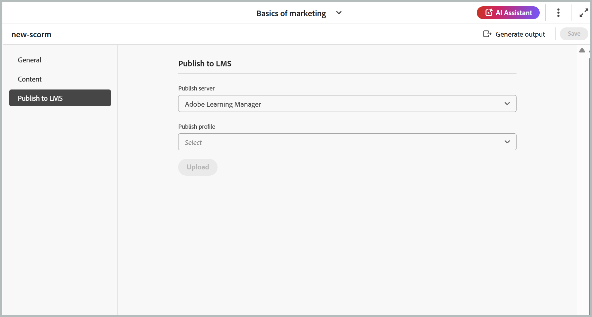

# 設定SCORM輸出預設集

建立預設集後，請配置SCORM預設集設定。 預設集組態選項會整理在「一般」、「內容」和「發佈」標籤下。

- **一般：**&#x200B;用於指定基本輸出設定，例如支援的版本、輸出路徑、ZIP檔案名稱、輸出範本，以及與學習者體驗相關的其他選項。

  {width="650"}

  **學習者的體驗**

   - **學習者必須依循序進行內容**：確保學習者能依固定順序進行測驗，且不能略過或跳到問題之間。
   - **學習者必須嘗試所有問題才能繼續**：要求學習者先嘗試所有問題，才能提交測驗，以防止提交不完整的試卷。
   - **隨機排列每次嘗試的問題順序**：以不同的順序顯示每次嘗試的測驗問題，有助於降低可預測性。
   - **隨機選擇每個嘗試的答案**：隨機選擇每個嘗試的答案選項，減少根據位置猜測的機會。
   - **在測驗報告中使用問題識別碼**：在測驗報告中包含唯一的問題識別碼，以便更輕鬆地追蹤、分析並將結果對應回特定問題。
   - **產生後工作流程**：選擇此選項時，會顯示新的「產生後工作流程」下拉式清單，其中包含所有已設定的工作流程。

- **內容：**&#x200B;使用指定可用的條件篩選（使用DITAVAL或使用某些條件預設集）和變數集。

  {width="650"}

- **發佈至LMS：**&#x200B;使用此設定直接將您的內容發佈至Adobe Learning Manager (ALM)。 從&#x200B;**發佈伺服器**&#x200B;下拉式清單中，選取&#x200B;**Adobe Learning Manager**，然後選擇先前在Workspace設定中設定的必要&#x200B;**發佈設定檔**。 選取的設定檔可用來建立連線，並將產生的內容上傳至ALM。

  >[!NOTE]
  >
  > 將內容發佈至ALM之前，您必須先設定Adobe Learning Manager發佈設定檔。 如需詳細資訊，請檢視[發佈設定檔](../lc-config-guide/lc-folder-profile.md)。

  {width="650"}

設定好所有變更後，請使用SCORM預設集頁面工具列右角的&#x200B;**儲存**，儲存SCORM預設集的變更。
