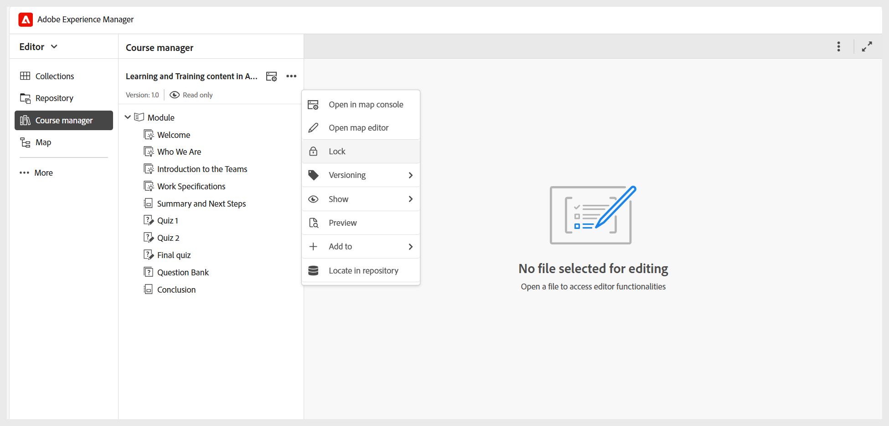

# 瞭解課程經理的基本知識

**課程管理員**&#x200B;是您建立和管理課程的中央工作區。 當您建立新課程時，會自動在「課程管理員」面板中開啟，以便您開始建立課程。

使用「課程管理員」時，請考量下列事項：

- 課程會以唯讀模式開啟，並自動指派1.0版，以表示課程的初始版本。
- 若要編輯課程，您必須從&#x200B;**選項**&#x200B;功能表取得鎖定。 鎖定課程後，您就可以開始新增主題或編輯課程中現有的主題。

  
- 面板中的&#x200B;**對應主控台**&#x200B;圖示會帶您前往對應主控台，顯示管理員設定的輸出預設集。 您也可以從&#x200B;**選項**&#x200B;功能表存取&#x200B;**地圖主控台**。