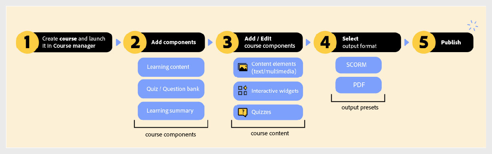

# 課程總覽

課程是學習單元，專為提供產品培訓和客戶教育的互動式培訓體驗而設計。  每個課程都包含學習內容、測驗以進行評估，以及學習摘要以強化關鍵要素。

## 如何運作？

身為作者，您可以使用可用的課程範本建立課程。 然後，您透過新增重要元件來建立課程，例如概述、主題、測驗、摘要或群組。 這些元件集中在一起，並透過直覺式製作介面進行強化，內容更包含文字、多媒體、互動式Widget和評估，以打造吸引人的學習體驗。

課程內容完成後，輸出預設集會設定為發佈課程。

下圖概述課程工作流程總覽。

在我們深入瞭解詳細資訊之前，這裡有一段簡短的逐步解說影片，會展示Experience Manager Guides中產品培訓和學習內容的概觀；涵蓋課程建立、內容新增和以所需格式發佈。

>[!VIDEO](https://video.tv.adobe.com/v/3475302/learning-content-aem-guides)