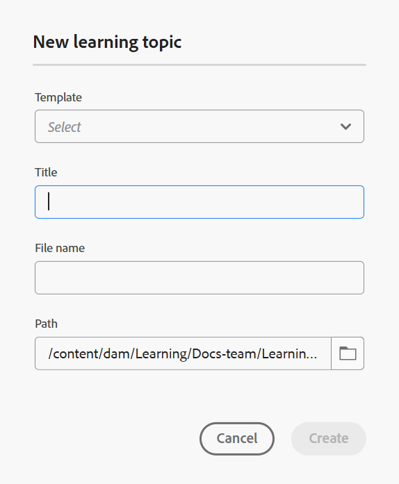

# 建立主題

在我們開始逐步程式之前，以下快速影片概觀可幫助您以視覺效果呈現如何建立學習主題。

>[!VIDEO](https://video.tv.adobe.com/v/3475211/learning-content-aem-guides)

執行以下步驟，將主題新增至課程：

1. 在&#x200B;**課程管理員**&#x200B;中開啟課程，並從&#x200B;**選項**&#x200B;功能表選取&#x200B;**新增**。

   {width="650" align="left"}

1. 選取&#x200B;**主題**。

   顯示&#x200B;**新學習主題**&#x200B;對話方塊。

   {width="350" align="left"}

1. 從下拉式選單中選取您想要的範本。

   {width="350" align="left"}

1. 為主題提供合適的標題。
1. 選取「**建立**」。

隨即會在課程中建立新的學習主題，並顯示在「課程管理員」面板中。

>[!NOTE]
>
> 建立新的學習主題後，系統會自動為其指派1.0版。
