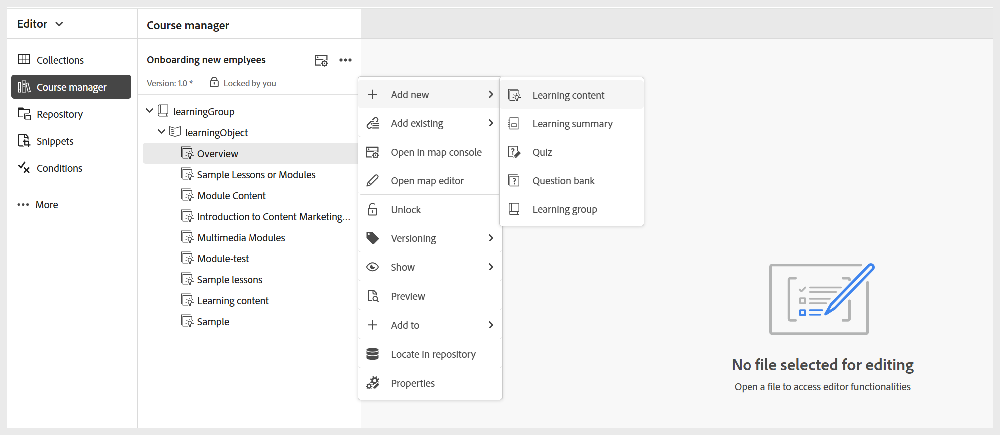
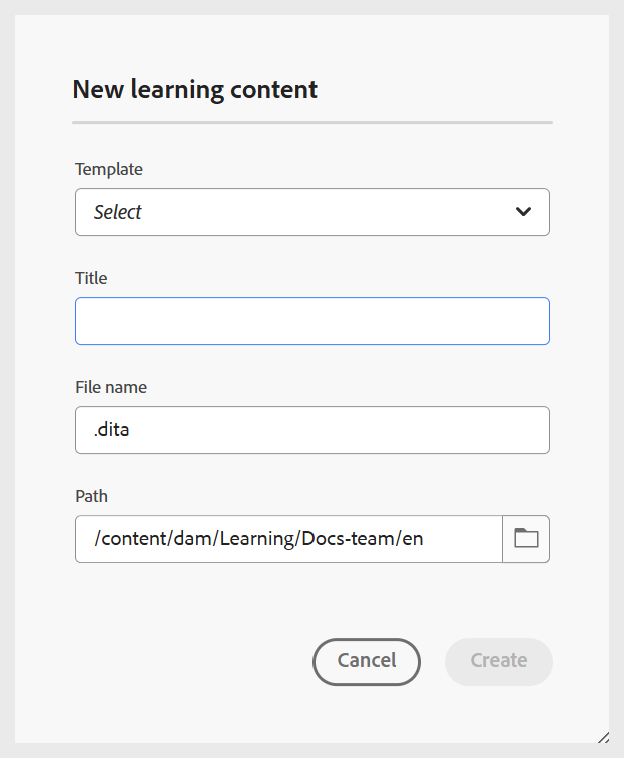
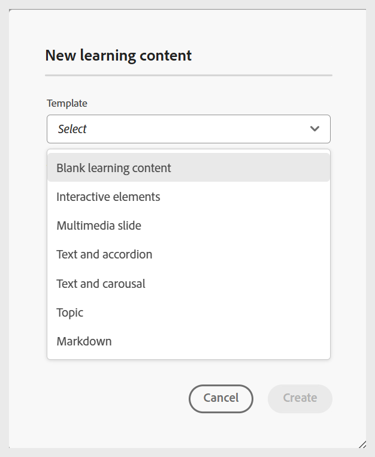

# 建立學習內容

執行以下步驟，將學習內容新增至課程：

1. 在&#x200B;**課程管理員**&#x200B;中開啟課程，並從&#x200B;**選項**&#x200B;功能表選取&#x200B;**新增**。

   {width="650" align="left"}

1. 選取&#x200B;**學習內容**。
新學習內容對話方塊隨即顯示。

   {width="350" align="left"}

1. 從下拉式選單中選取您想要的範本。

   {width="350" align="left"}

1. 為學習內容提供合適的標題。
1. 選取「**建立**」。

學習內容會在課程中建立，並顯示在「課程管理員」面板中。

>[!NOTE]
>
> 建立新學習內容後，系統會自動指派版本1.0。

