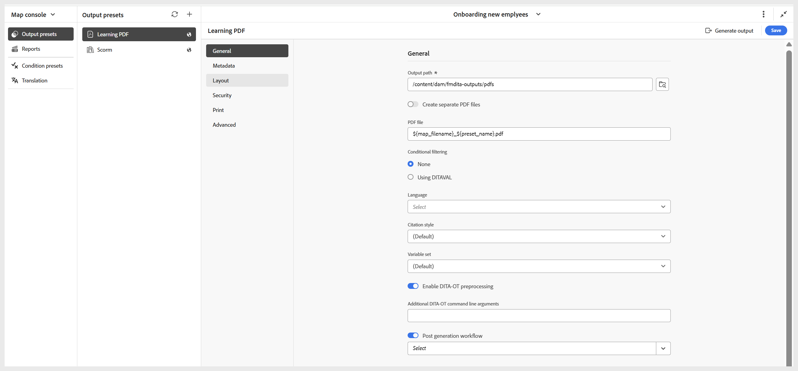

# 建立PDF輸出預設集

執行以下步驟來建立PDF輸出預設集：

1. 在&#x200B;**地圖主控台**&#x200B;中開啟課程。

   {width="350" align="left"}

1. 在&#x200B;**輸出預設集**&#x200B;面板中，選取+圖示以建立輸出預設集。
1. 從[新增輸出預設集]對話方塊的[型別] **&#x200B;**&#x200B;下拉式清單中選取[PDF] **&#x200B;**。
1. 在&#x200B;**名稱**&#x200B;欄位中，提供此預設集的名稱。
1. 在&#x200B;**使用**&#x200B;產生PDF欄位中，選取&#x200B;**原生PDF**。
1. 選取&#x200B;**新增至目前的資料夾設定檔**&#x200B;選項，以在目前的資料夾設定檔中建立輸出預設集。
1. 選取「**新增**」。

PDF預設集頁面隨即開啟，您可在其中進行必要設定。

{width="650" align="left"}
