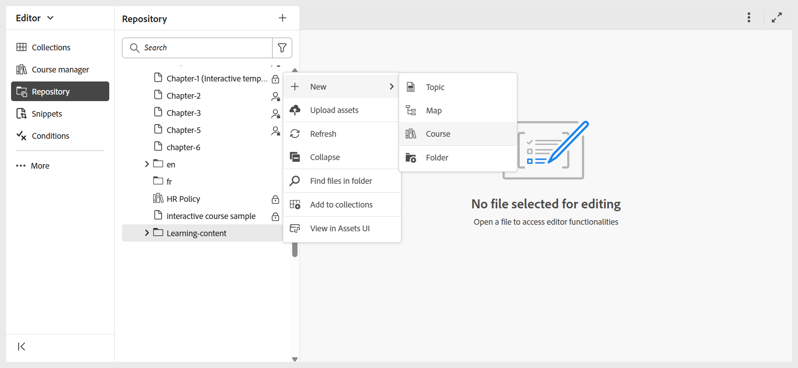

# 建立您的第一個課程

Experience Manager Guides中的課程可依照不同的學習目標而設計。 雖然常規學習課程可能包括主題、測驗和摘要，但您也可以建立主要聚焦於評估的課程。 例如，您可以設定僅含測驗的課程，或附有一個概觀主題的測驗，以快速檢查瞭解。 您也可以建立包含評估前測驗、主要課程內容和最終測驗的結構化路徑。 這些選項可協助您提供目標式學習體驗，同時有效測量學習者進度。

在我們開始逐步程式之前，這裡有一段簡短的逐步解說影片，示範如何建立您的第一個課程及新增元件。

>[!VIDEO](https://video.tv.adobe.com/v/3469537/aem-guides-learning-content?quality=12&learn=on)

執行以下步驟來建立您的第一個課程：

1. 導覽至您要建立課程的資料夾，然後從&#x200B;**選項**&#x200B;功能表選取&#x200B;**新增>課程**。
   

   顯示&#x200B;**新課程對話方塊**。
2. 在&#x200B;**新課程對話方塊**&#x200B;中，提供下列詳細資料：
   - 課程將依據的範本。

     >[!NOTE]
     >
     > 您只會檢視管理員設定的課程範本。

   - 課程的標題。
   - 課程的檔案名稱。 系統會根據課程「標題」自動建議檔案名稱。 如果您的管理員已根據UUID設定啟用自動檔案名稱，則您將不會檢視「檔案名稱」欄位。
   - 您想要儲存課程的路徑。 依預設，存放庫中目前所選資料夾的路徑會顯示在「路徑」欄位中。
3. 選取「**建立**」。
課程會根據選取的範本，在指定的路徑上建立。 此外，課程會在「課程管理員」中開啟以進行編輯。

   
