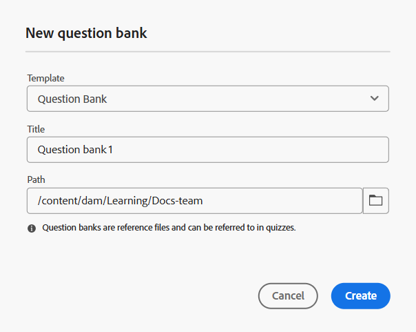

# 建立問題庫

您可以直接從問題庫插入問題，以簡化建立測驗的程式。 此功能可讓您重複使用現有的問題、維持評估的一致性，並節省建立測驗的時間。
為了簡化測驗的建立和重複使用，您可以建立符合您特定要求的自訂問題庫。 請依照下列步驟建立問題庫。

1. 在&#x200B;**課程管理員**&#x200B;中開啟課程，並從&#x200B;**選項功能表**&#x200B;中選取&#x200B;**新增**。
1. 選取&#x200B;**問題庫**。
**新問題庫**&#x200B;對話方塊開啟。 您可以從下拉式清單中選取範本、指定問題庫的適當標題，以及指定要在存放庫中儲存此問題庫的路徑。

   {width="350" align="left"}

1. 選取&#x200B;**建立**。
「問題庫」會新增為課程的一部分，並顯示在「課程管理員」面板中。
1. 您可以用與測驗相同的方式將問題新增到問題庫，同時還可以彈性地配置流程中每個問題的屬性。 如需詳細資訊，請檢視[將問題插入測驗](./quiz-insert-questions.md)。

