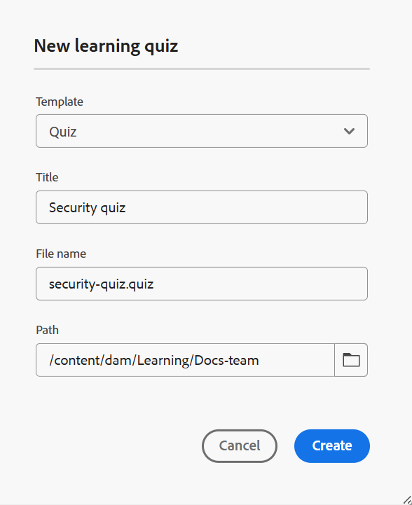

# 建立測驗

執行以下步驟來新增測驗至課程：

1. 在&#x200B;**課程管理員**&#x200B;中開啟課程，並從&#x200B;**選項**&#x200B;功能表選取&#x200B;**新增**。

   {width="650" align="left"}

1. 選取&#x200B;**測驗**。\
   **新學習測驗**&#x200B;對話方塊開啟，以指定測驗的相關詳細資料。 您可以從下拉式選單中選取範本，並為該範本指定適當的標題。

   {width="350" align="left"}

1. 選取「**建立**」。

「測驗」會新增為課程的一部分，並顯示在「課程管理員」面板中。

>[!NOTE]
>
>  建立測驗後，測驗會自動指派為1.0版。
