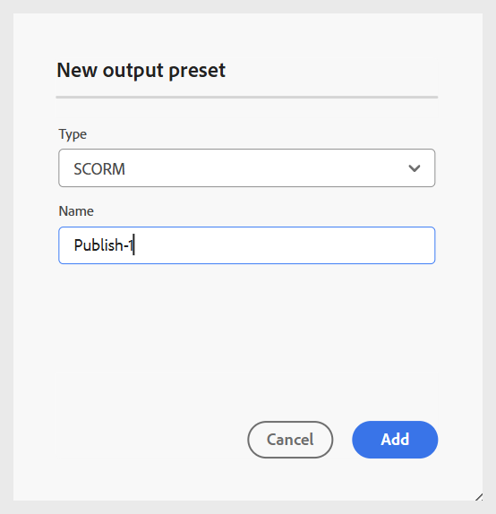

# 建立SCORM輸出預設集

執行以下步驟來建立SCORM輸出預設集：

1. 在&#x200B;**地圖主控台**&#x200B;中開啟課程。

   {width="350"}

1. 在&#x200B;**輸出預設集**&#x200B;面板中，選取+圖示以建立輸出預設集。
1. 從&#x200B;**新增輸出預設集**&#x200B;對話方塊中的&#x200B;**型別**&#x200B;下拉式清單中選取&#x200B;**SCORM**。

   {width="350"}

1. 在&#x200B;**名稱**&#x200B;欄位中，提供此預設集的名稱。
1. 選取&#x200B;**新增至目前的資料夾設定檔**&#x200B;選項，以在目前的資料夾設定檔中建立輸出預設集。
1. 選取「**新增**」。

會建立SCORM預設集。 SCORM預設集頁面隨即開啟，您可以在其中進行必要的設定。

{width="800"}