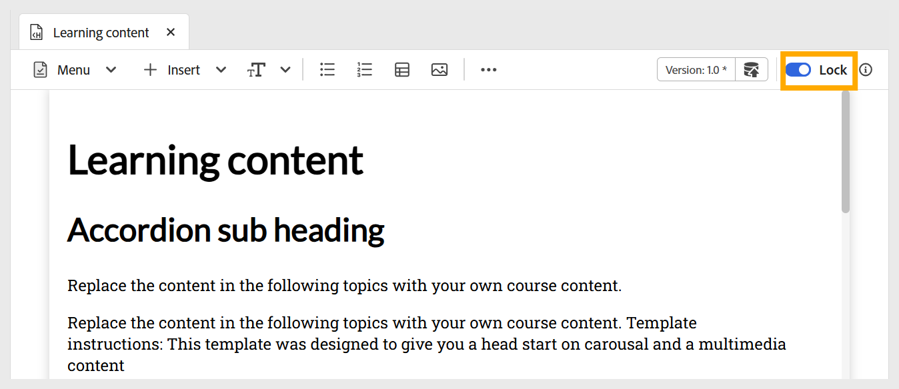
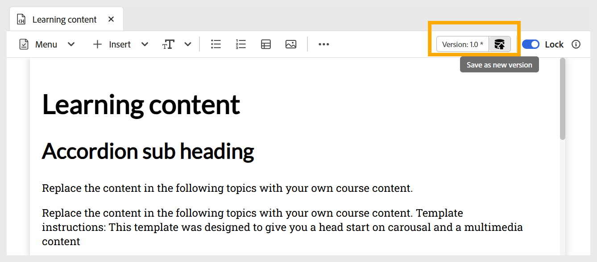

# 編輯學習內容

執行以下步驟來編輯學習內容：

1. 連按兩下「學習內容」，從「課程管理員」面板中將其開啟。
1. 您必須使用切換功能&#x200B;**鎖定**&#x200B;主題，如下所示。 這可讓您編輯內容，其他人無法對此主題進行任何變更。

   {width="650" align="left"}

1. 若要新增內容至主題，您可以[新增基本建置區塊](./lc-basic-blocks.md) （例如文字、多媒體）以及各種互動式[介面工具集](./lc-widgets.md)。
1. 若要儲存您的工作，請使用&#x200B;**另存為新版本**&#x200B;以建立新版本，或按Ctrl+S覆寫現有的檔案。

   {width="650" align="left"}

1. 儲存內容後，您可以&#x200B;**解鎖**&#x200B;其他要編輯的主題。

