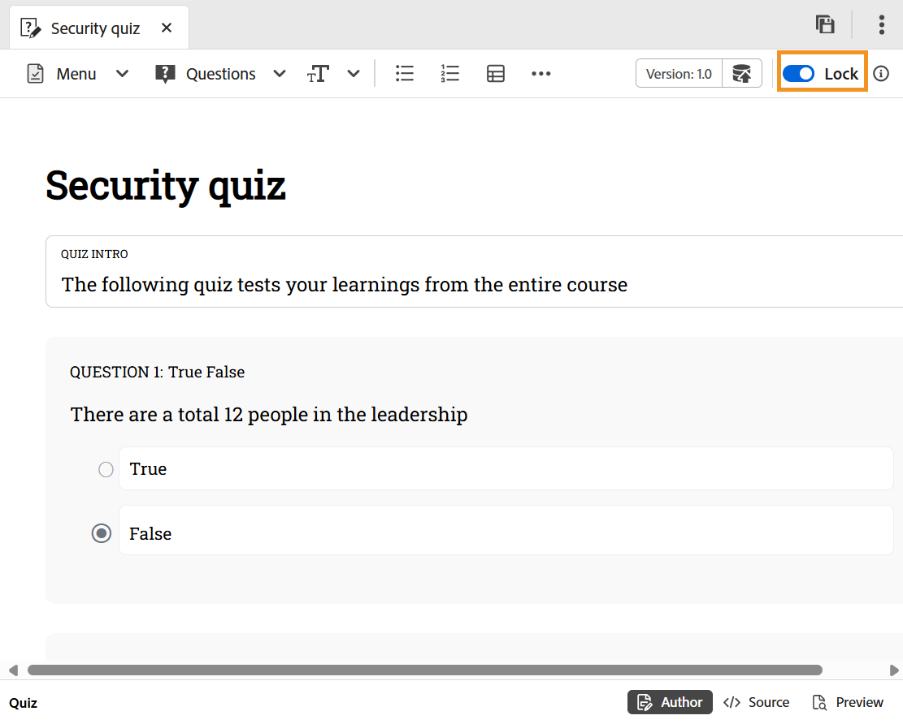

# 編輯測驗

執行以下步驟來編輯測驗：

1. 連按兩下測驗以從「課程管理員」面板開啟它。
1. 您必須使用切換功能&#x200B;**鎖定**&#x200B;測驗。 這可讓您編輯測驗，其他人無法對此測驗進行任何變更。

   {width="650" align="left"}

1. 您可以[新增問題到測驗](./quiz-insert-questions.md)以及[插入問題庫](./insert-questions.md)的問題。
1. 若要儲存您的工作，請使用&#x200B;**另存為新版本**&#x200B;以建立新版本，或按Ctrl+S覆寫現有的檔案。
1. 儲存測驗後，您可以&#x200B;**解鎖**&#x200B;主題以供其他人編輯。

