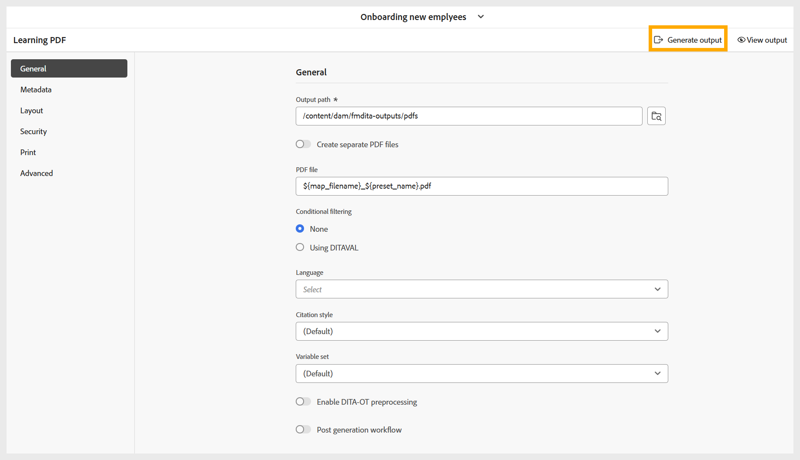
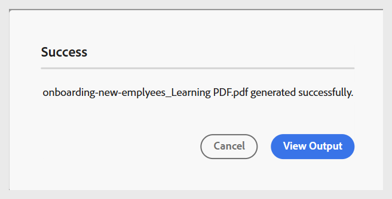
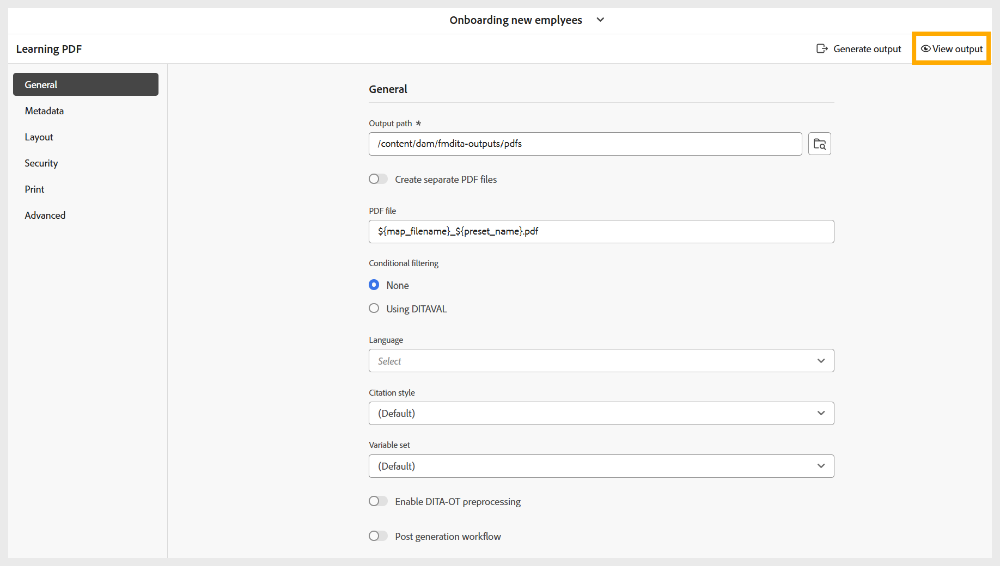

# 產生 PDF

執行以下步驟來產生PDF：

1. 根據您的偏好設定，為PDF輸出設定所有必要的設定後，請導覽至PDF預設集頁面上的工具列。
1. 選取&#x200B;**產生輸出**。

   {width="650" align="left"}

1. 產生程式完成後，系統會顯示成功訊息，確認PDF已建立。

   {width="350" align="left"}

1. 您可以在成功訊息及工具列上選取&#x200B;**檢視輸出**，即可下載PDF。

   {width="650" align="left"}

