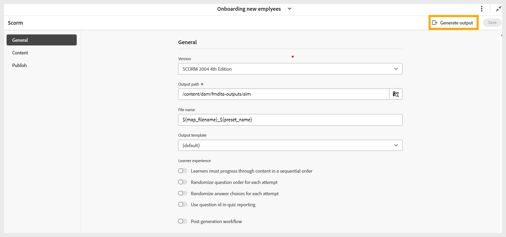
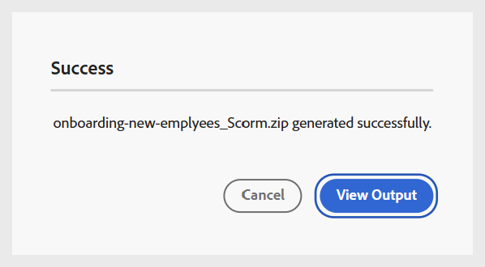
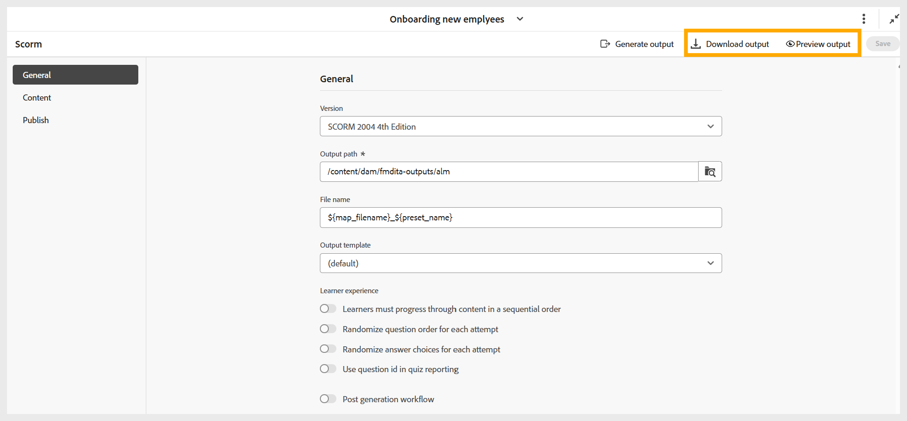

# 產生SCORM輸出

執行以下步驟來產生SCORM輸出：

1. 根據您的偏好設定SCORM輸出的所有必要設定後，請瀏覽至SCORM預設集頁面的工具列。
1. 選取&#x200B;**產生輸出**。

   {width="650" align="left"}

1. 產生完成後，會顯示一則成功訊息，確認已建立&#x200B;**filename.zip**&#x200B;檔案。 您可以使用成功訊息上的&#x200B;**檢視輸出**&#x200B;來預覽輸出。

   {width="350" align="left"}

1. 您可以分別選取&#x200B;**下載輸出**&#x200B;或&#x200B;**預覽輸出**，來下載或預覽輸出。

   {width="650" align="left"}

您可以將ZIP檔案上傳至LMS，讓學習者也能使用該課程。

