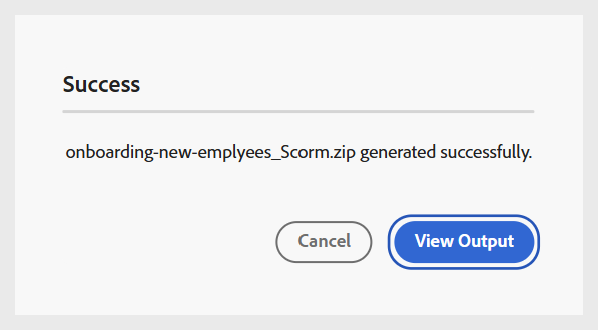

# 產生SCORM輸出

執行以下步驟來產生SCORM輸出：

1. 根據您的偏好設定SCORM輸出的所有必要設定後，請瀏覽至SCORM預設集頁面的工具列。
1. 選取&#x200B;**產生輸出**。

   {width="650"}

1. 產生完成後，會顯示一則成功訊息，確認已建立&#x200B;**filename.zip**&#x200B;檔案。 您可以使用成功訊息上的&#x200B;**檢視輸出**&#x200B;來預覽輸出。

   {width="350"}

1. 您可以分別選取&#x200B;**下載輸出**&#x200B;或&#x200B;**預覽輸出**，來下載或預覽輸出。

   >[!NOTE]
   >
   > 產生SCORM輸出時，可使用SCORM預覽。 如果您的課程依賴外部網域提供字型、樣式表或內嵌內容，請在[設定SCORM預覽](../lc-config-guide/conf-scorm-preview-filters.md)中設定允許的網域。

   {width="650"}

您可以使用SCORM預設集之&#x200B;**發佈至LMS**&#x200B;索引標籤上的&#x200B;**上傳**&#x200B;選項，將ZIP檔案上傳至LMS，讓學習者可以使用課程。

