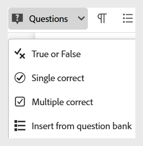
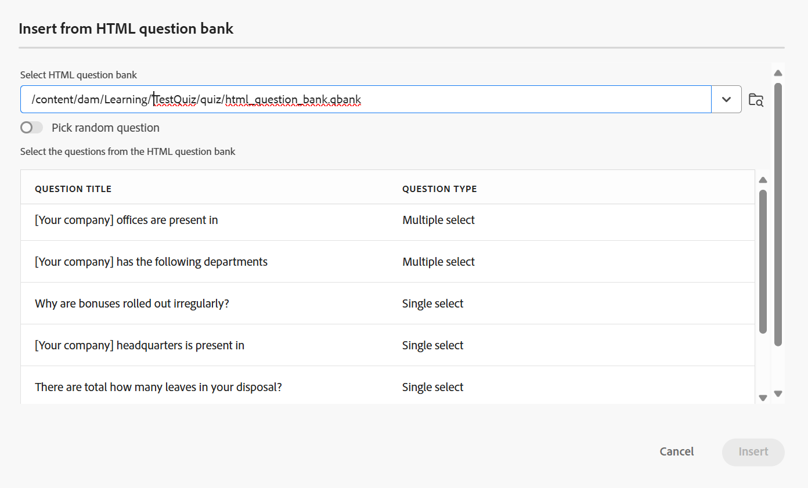
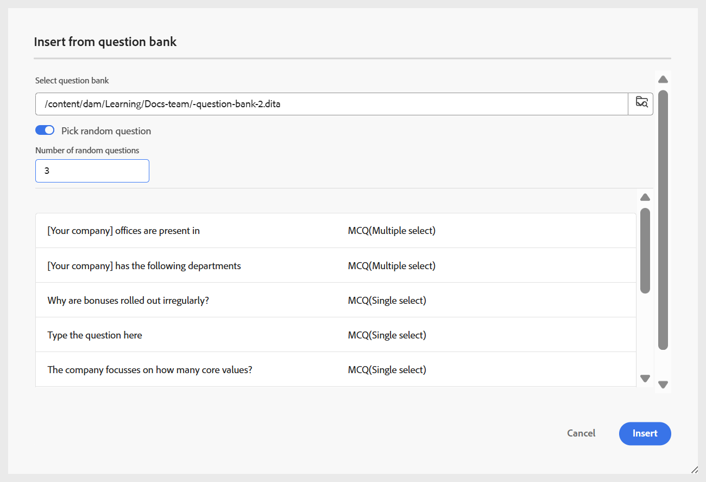
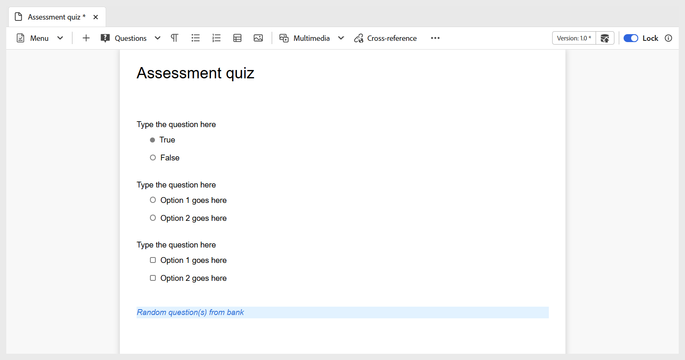

# 插入來自問題庫的問題

執行下列步驟，在測驗中插入題庫中的問題：

1. 從工具列的&#x200B;**問題**&#x200B;下拉式選單中選取&#x200B;**從問題庫插入**&#x200B;選項，如下所示。 **從問題庫**&#x200B;插入對話方塊開啟。

   {width="350" align="left"}

1. 指定儲存於存放庫中的問題庫的路徑，並選取您要插入測驗中的問題，如下所示。 您也可以使用&#x200B;**全選**&#x200B;來選取問題庫的所有問題。

   {width="650" align="left"}

1. 選取的問題會以藍色反白顯示插入測驗中，表示它們不可編輯。 不過，它們通常會顯示在發佈的輸出中。

   {width="650" align="left"}

1. 此外，您也可以使用切換功能來啟用&#x200B;**挑選隨機問題**&#x200B;選項。 啟用後，您可以定義要隨機選取的問題數。 然後，測驗會顯示一個預留位置，指出已插入隨機問題，如第二個熒幕擷圖所示。 發佈期間，系統會自動從問題庫選取並插入指定數量的隨機問題。

   {width="650" align="left"}

   隨機問題會新增到測驗中，如下所示。

   {width="650" align="left"}