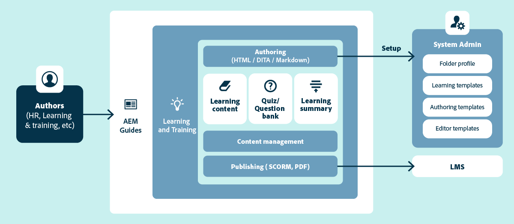

# 學習與訓練內容概觀

學習與訓練內容支援可讓您在企業環境中輕鬆建立和管理互動式電子學習內容。 您可以使用範本建立課程、新增互動式元素（例如摺疊式功能表、輪播、多媒體等）、使用不同問題型別或透過問題庫新增測驗，以及以支援的輸出格式發佈課程。

## 核心功能總覽

主要功能如下：

- 集中式學習內容管理
- 範本驅動撰寫
- 支援結構化撰寫和內容重複使用
- 測驗建立與管理
- 領先業界的翻譯管理
- 使用現成的SCORM和PDF輸出格式的多管道發佈
