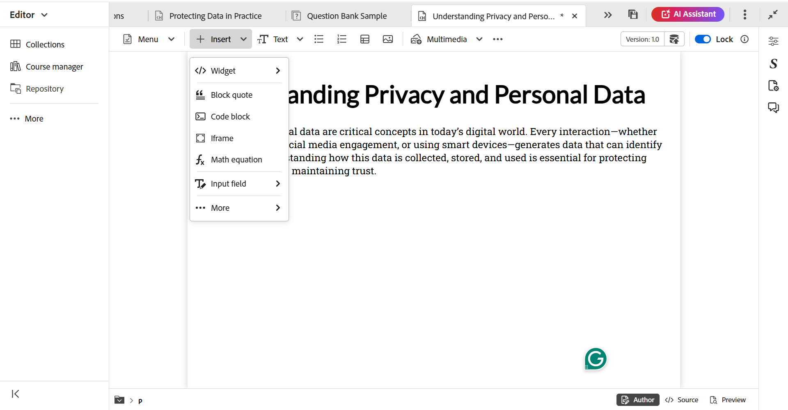
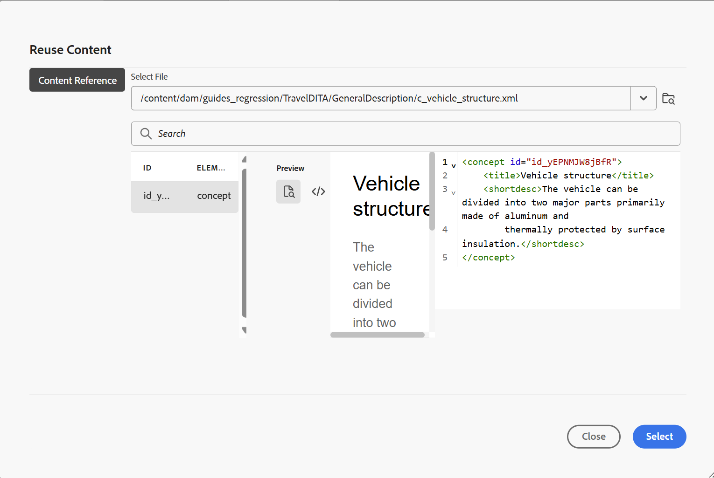
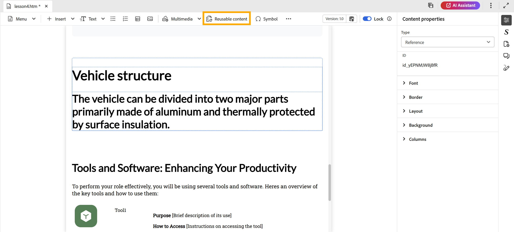

# 將基本建置區塊新增至主題

為了更清楚瞭解如何建立學習主題及新增基本建置區塊，以下影片提供可用功能的簡短概覽。

>[!VIDEO](https://video.tv.adobe.com/v/3469535/learning-content-aem-guides)

您可以使用編輯器工具列上可用的基本編輯功能，如下所述：

- **插入選項**：提供可新增[互動式介面工具集](./lc-widgets.md)的選項，例如Accordion、Carousel、HotSpot、Tab、Flip card和Click以顯示，以及[結構元素](./lc-other-insert-options.md)，例如Iframe、區塊引號、程式碼區塊等。 使用此功能表為您的學習內容新增功能和多樣性，使其吸引人且結構良好。

  {width="650" align="left"}

- **文字元件**：為您的內容新增標題/標題、段落、內嵌引號、上標、下標和引文。

  {width="650" align="left"}

- **未排序清單**：在您的內容中新增未排序清單。

  {width="650" align="left"}

- **排序清單**：在內容中插入編號清單。

  {width="650" align="left"}

- **表格**：將必要維度的表格插入內容中。 您可以使用&#x200B;**內容屬性**&#x200B;面板進一步管理各種資料表屬性，如下所示。

  {width="650" align="left"}

- **影像**：將影像連同替代文字和熒幕提示插入內容中。 可以從存放庫或透過外部URL新增影像。 此外，可以使用&#x200B;**內容屬性**&#x200B;面板修改影像屬性。

  {width="650" align="left"}

- **多媒體**：將視訊和音訊新增至內容。 您可以使用&#x200B;**內容屬性**&#x200B;面板自訂其屬性。

  {width="650" align="left"}

- **可重複使用的內容**：可讓您合併資產或存放庫中的現有內容，以便重複使用。 執行以下步驟來插入可重複使用的內容：

   1. 從工具列選取&#x200B;**可重複使用的內容**。
**重複使用內容**&#x200B;對話方塊開啟。
   2. 瀏覽並選取想要的主題，以將其內容納入目前的課程。
   3. 選取您要新增內容的ID；預覽將會與旁邊顯示以供參考。

      {width="650" align="left"}

   4. 選擇&#x200B;**選取**。

  內容會插入。 例如，有關車輛結構的區段是重複使用並新增至課程主題的內容片段。 型別顯示為&#x200B;**Reference**，其&#x200B;**ID**&#x200B;反映在&#x200B;**內容屬性**&#x200B;面板中。

  {width="650" align="left"}

- **符號**：將您選擇的符號從清單新增至內容，如下所示。

  {width="350" align="left"}

- **超連結**：將超連結新增至內容中的必要位置。 它可以是檔案參考、網頁URL或電子郵件連結，如下所示。

  {width="650" align="left"}

此外，**功能表**&#x200B;下拉式清單提供編輯動作（剪下、複製、刪除）、尋找和取代以及版本標籤的存取權。
