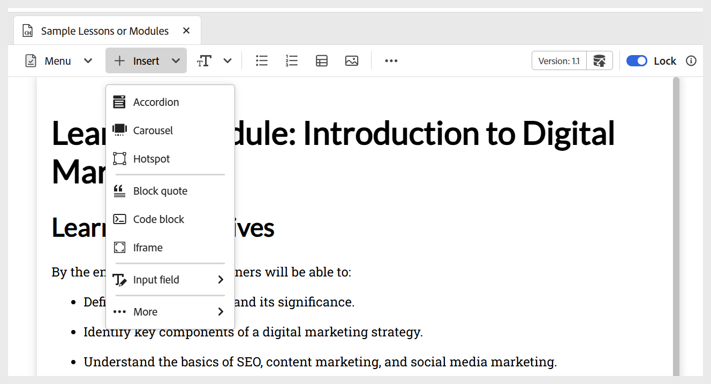
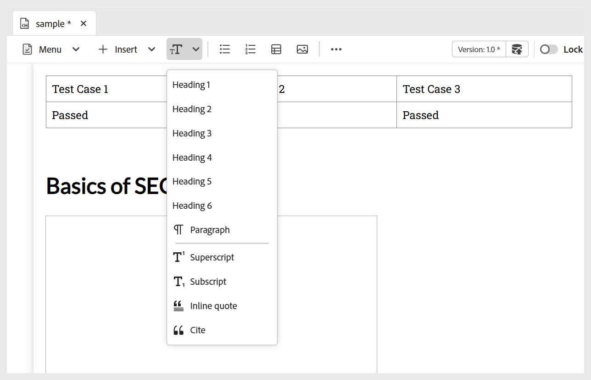
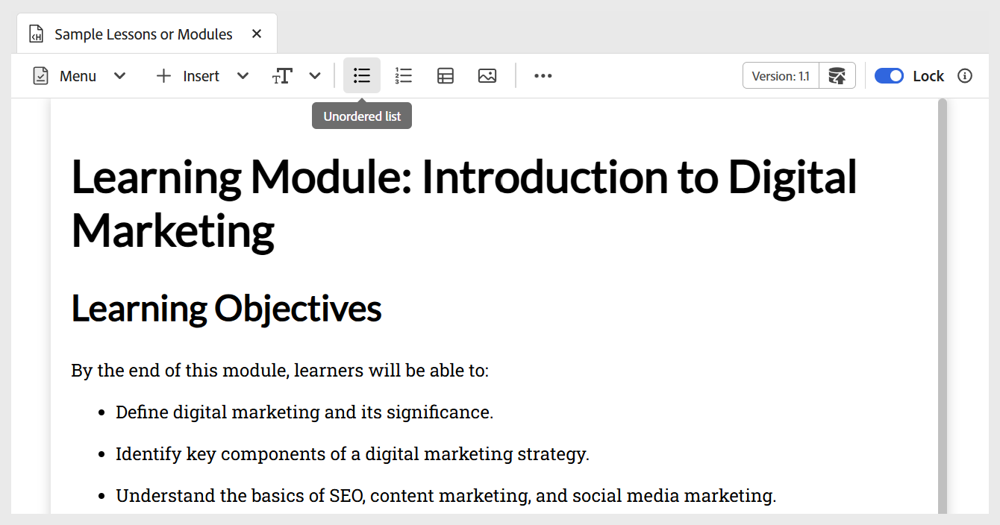
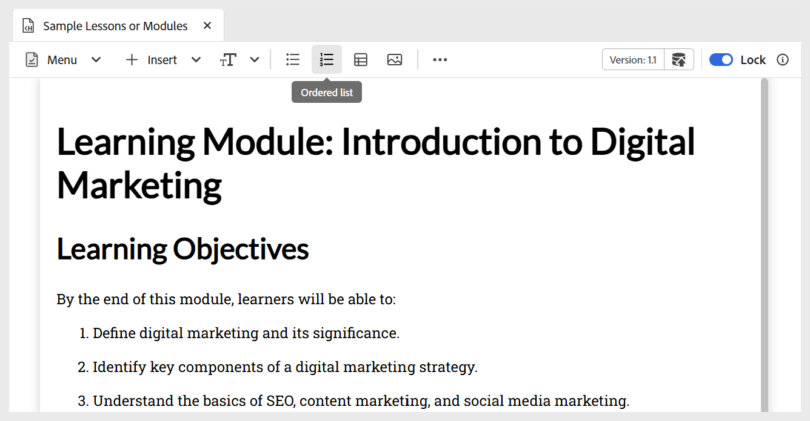
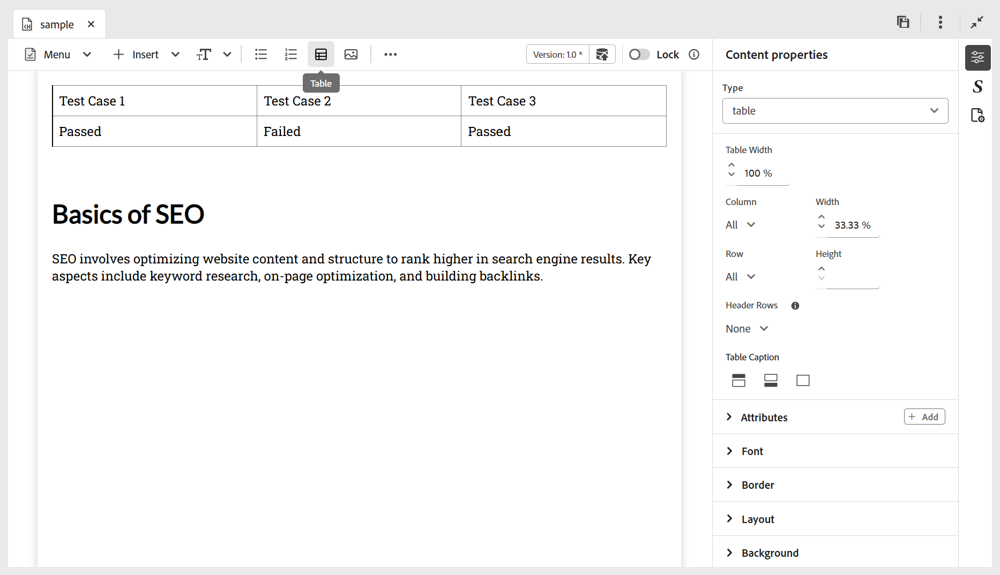
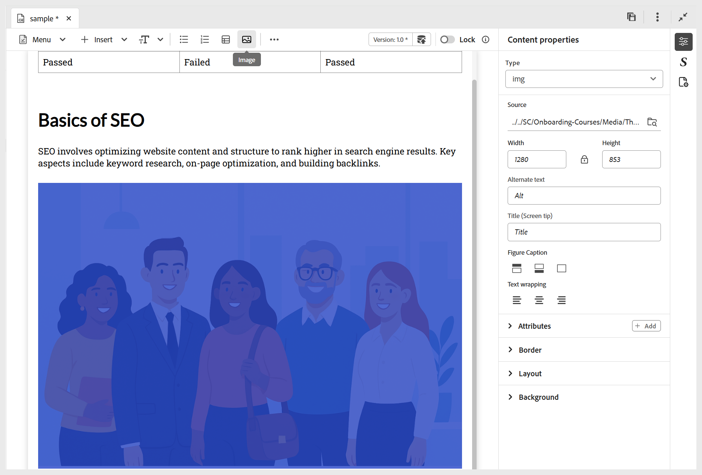
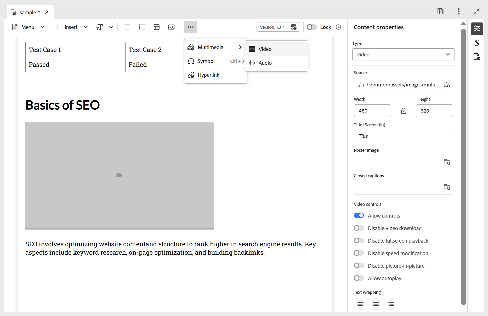
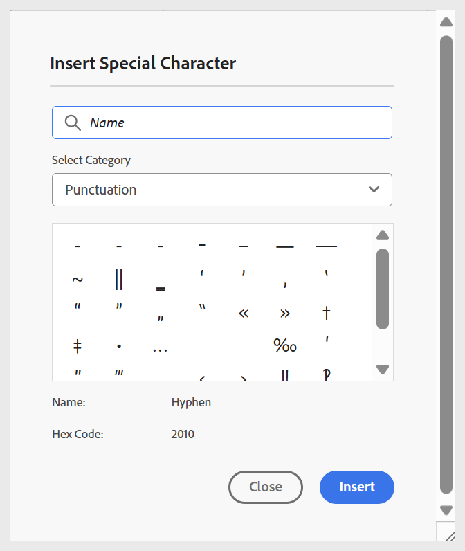
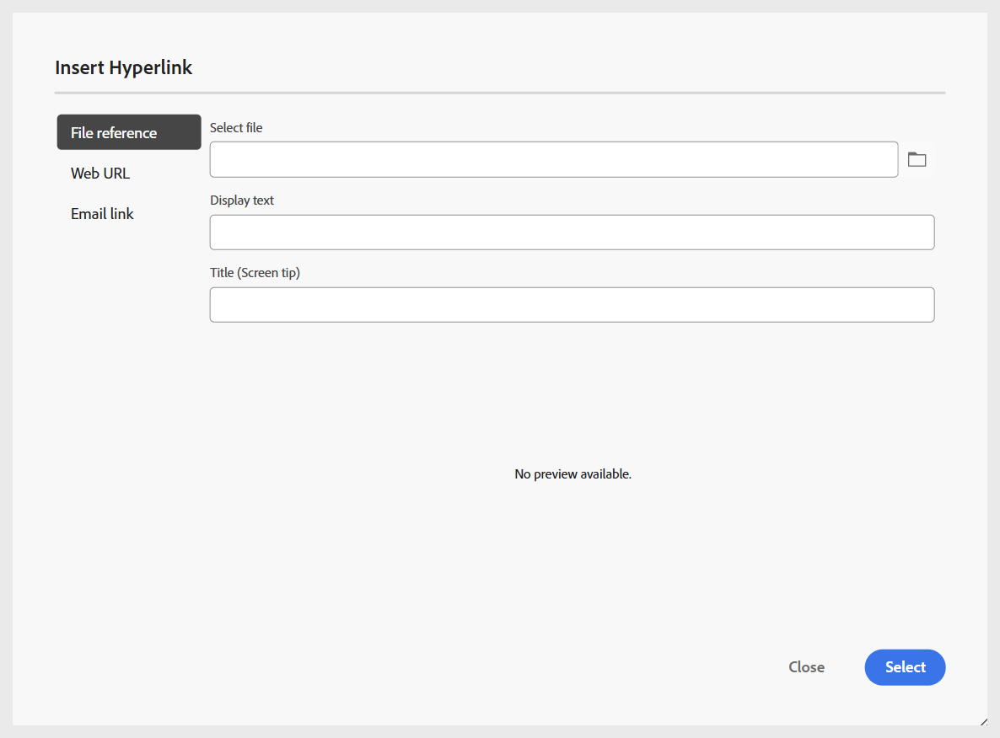

# 將基本建置區塊新增至主題

為了更清楚瞭解如何建立學習主題及新增基本建置區塊，以下影片提供可用功能的簡短概覽。

>[!VIDEO](https://video.tv.adobe.com/v/3469535/learning-content-aem-guides)

您可以使用編輯器工具列上可用的基本編輯功能，如下所述：

- **介面工具集**：使用&#x200B;**插入**&#x200B;功能表，將摺疊式功能表、轉盤、熱點等介面工具集新增至您的主題或學習內容，如下所示。 如需互動介面工具集的詳細資訊，請檢視[使用互動介面工具集](./lc-widgets.md)。

  {width="650" align="left"}

- **文字元件**：為您的內容新增標題/標題、段落、內嵌引號、上標、下標和引文。

  {width="650" align="left"}

- **未排序清單**：在您的內容中新增未排序清單。

  {width="650" align="left"}

- **排序清單**：在內容中插入編號清單。

  {width="650" align="left"}

- **表格**：將必要維度的表格插入內容中。 您可以使用&#x200B;**內容屬性**&#x200B;面板進一步管理各種資料表屬性，如下所示。

  {width="650" align="left"}

- **影像**：將影像連同替代文字和熒幕提示插入內容中。 可以從存放庫或透過外部URL新增影像。 此外，可以使用&#x200B;**內容屬性**&#x200B;面板修改影像屬性。

  {width="650" align="left"}

- **多媒體**：從工具列上的&#x200B;**更多**&#x200B;功能表新增視訊和音訊至內容。 您可以使用&#x200B;**內容屬性**&#x200B;面板自訂其屬性。

  {width="650" align="left"}

- **符號**：將您選擇的符號從清單新增至內容，如下所示。 您可以從工具列上的&#x200B;**更多**&#x200B;功能表使用它。

  {width="350" align="left"}

- **超連結**：將超連結新增至內容中的必要位置。 您可以從工具列上的&#x200B;**更多**&#x200B;功能表使用它。 它可以是檔案參考、網頁URL或電子郵件連結，如下所示。

  {width="650" align="left"}
