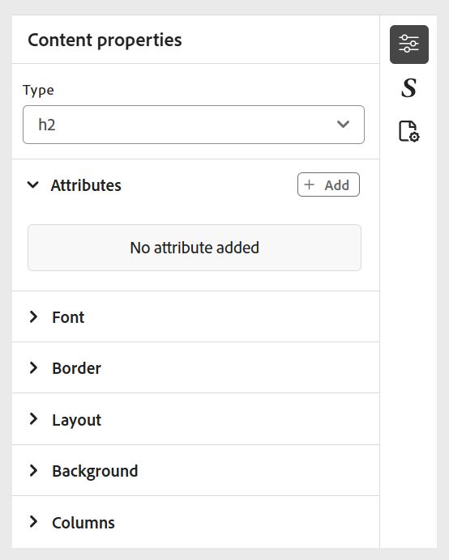
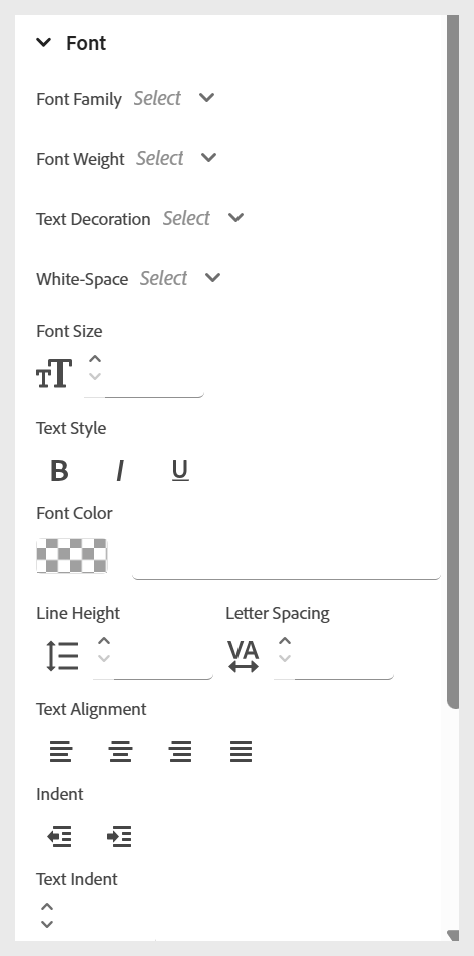
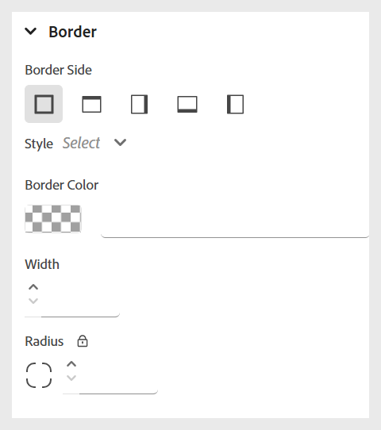
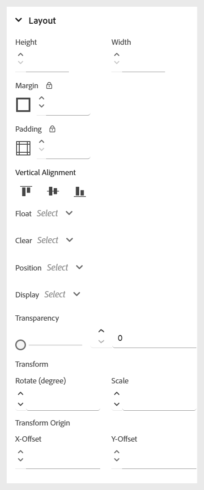
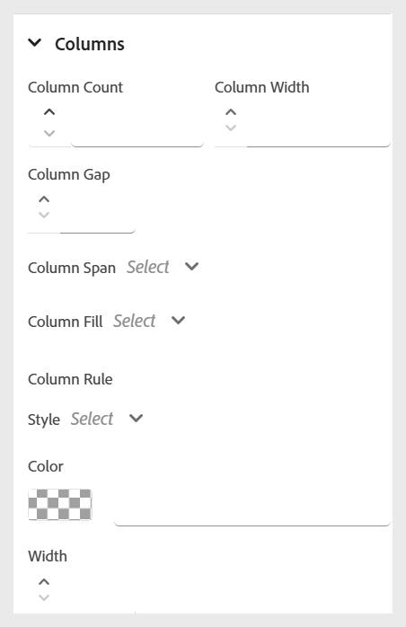

# 使用內嵌樣式

套用內嵌樣式，以直接在課程內容中自訂特定文字的外觀。 這允許快速格式化調整，例如字型大小、顏色、對齊方式等。 您可以使用&#x200B;**內容屬性**&#x200B;面板，修改所選文字的內嵌樣式。

>[!NOTE]
>
> 這些樣式選項只有在管理員啟用時才會顯示。

>[!VIDEO](https://video.tv.adobe.com/v/3469533/aem-guides-learning-content)

下列是可用的內嵌樣式選項。

{width="350" align="left"}

- **字型：**&#x200B;可讓您使用各種選項（如字型系列、字型粗細、文字裝飾、字型大小等）自訂文字外觀。 這些設定可協助您設定內容樣式，如下列範例所示。

  {width="350" align="left"}

- **框線**：可讓您使用選項(例如框線側、寬度、樣式（實線、虛線、點狀等）、顏色)來定義及自訂元素的框線。 這些設定可協助您透過視覺化方式分隔或反白顯示內容的特定區段。

  {width="350" align="left"}

- **配置**：協助您控制內容中元素的位置和間距。 您可以調整屬性，例如邊界、邊框間距、對齊方式、顯示型別等。 以有效地組織您的內容結構。

  {width="350" align="left"}

- **背景**：可讓您藉由設定背景顏色、影像、位置和重複樣式等選項來自訂元素的背景。 這些設定有助於增強內容的視覺吸引力和清晰度。

  {width="350" align="left"}

- **欄**：可讓您將內容組織成多欄。 您可以調整欄數、欄間距、欄寬等等。 以改善內容中的可讀性和版面結構。

  {width="350" align="left"}
