# 插入功能表中的其他選項

在編輯器工具列的「插入」選單中可用的其他選項包括：

- **區塊引號：**&#x200B;在您的內容中新增區塊引號與引號。

  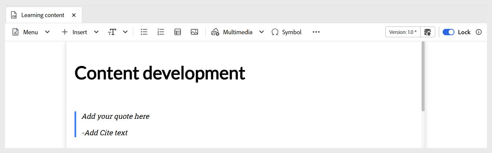{width="650" align="left"}

- **程式碼區塊：**&#x200B;新增程式碼區塊至您的內容。

  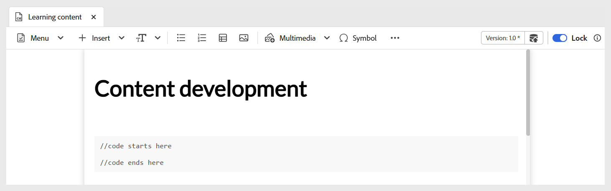{width="650" align="left"}

- **Iframe：**&#x200B;將iframe插入內容以內嵌外部網頁或互動式資源。 您可以使用&#x200B;**內容屬性**&#x200B;面板來設定iframe屬性，包括來源URL、寬度、高度、對齊方式及標題。 您可以切換至&#x200B;**預覽**&#x200B;模式，檢視iframe中新增的內容，如下所示。

  **作者**&#x200B;檢視：

  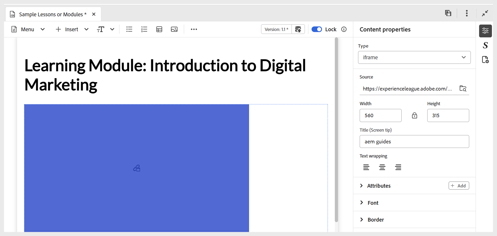{width="650" align="left"}

  **預覽**&#x200B;模式：

  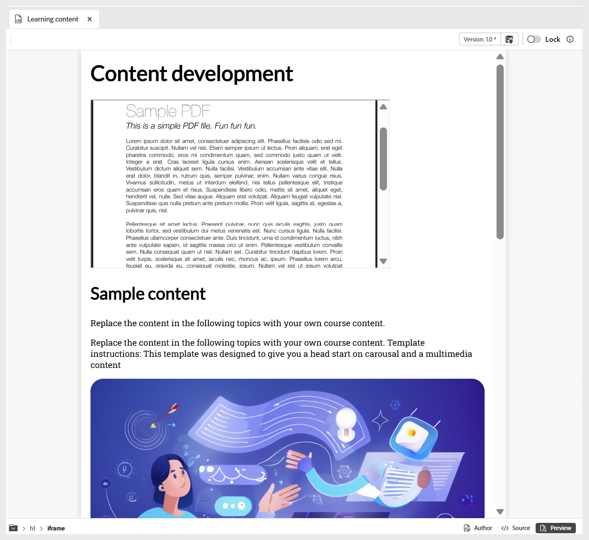{width="650" align="left"}

- **H5P：**&#x200B;新增互動式H5P套件至您的學習內容。 若要新增H5P內容，請將游標置於所需位置，然後從[插入]功能表選取&#x200B;**H5P**。 在「插入H5P」對話方塊中，提供您要新增至學習內容的H5P檔案參考。

  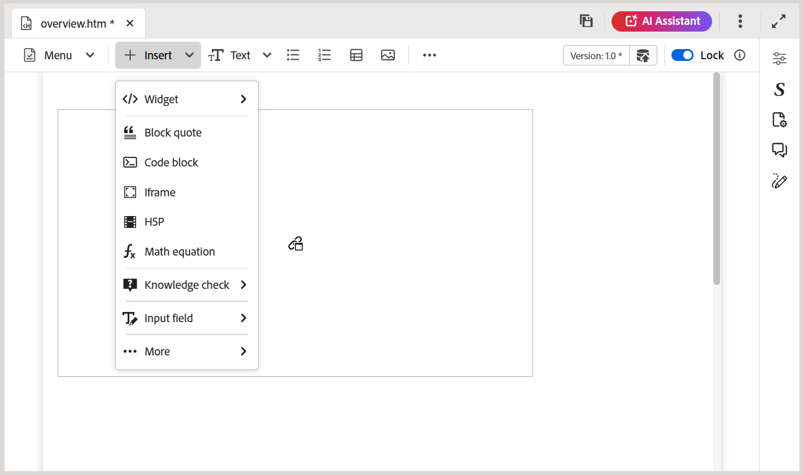

  如果您偏好使用您系統中的H5P內容，請先在DAM[中使用](../user-guide/authoring-upload-existing-files.md)上傳資產&#x200B;**選項**&#x200B;上傳檔案，然後將其加入存放庫檢視/Assets。

  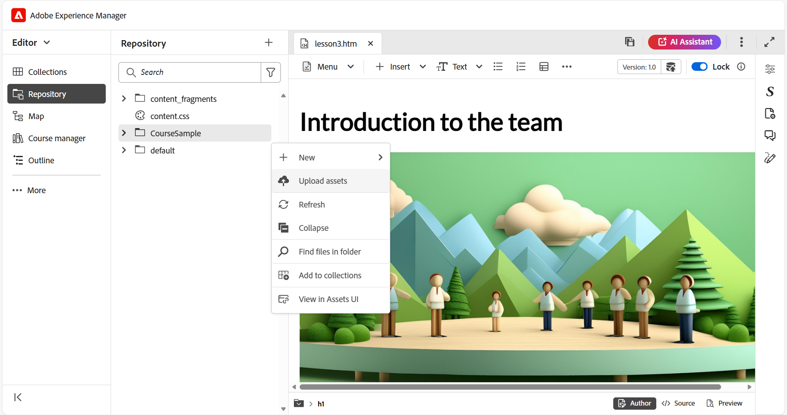

  完成後，在預覽模式下檢閱H5P內容並發佈輸出。

  >[!NOTE]
  >
  > Adobe Experience Manager Guides不支援編輯或建立H5P內容。 在上傳之前，請先在外部準備H5P套件。

- **數學方程式：**&#x200B;將MathML方程式插入您的內容。 您可以建立MathML方程式，並選取&#x200B;**插入**&#x200B;以將其新增至您的檔案。

  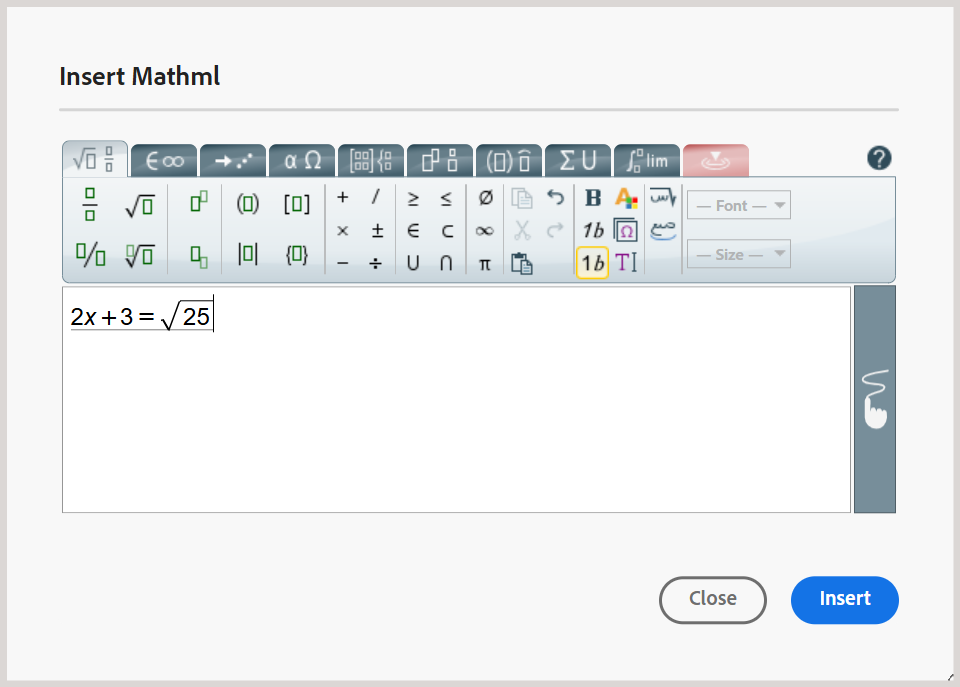{width="350" align="left"}

  方程式會以淺灰色背景插入。 您可以隨時更新方程式，只要在現有方程式上按一下滑鼠右鍵，然後從內容功能表選取&#x200B;**編輯數學方程式**。 如需在Experience Manager Guides中驗證MathML方程式的詳細資訊，請在MathML編輯器中檢視[方程式驗證](../user-guide/web-editor-other-features.md#validation-of-equations-in-the-mathml-editor)。

- **知識檢查：**&#x200B;可讓您新增可用格式的問題（單一正確、多重正確、True/False、符合以下內容，或從問題庫插入），以供檢閱和確認理解，而不需要評分或報告。 這些問題反映了標準格式並排除分數，因此非常適合自我評估，並適合作為課程內容或主題的一部分，之後可視需要於測驗或評估前進行。

  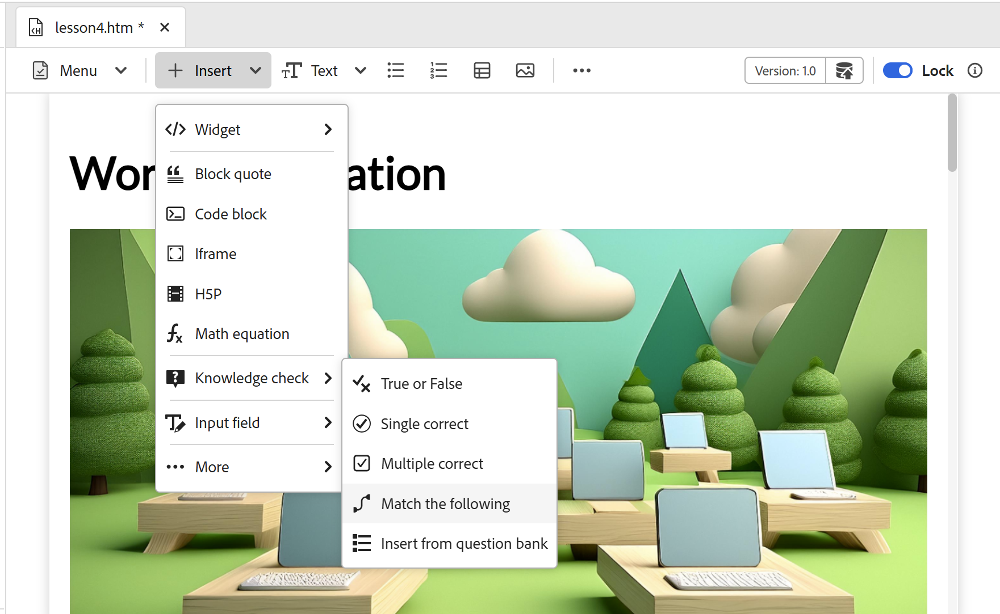{width="650" align="left"}

  您可以透過&#x200B;**內容屬性**&#x200B;面板來設定正確答案和其他必要欄位。 如需詳細資訊，請檢視[問題型別](./quiz-insert-questions.md)。 您可以使用如下所示的知識檢查選項來新增各種問題型別。

  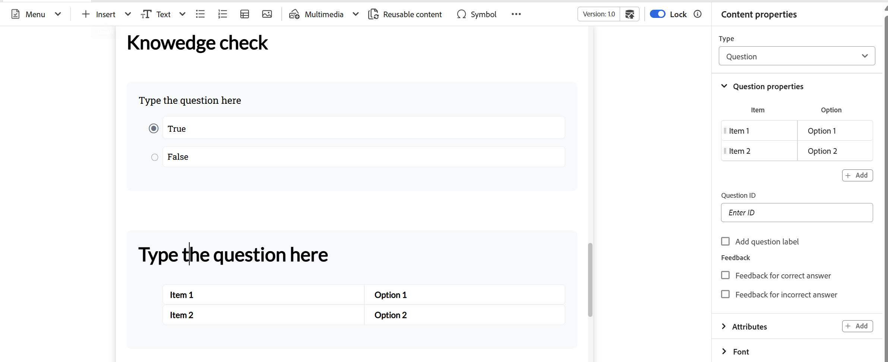{width="650" align="left"}

- **輸入欄位：**&#x200B;新增文字輸入欄位以及按鈕至您的內容。 您可以使用此組合來擷取使用者輸入並觸發特定動作。 播放按鈕已新增到內容中，如下所示。

  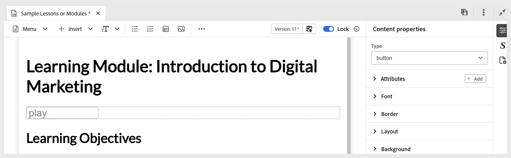{width="650" align="left"}

- **更多選項：**&#x200B;您有其他選項可增強您的學習內容，包括插入水平線、分行符號、文字方塊、定位文字方塊和內嵌HTML。

  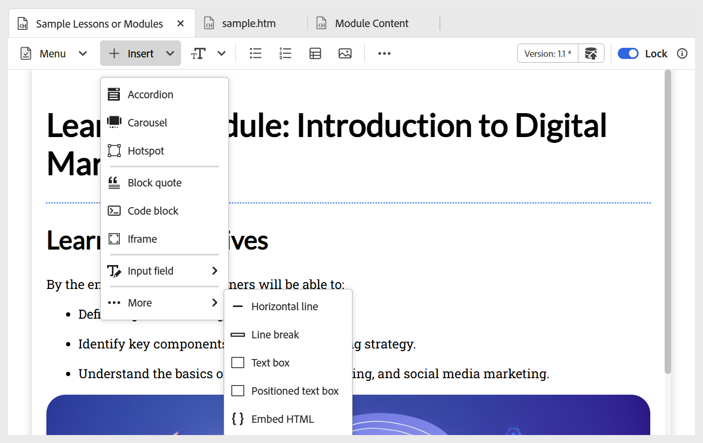{width="650" align="left"}
