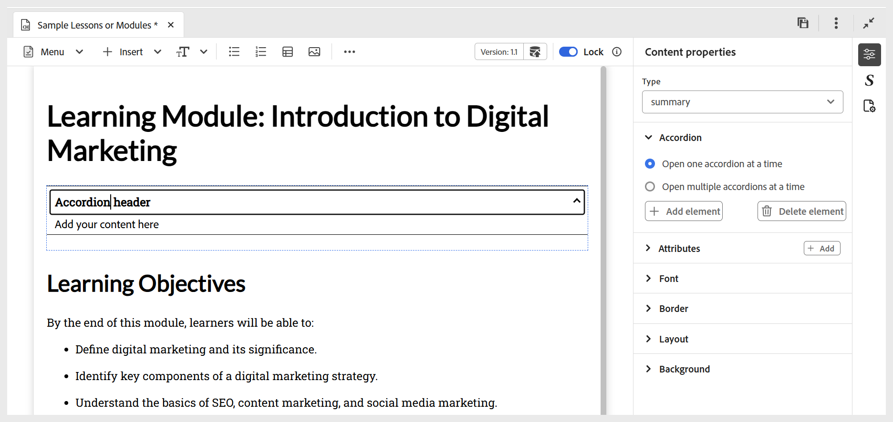
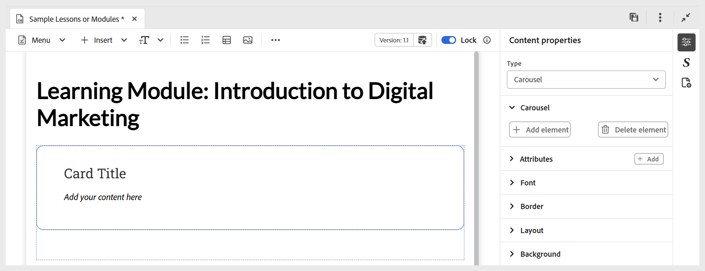
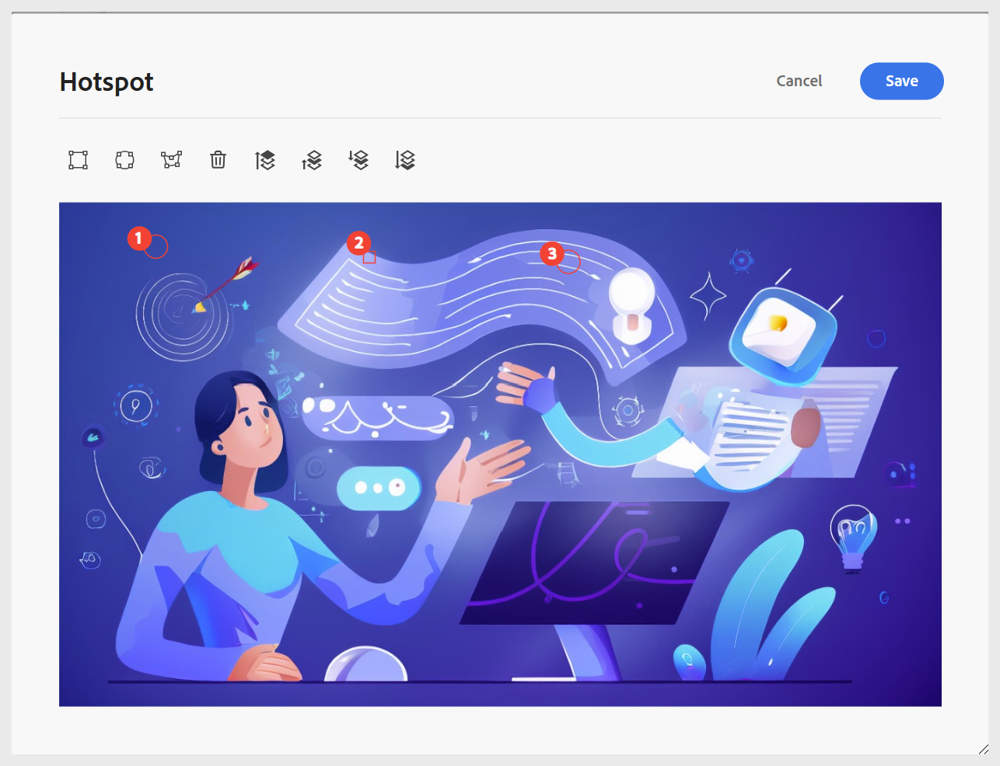
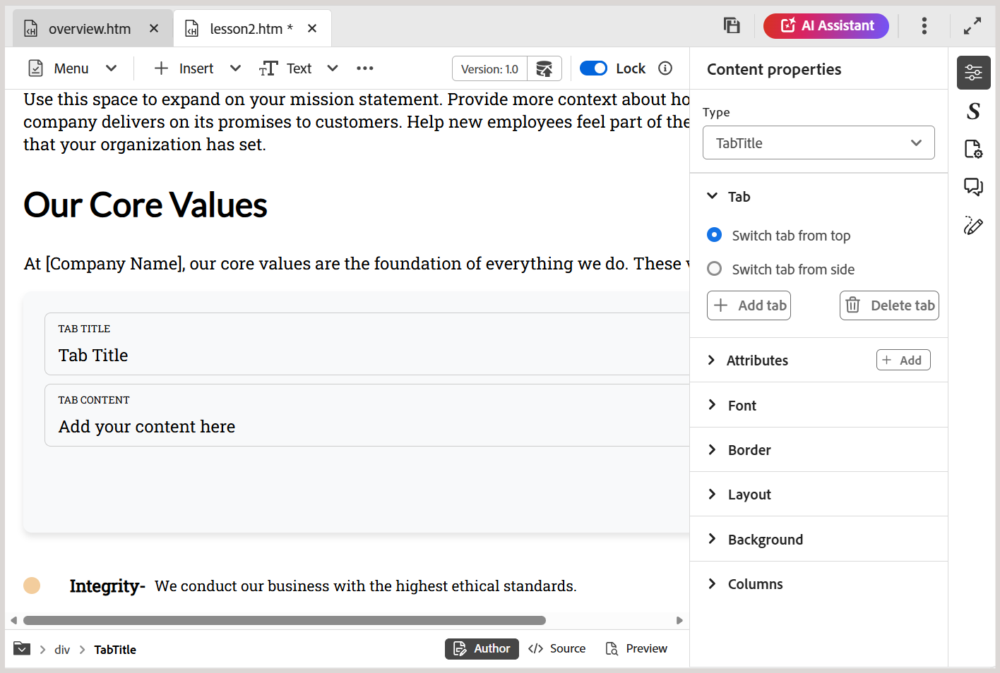
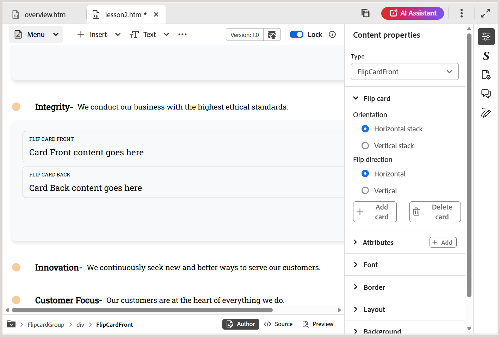
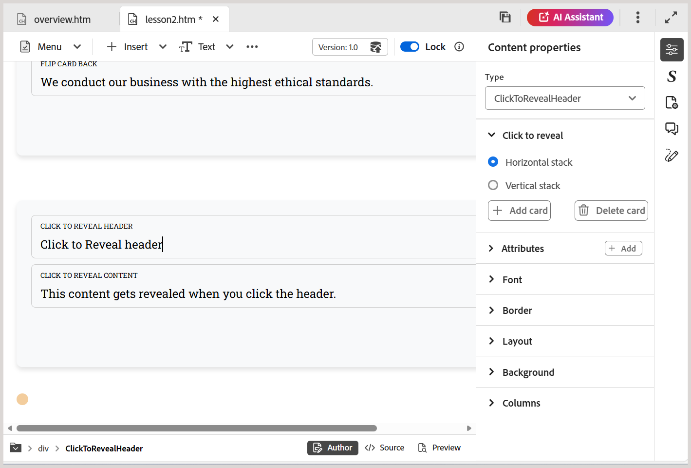

# 使用互動式Widget

您可以新增多個Widget來增強學習內容，讓課程更具互動性。 以下是各種可用Widget的簡短逐步解說影片。

>[!VIDEO](https://video.tv.adobe.com/v/3469531/learning-content-aem-guides)

可用的Widget可強化使用者體驗並簡化內容傳送，包括：

- **收合式選單：**&#x200B;新增收合式選單至內容。 您可以在收合式選單標題及其內文中插入適當的文字。 可以使用&#x200B;**Content properties**&#x200B;面板管理其屬性，包括允許同時開啟單一或多個摺疊式功能表，以及新增或移除元素的選項。 若要刪除Widget的元素或專案，您也可以使用&#x200B;**按一下滑鼠右鍵>刪除專案**。

  {width="650" align="left"}

- **輪播：**&#x200B;新增輪播至內容。 您可以在卡片標題和其內文中插入適當的文字。 可以使用&#x200B;**Content properties**&#x200B;面板管理其屬性，包括新增或移除元素的選項。 若要刪除Widget的元素或專案，您也可以使用&#x200B;**按一下滑鼠右鍵>刪除專案**。

  {width="650" align="left"}

- **熱點：**&#x200B;新增熱點到選取的影像。 從選擇影像開始，然後導覽至&#x200B;**插入>熱點**。 這會開啟「熱點」對話方塊，您可以在其中設定各種選項，例如設定不同的熱點大小、新增對應連結，以及透過將區域向前或向後移動來調整分層。 若要刪除Widget的元素或專案，您也可以使用&#x200B;**按一下滑鼠右鍵>刪除專案**。

  {width="650" align="left"}

- **標籤：**&#x200B;可讓您將內容組織成互動式區段。  每個標籤都可以代表不同的主題或類別；學習者可以按一下或點選標籤，以顯示對應的內容。 將游標放在您希望Tab Widget出現在內容中的位置，然後導覽至&#x200B;**插入> Widget >標籤**。 這會將索引標籤容器新增至您的內容。 現在，開始將內容新增到索引標籤，包括索引標籤標題及其對應內容。  若要刪除Widget的元素或專案，您也可以使用&#x200B;**按一下滑鼠右鍵>刪除專案**。

  

  若要新增、刪除和切換索引標籤配置（垂直索引標籤或水準索引標籤），請使用右側面板中的&#x200B;**內容屬性**&#x200B;區段。
- **翻轉卡片：**&#x200B;新增互動卡片至您的內容，可翻轉以顯示其他資訊。 每張卡片都有兩面 — 正面和背面，讓學習者以吸引人的方式探索資訊。  若要插入Flip卡片，請將游標置於所需位置，並導覽至&#x200B;**插入> Widget >翻轉卡片**，這會將Flip卡片容器新增至您的內容。 然後，您可以在正面新增標題和選填的影像，並在背面輸入對應的內容。 若要刪除Widget的元素或專案，您也可以使用&#x200B;**按一下滑鼠右鍵>刪除專案**。

  

  若要新增或刪除卡片，或變更其版面，請使用右側面板中的&#x200B;**內容屬性**&#x200B;區段。
- **按一下以顯示：**&#x200B;將互動式Widget插入您的內容中，隱藏內容，直到學習者按一下以顯示。 這有助於減少雜亂，並鼓勵探索。 將游標置於所需位置並選取&#x200B;**插入> Widget >按一下以顯示**，以插入Widget。 插入後，請為Widget標題提供標題，並定義學習者互動時顯示的隱藏內容。

  

  若要新增或刪除Widget，或管理Widget方向，請使用右側面板中的&#x200B;**內容屬性**&#x200B;區段。 若要刪除Widget的元素或專案，您也可以使用&#x200B;**按一下滑鼠右鍵>刪除專案**。