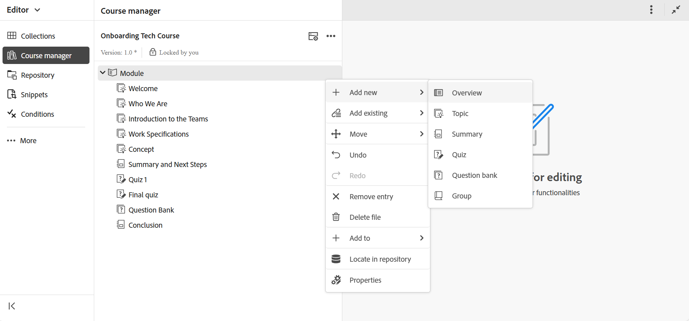
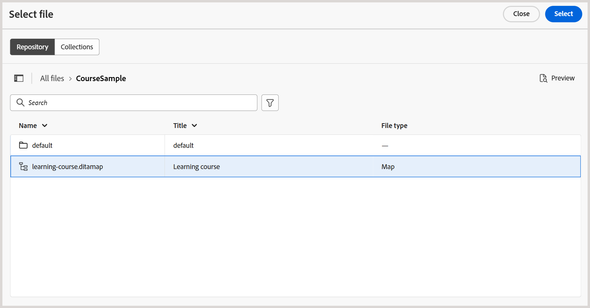
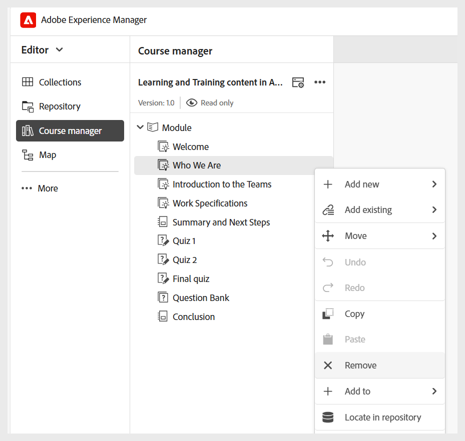
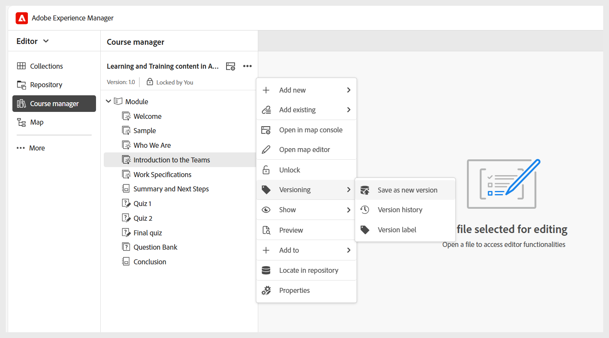
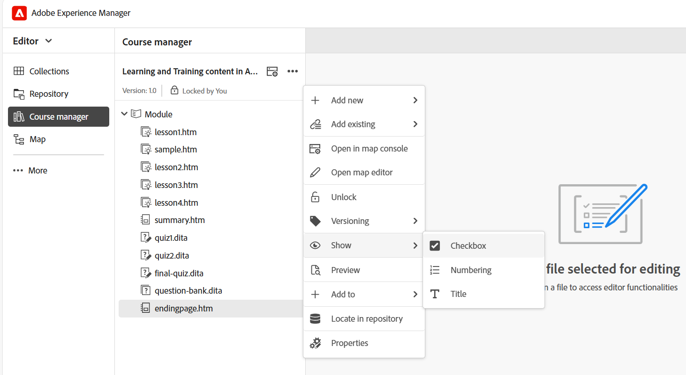

# 管理您的課程

建立課程後，課程會在「課程管理員」面板中開啟。 您可以鎖定課程並在課程層級進行所有必要的變更。 以下各節將說明編輯課程的可用選項。

## 新增內容

執行以下步驟，在您的課程中新增內容：

1. 選取&#x200B;**選項**&#x200B;功能表> **新增**。

   
2. 選取您要建立的內容型別。 可使用的選項包括：
   - **概述**：提供課程內容快速介紹的課程第一個主題。
   - **主題**：課程中的主要素材是由一些簡短且重點突出的片段所組成，例如步驟、範例，或教導特定技能或想法的說明。 如需詳細資訊，請檢視[建立和自訂主題](./create-content.md)。
   - **摘要**：課程章節結尾的快速檢閱，提醒學習者他們剛學到的要點。
   - **測驗**：一組用於檢查某個人是否瞭解他們所學知識的問題。 如需詳細資訊，請檢視[建立和管理測驗](./create-quiz.md)。
   - **問題庫**：可重複使用問題的共用集區，可用來快速且一致地建立測驗。 如需詳細資訊，請檢視[問題庫](./create-qb.md)。
   - **群組**：學習群組可協助將相關主題（例如章節、主題和其他模組）組織成邏輯順序，以建立清晰的階層，更易於管理和重複使用訓練教材。
3. 選取「**建立**」。

所選內容隨即建立並新增至課程。 如需影片概述，請檢視[新增內容至課程](https://video.tv.adobe.com/v/3469537/aem-guides-learning-content?quality=12&learn=on)。

## 新增現有內容

您可以將內容存放庫中的現有內容新增到課程中。 執行以下步驟來新增現有內容：

1. 選取&#x200B;**選項**&#x200B;功能表> **新增現有**。
2. 選取您要建立的課程內容型別。
3. 在&#x200B;**選取路徑**&#x200B;對話方塊中，導覽至內容位置並選取想要的學習內容。

   
4. 選擇&#x200B;**選取**。

選取的課程內容會從存放庫新增至課程。

>[!NOTE]
>
>您也可以使用&#x200B;**Add Existing**>**File （僅限資源zip）**&#x200B;選項來包含解壓縮並整合至最終SCORM輸出的資料夾結構的zip檔案。 這有助於在課程發佈期間簡化資源封裝。

如需影片概述，請檢視[新增現有內容至課程](https://video.tv.adobe.com/v/3469537/aem-guides-learning-content?quality=12&learn=on)。

## 移除內容

您可以選取特定主題的&#x200B;**選項**&#x200B;功能表，然後選取&#x200B;**移除專案**，移除課程中的任何主題，如下所示。

如需影片概述，請檢視[從課程](https://video.tv.adobe.com/v/3475210/learning-content-aem-guides)移除內容。

## 建立課程版本

您可以選取&#x200B;**選項**&#x200B;功能表> **版本設定**&#x200B;來控制課程的版本設定。

您會取得下列課程版本設定選項：

- **另存為新版本**：以新版本編號儲存您的課程。
- **版本記錄**：顯示目前版本的預覽，也可讓您與課程的其他可用版本比較。
- **版本標籤**：可讓您以自由格式文字格式指定標籤，或使用一組預先定義的標籤。

## 顯示設定：顯示

**顯示**&#x200B;選項決定如何顯示主題。 您可以選擇使用多個主題選取項的核取方塊來顯示它們，使用編號來指示階層結構，或者顯示主題標題或檔案名稱。

>[!NOTE]
>
> 這些檢視設定只會套用在「課程管理員」中，不會影響已發佈的輸出。

如需影片簡介，請檢視[顯示選項](https://video.tv.adobe.com/v/3475210/learning-content-aem-guides)。
