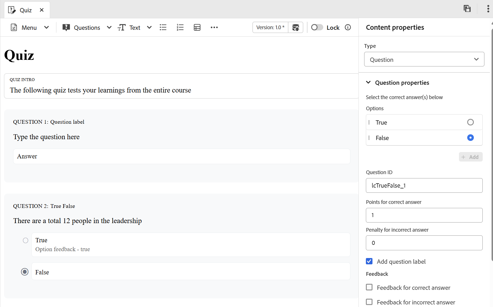
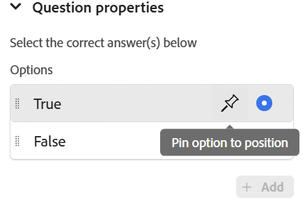
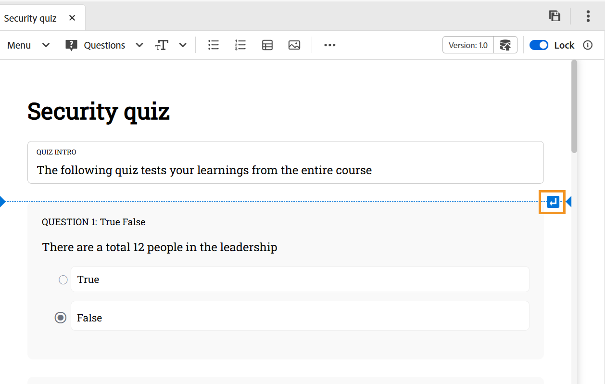
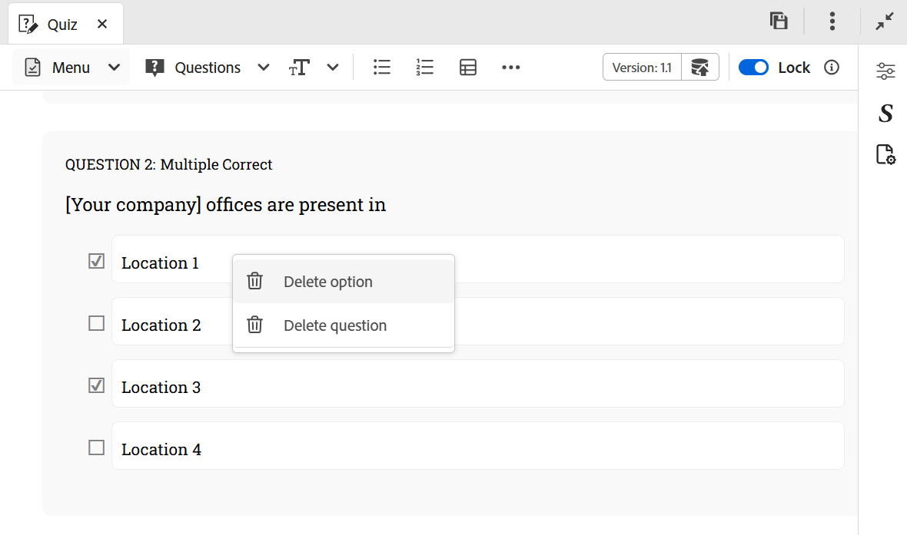
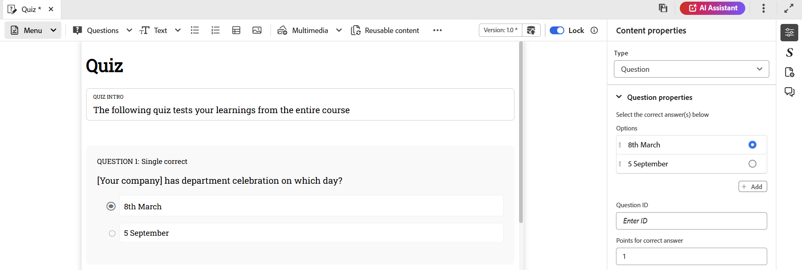
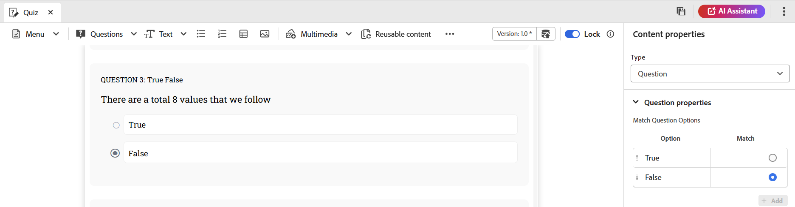
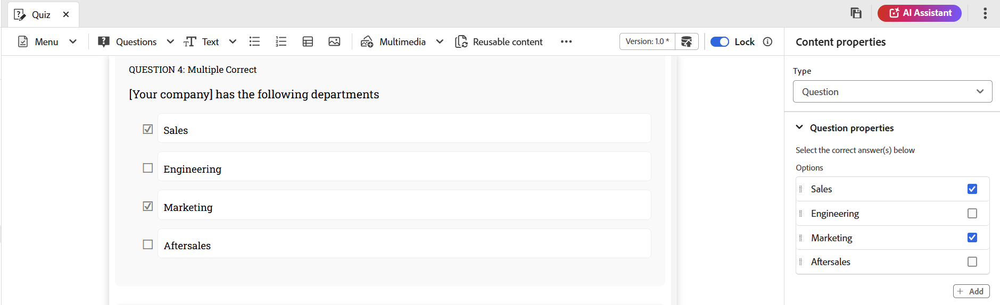
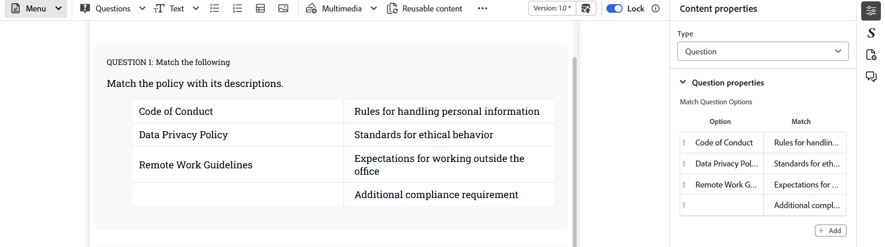
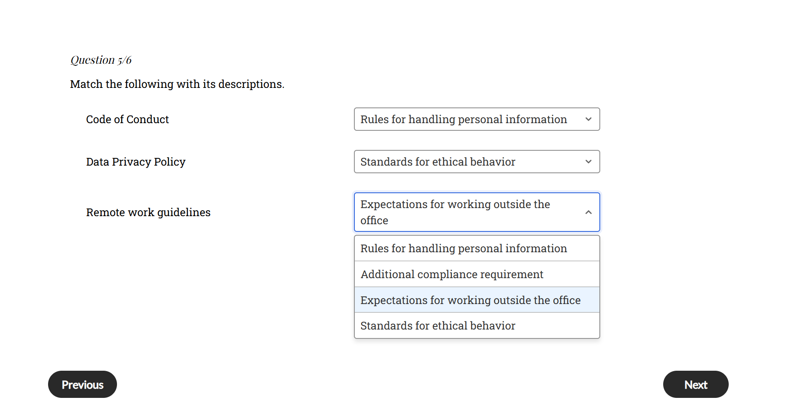
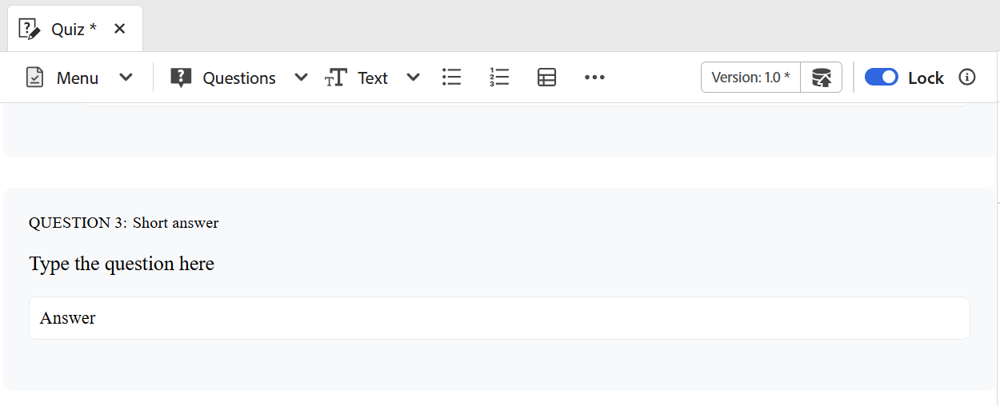

# 在測驗中插入問題

執行以下步驟，將問題插入測驗：

1. 從工具列的&#x200B;**問題**&#x200B;下拉式選單中選擇所需的問題型別。 您可以根據您的需求，使用四種可用格式中的任一種來新增問題：真或假、單一正確、多重正確、符合以下內容以及簡短答案，如下所示。 如需詳細資訊，請檢視[問題型別](#question-types)。

   {width="650" align="left"}

   插入問題時，如果游標位於問題區塊上，則新問題會依預設新增至其後面。

   若要在兩個現有問題之間插入問題，請先[插入段落](#insert-paragraph-within-the-quiz)，然後插入問題。

1. 問題會以選取的格式插入。 然後，您可以根據您的要求編輯問題。

1. 您可以選取任何問題，並使用&#x200B;**內容屬性**&#x200B;面板來設定其屬性。

   {width="650" align="left"}

1. 儲存您在測驗中所做的所有變更。

## 問題屬性

您可以使用&#x200B;**內容屬性**&#x200B;面板中的下列問題屬性來設定問題：

{width="350" align="left"}

- **選項**：指定問題的正確答案
- **問題識別碼**：指定每個問題的問題識別碼。 如果問題ID不存在，建議一律新增它。
- **正確答案的點數**：指定正確答案的得分。
- **錯誤答案的懲罰**：指定錯誤答案要扣除的點數。
- **問題標籤**：啟用以新增問題標籤。
- **意見反應**：啟用以針對正確或不正確的答案提供意見反應。
- 將&#x200B;**選項釘選至位置**：釘選問題的特定選項時，該選項會維持在選項清單中的指定位置，即使在SCORM預設集組態中啟用了&#x200B;**每次嘗試的隨機答案選擇**，否則會重新配置可用的選項。 您可以在「內容屬性」面板中，將滑鼠指標停留在問題的所需選項上，並加以釘選。

  {width="350" align="left"}

## 在測驗中插入段落

當您將游標放在特定問題或兩個問題之間的空白處時，藍色水平線會以藍色箭頭顯示在畫面的最右角。 選取藍色箭頭，可在測驗編寫介面中插入段落。

{width="650" align="left"}

- 用於問題中時，它可讓您在問題中新增更多元素，例如影像、表格、文字元素等。
- 在問題之間使用時，它可讓您插入另一個問題或新增上述的其他編寫元素。

## 刪除問題或選項

執行以下步驟來刪除測驗中的問題或特定選項：

1. 以滑鼠右鍵按一下您要移除的問題或選項。
1. 在內容功能表中，選取&#x200B;**刪除問題** （以移除整個問題）或&#x200B;**刪除選項** （僅移除選取的選項）。

{width="650" align="left"}

## 問題型別

測驗支援下列問題型別：

- **單一正確**：有多個選項的問題，只有一個答案正確。

  {width="650" align="left"}

- **True/False**：學習者選擇為True或False的陳述式問題。

  {width="650" align="left"}

- **多個正確**：有多個選項的問題，多個答案可以正確。

  {width="650" align="left"}

- **符合下列專案**：允許學習者比對兩個清單中的專案，以形成正確的配對。 您可以從&#x200B;**內容屬性**&#x200B;面板新增選項集。 若要增加複雜性，您可以從第一個清單中移除一個選項，並在「比對」欄中加入額外的相符項。 這會要求學習者慎重考慮哪個選項沒有直接的配對，造成困難。

  {width="650" align="left"}

  在發佈的輸出中，**符合以下**&#x200B;個問題會隨每個專案的下拉式選單一起出現，可讓您從可用選項中選取正確的相符專案。

  {width="650" align="left"}

- **簡短答案**：允許學習者使用簡短文字輸入回應。 它接受英數字元回答，不區分大小寫比對回答，而且對於非常長的回答，它提供水準卷軸。

  {width="650" align="left"}
