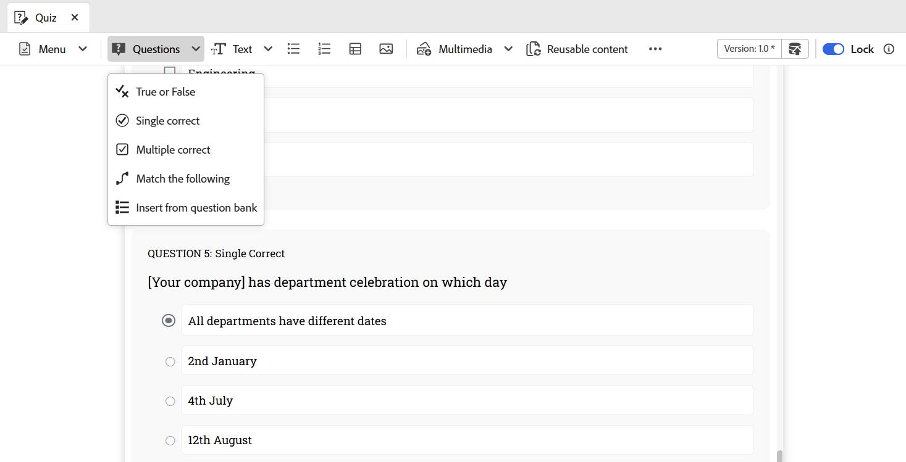

# 在測驗中插入問題

執行以下步驟，將問題插入測驗：

1. 從工具列的&#x200B;**問題**&#x200B;下拉式選單中選擇所需的問題型別。 您可以根據您的需求，使用下列三種可用格式中的任何一種來新增問題：真或假、單一正確和多重正確，如下所示。

   {width="650" align="left"}

1. 問題會以選取的格式插入。 然後，您可以根據您的要求編輯問題。

1. 您可以選取任何問題，並使用&#x200B;**內容屬性**&#x200B;面板來設定其屬性。 例如，您可以指定正確答案、設定要授與的標籤，以及定義不正確回應的任何懲罰。

   {width="650" align="left"}

1. 儲存您在測驗中所做的所有變更。

