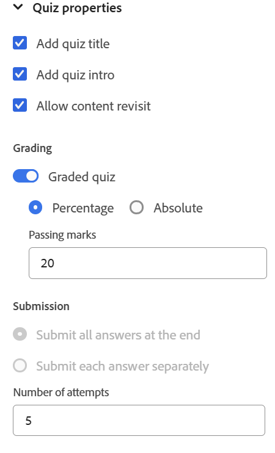

# 測驗屬性

您可以使用下列選項來設定測驗屬性：

- 將游標放在測驗標題或測驗簡介上，然後從右側面板開啟&#x200B;**內容屬性**&#x200B;面板。 您可以從這裡編輯測驗屬性。

  {width="650" align="left"}

- 確保編寫測驗時測驗標題和簡介不要空白，因為它們會出現在已發佈測驗的第一張投影片上。 如果意外移除，您可以選取&#x200B;**新增測驗標題**&#x200B;和&#x200B;**新增測驗簡介**&#x200B;選項來還原它們。
- 您可以開啟&#x200B;**分級測驗**&#x200B;切換來啟用測驗的評分。 啟用後，您可以選擇以百分比為基礎或絕對的閱卷方式，並相應地定義通過條件。

  {width="350" align="left"}

- 您也可以設定其他設定，例如答案提交選項、意見與稽核選項、測驗時間以及版面配置偏好設定，如下所示。

  {width="350" height="200" align="left"}

- 您可以使用選項&#x200B;**允許內容在測驗屬性中重新造訪**，在持續性測驗期間重新造訪課程內容；類似於開放式書籍測試。 但是，當啟用此選項時，您無法設定提交選項，且測驗計時功能已停用。
  {width="350" height="200" align="left"}
