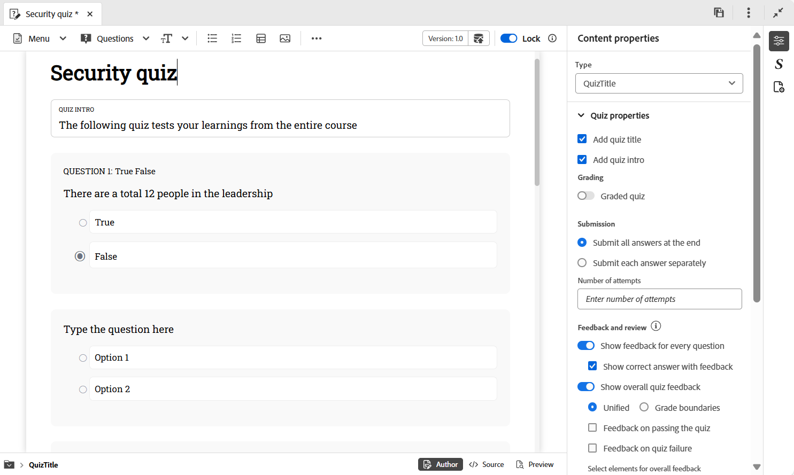
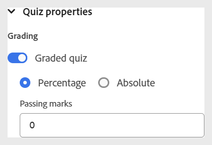
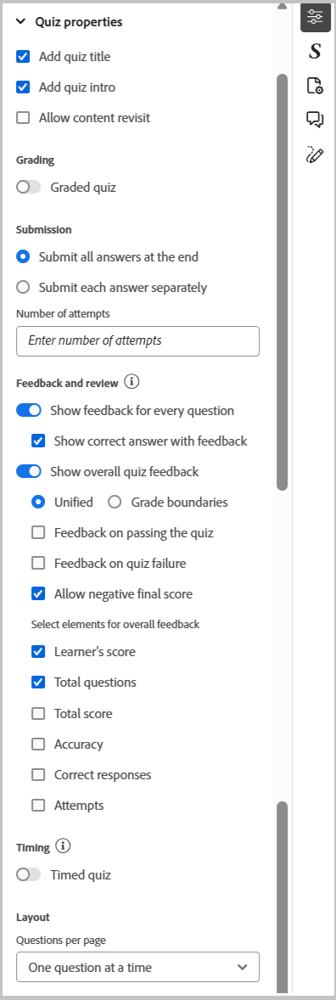

# 測驗屬性

您可以使用下列選項來設定測驗屬性：

- 選取測驗的標題，然後選取右側工具列上的&#x200B;**內容屬性**&#x200B;圖示以開啟&#x200B;**內容屬性**&#x200B;面板。 您可以從這裡編輯測驗屬性。

  {width="650" align="left"}

- 您可以開啟&#x200B;**分級測驗**&#x200B;切換來啟用測驗的評分。 啟用後，您可以選擇以百分比為基礎或絕對的閱卷方式，並相應地定義通過條件。

  {width="350" align="left"}

- 您也可以設定其他設定，例如答案提交選項、意見與稽核選項、測驗時間以及版面配置偏好設定，如下所示。

  {width="350" height="200" align="left"}