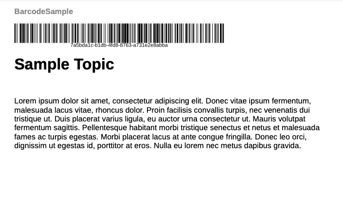

# 將條碼新增至PDF輸出

條碼是電腦可讀取的資料模式。 客戶可使用條碼掃描器或其智慧型手機相機掃描條碼。 產品詳細資料、詳細目錄編號或網站URL等編碼資訊可能會有所幫助。 新增條碼可協助您輕鬆擷取資料、增強客戶體驗，以及促進更優異的資料管理和安全性。

您可以建立條碼的樣式。 並用來在頁面配置中插入條碼。 您可以套用樣式至所需版面配置中的範例條碼。


本教學課程可協助您在PDF輸出中新增條碼。

## 產生條碼的步驟

若要產生條碼，請執行下列步驟：

### 更新範本的CSS以轉譯條碼值

修改`layout.css`檔案以在產生PDF期間轉譯條碼。 支援各種條碼型別，例如「qrcode」和「pdf417」。  如需詳細資訊，請檢視[條碼型別](#barcode-types)。


```css
...
.barcode { 
-ro-replacedelement: barcode;   
-ro-barcode-type: code128;   
-ro-barcode-size: 100%;   
-ro-barcode-content: content();   
object-fit: contain;   
margin-top: 2mm;
 
}
...
```

### 使用CSS樣式產生條碼

您可以用不同的方式產生條碼。 部分範例如下：

**範例 1**

在範本標題中新增條碼預留位置並套用樣式：

1. 編輯&#x200B;**範本** > **頁面配置**
1. 選取版面配置。 例如，您可以選取「封底」頁面版面，其中包含頁首或頁尾。
1. 將下列範圍新增至您要插入條碼的位置。

   `<span class="barcode">Sample barcode</span></p>`。

   >[!NOTE]
   >
   > 使用您在`layout.css`中定義的相同類別名稱。

1. 將`<Sample barcode>`取代為您要條碼掃描器讀取的值。

您可以使用範本（包括頁面配置）在產生輸出PDF時檢視條碼。 執行上述步驟後，您就可以使用條碼產生PDF輸出。

下列熒幕擷圖顯示PDF輸出中的範例條碼。



**範例 2**

修改`Common.plt`Basic **範本中的**&#x200B;檔案，在專案標題之後新增條碼。

若要建立ISBN號碼的條碼，請新增ISBN號碼。 然後使用ISBN編號來產生條碼。

```html
...

  <div data-region="header">
    <p class="chapter-header"><span data-field="project-title" data-format="default">Project Title</span> </p>
    <p><span class="barcode">978-1-56619-909-4</span></p>
  </div>
} 
...
```

**範例 3**

若要使用地圖中繼資料建立條碼：

使用DITA map的`<topicmeta>`元素中存在的任何中繼資料，以條碼顯示。 確定使用正確的XPath。 例如，您可以在DITA map `<resourceid>`中新增`<topicmeta>`。

在以下範例中，資源ID會作為產生條碼的主要輸入。

```xml
<?xml version="1.0" encoding="UTF-8"?>
<!DOCTYPE map PUBLIC "-//OASIS//DTD DITA Map//EN" "technicalContent/dtd/map.dtd">
<map id="GUID-3c330691-4dac-4020-904a-d2d6246aeeb1-en">
  <title>Barcode Sample</title>
  <topicmeta>
    <resourceid id="7a5bda1c-b1db-4fd8-8763-a731e2e8abba">
    </resourceid>
  </topicmeta>
  <topicref href="GUID-139f6c64-bea3-4f17-8b22-ee131557e249-en.dita" type="topic">
  </topicref>
</map>  
```


您可以在頁面配置中使用資源ID，如下所示：


```html
  <div data-region="header">
    <p class="chapter-header"><span data-field="project-title" data-format="default">Project Title</span> </p>
    <p><span class="barcode" data-field="metadata" data-format="default" data-subtype="//resourceid/@id">Resource ID (barcode)</span></p>
  </div>
} 
```

## 條碼型別 {#barcode-types}

部分常用的條碼如下：

| 類型 | -ro-barcode-type | 其他詳細資料 |
| ---| --- | --- |
| QR碼 | qrcode | 根據ISO/IEC 18004:2015的QR碼條碼符號。 |
| 代碼128 | code128 | ISO/IEC 15417:2007中定義的Code 128條碼符號。 |
| 代碼32 | code32 | Code 32，也稱為義大利島碼。 |
| 代碼49 | code49 | 根據ANSI/AIM-BC6-2000執行代碼49。 |
| 代碼11 | code11 |                            |
| 代碼93 | code93 |                            |
| Code16k | 代碼16k |                            |
| PDF417 | pdf417 | PDF417/MicroPDF417條碼符號符合ISO/IEC 15438:2006和ISO/IEC 24728:2006。 |
| 代碼3/9 | code39 | 根據ISO/IEC 16388:2007，9個條碼符號的代碼3。 |
| MSI Plessey | msiplessey |                            |
| 管道代碼 | channelcode | 根據ANSI/AIM BC12-1998的通道代碼。 |
| Codabar | codabar | 根據BS EN 798:1996的Codabar條碼符號。 |
| EAN-8 | ean-8 | 根據BS EN 797:1996的EAN條碼符號。 |
| EAN-13 | ean-13 | 根據BS EN 797:1996的EAN條碼符號。 |
| UPC-A | upc-a | 根據BS EN 797:1996的UPC條碼符號。 |
| upc-E | upc-e | 根據BS EN 797:1996的UPC條碼符號。 |
| Ean/UPC附加元件 | 附加元件 | 根據BS EN 797:1996的EAN/UPC附加元件條碼符號。 |
| 電話畫筆 | 電線筆 | 亦稱為Telepen Alpha。 |
| GS1資料庫/資料庫14 | 資料庫 | 根據ISO/IEC 24724:2011的GS1資料列。 |
| GS1資料庫擴充/資料庫擴充14 | 資料庫擴充 | GS1 DataBar根據ISO/IEC 24724:2011展開。 |
| GS1資料庫有限公司 | 資料庫限制 | 根據ISO/IEC 24724:2011，GS1 DataBar有限。 |
| POSTNET （郵遞區號編碼技術） | postnet | 美國郵政服務使用的POSTNET (Postal Numeric Encoding Technology)條碼符號。 |
| Pharmazentralnummer (PZN-8) | pzn8 | 德國製藥業所使用的基於代碼39的條碼符號。 |
| Pharmacode | pharmacode |                            |
| 程式碼區塊F | codablockf | 根據AIM Europe的符號「統一符號規格Codablock F」，1995年。 |
| Logmars | logmars | 美國國防部使用的LOGMARS （自動化標示和讀取符號的物流應用程式）標準。 |
| Aztec Runes | aztec-runes | 根據ISO/IEC 24778:2008 Annex A的Aztec Runes條碼符號。 |
| Aztec代碼 | aztec-code | 根據ISO/IEC 24778:2008的Aztec條碼符號。 |
| DataMatrix | data-matrix | 資料矩陣ECC 200條碼符號依據ISO/IEC 16022:2006。 |
| 程式碼1 | code-one |                            |
