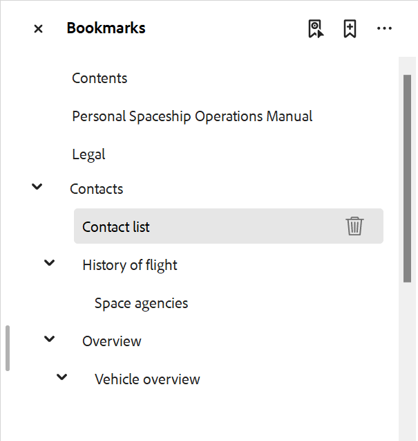

# 在PDF輸出中新增自訂書籤

一般而言，DITA map中的TOC會復製為最終PDF輸出中的書籤。 此TOC是根據DITA map中的主題或區段標題建立的。 有時您可能想要在PDF輸出中的特定內容上新增自訂書籤，以方便瀏覽。 若要達成此目的，請在元素上新增`outputclass`屬性，並套用下列屬性：

`bookmark-level: 3`

在此，`bookmark-level`是屬性，而數字`3`是指示書籤加入所在書籤階層中層級的值。 在下列範例中，第一層級主題「連絡人」有一個表格「連絡人清單」，我們已在其中新增值為`custom-bookmark`的`outputclass`屬性。


`custom-bookmark`類別的下列定義已新增至CSS檔案中：

```css
…
/*Adding a custom bookmark*/
.custom-bookmark{
    bookmark-level: 2
}
…
```

在PDF輸出中，*連絡人清單*&#x200B;表格新增到PDF書籤清單的第2層，如下所示：



>[!NOTE]
>
>您必須選擇新增自訂書籤的正確層級。 如果您指定的數字小於父級主題的書籤，則自訂書籤會佔據父級書籤的位置，而所有其他書籤都會顯示為子系。 這可能會導致意外的書籤結構。
