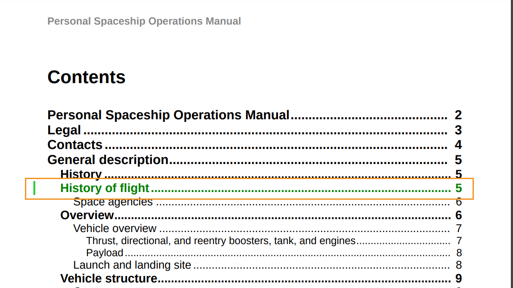

# 使用自訂變更列樣式

變更列是垂直線，以視覺化方式識別新內容或修訂的內容。 AEM Guides可讓您在主題內已變更內容的左側顯示變更列，也可在PDF輸出的目錄中顯示已變更的主題。

如需顯示變更列的詳細資訊，請參閱&#x200B;*發佈PDF輸出*&#x200B;中的[使用已發佈版本之間的變更列建立PDF](../web-editor/native-pdf-web-editor.md)設定。

## 主題中變更的內容

變更列會顯示在已插入、變更或刪除之主題的內容左側。

您可以修改下列樣式以顯示變更的內容以及變更列。


>[!NOTE]
>
>這些樣式是`layout.css`檔案的一部分，您可以視需要加以編輯。

例如，您可以使用`.inserted-block`樣式中的color屬性來定義插入內容在已發佈PDF輸出中的顯示方式。


```css
...
.inserted-block { 
  color: #2ECC40; 
  display: inline; 
  -ro-comment-content: " "; 
  -ro-comment-style: underline; 
  -ro-comment-title: "Inserted"; 
  -ro-comment-date: attr(data-time); 
  -ro-comment-dateformat: "yyyy/dd/MM HH:mm:ss"; 
} 
...
```

同樣地，您可以使用`.deleted-block`樣式來定義已刪除內容在已發佈PDF輸出中的顯示方式。

```css
...
.deleted-block { 
  display: inline; 
  color: #FF6961; 
  text-decoration: line-through; 
  -ro-comment-content: " "; 
  -ro-comment-style: strikeout; 
  -ro-comment-title: "Deleted"; 
  -ro-comment-date: attr(data-time); 
  -ro-comment-dateformat: "yyyy/dd/MM HH:mm:ss"; 
} 
...
```

您可以使用`.inserted-change-bar`和`.deleted-change-bar`樣式來修改更新內容左邊顯示的變更列外觀。

例如，您可以使用`-ro-change-bar-color`樣式中的`.inserted-change-bar`屬性，以綠色顯示插入的變更列。 您也可以使用`-ro-change-bar-color`樣式中的`.deleted-change-bar`屬性，以紅色顯示刪除的變更列。

```css
...
.inserted-change-bar { 
  -ro-change-bar-color: #2ECC40; 
} 

.deleted-change-bar { 
  -ro-change-bar-color: #FF6961; 
  } 
...
```


## 目錄(TOC)中的已變更主題

您也可以在PDF輸出的目錄，在已變更主題的左側新增變更列。 您可以在`-ro-change-bar-color`樣式中使用`.changed-topic`屬性，針對目錄清單中更新的主題，以您選擇的顏色新增變更列。

例如，您可以新增綠色變更列。

```css
...
.changed-topic { 
 -ro-change-bar-color: #2ECC40; 
}  
...
```


這會針對目錄中所有已進行部分更新的主題顯示綠色變更列。 您可以按一下目錄中的已變更主題並檢視詳細變更。


