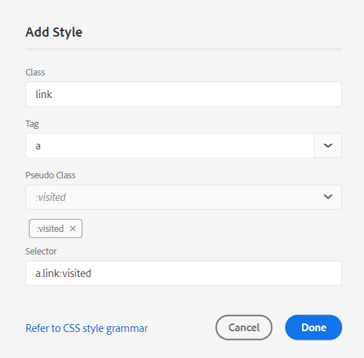

# PDF範本的元件 {#components-pdf-template}

PDF範本有四個元件：頁面配置、樣式表、資源和設定。 您可以自訂這些個別元件，並在產生PDF輸出時將範本與輸出預設集建立關聯，藉此建立範本。 以下各節將詳細介紹這些元件及其自訂程式。

## 建立和自訂頁面配置 {#create-customize-page-layout}

「頁面配置」元件中的設定可讓您定義頁面上的頁首、頁尾和內容區域，以設計頁面的結構。 使用WYSIWYG頁面配置編輯器，您可以為PDF中的不同區段建立頁面配置，例如正面與背面封面頁、章節、表格
內容(TOC)、索引、空白頁面、Front Matter Pages、Back Matter Pages、List of Figures (LOF)、List of Tables (LOT)、字彙表，或建立自訂頁面的配置。 在PDF範本設定中，您可以指派具有PDF中不同區段的頁面配置，然後使用這些區段來產生PDF輸出。

### 建立新的頁面配置 {#create-page-layout}

>[!NOTE]
>
>有現成可用的範例頁面配置。 您可以自訂這些或建立新的頁面配置。

1. 在Web編輯器中，移至&#x200B;**輸出**&#x200B;標籤。
1. 展開左側邊欄並按一下&#x200B;**範本**。
1. 開啟您要使用的範本。

   >[!NOTE]
   >
   >您可以按兩下範本名稱或按一下範本名稱旁的>圖示來開啟範本。

1. 若要建立新的頁面配置，請執行下列任一項作業：

   * 將游標暫留在&#x200B;**頁面配置**&#x200B;上，然後按一下（*選項*&#x200B;圖示） **...**&#x200B;並選擇&#x200B;**新頁面配置**。

   * 在&#x200B;**範本**&#x200B;面板中，按一下&#x200B;**範本**&#x200B;旁的&#x200B;**+**&#x200B;圖示，然後從內容功能表選擇&#x200B;**頁面配置**。

     這會開啟&#x200B;**新增配置**&#x200B;對話方塊。

     

1. 指定新頁面配置的名稱。
   >[!NOTE]
   >
   >在命名頁面配置時，請避免使用任何特殊字元。 名稱中的空格會以底線「_」取代。

1. 按一下&#x200B;**完成**。

   新版面即建立並新增至「頁面版面」下。

### 複製頁面配置 {#duplicate-page-layout}

1. 在要複製的範本之&#x200B;**範本**&#x200B;區段中，按兩下&#x200B;**頁面配置**&#x200B;或按一下&#x200B;**頁面配置**&#x200B;前的&#x200B;**>**&#x200B;圖示。

   這會顯示範本中的頁面配置清單。

1. 將滑鼠停留在您要複製的版面配置上，然後按一下（*選項*&#x200B;圖示） **...**，然後從內容功能表中選取&#x200B;**複製**。

1. 在&#x200B;_重複的配置_&#x200B;對話方塊中，輸入頁面配置的名稱。

1. 按一下&#x200B;**完成**。
所選頁面配置圖的副本隨即建立並新增至「頁面配置」下。

### 自訂頁面配置 {#customize-page-layout}

1. 在您要編輯之範本的&#x200B;**範本**&#x200B;區段中，按兩下&#x200B;**頁面配置**&#x200B;或按一下&#x200B;**頁面配置**&#x200B;前的&#x200B;**>**&#x200B;圖示。

   這會顯示範本中的頁面配置清單。
1. 若要自訂任何頁面配置，請執行下列任一項作業：
   * 按兩下任何頁面配置。
   * 將滑鼠停留在任何版面配置上，然後按一下（*選項*&#x200B;圖示） **...**，然後從內容功能表中選取&#x200B;**編輯**。

   這會開啟頁面配置編輯器以進行自訂。
1. 完成所需的變更後，按一下&#x200B;*儲存全部* （或`Crl+S`）。

   如需定義頁首、頁尾、頁碼、標題等個別版面配置元素的詳細資訊，請參閱[設計版面配置](design-page-layout.md)。

## 使用樣式表來自訂PDF {#stylesheet-customization}

樣式表元件中的設定可讓您使用WYSIWYG編輯器來設定頁面配置元件和DITA內容的樣式，或直接使用CSS檔案。 您可以建立自己的樣式，或是自訂預設的樣式屬性。 WYSIWYG編輯器可讓您存取設定頁面配置或DITA內容樣式所需的大多數屬性。 如需進階自訂，您可以直接在Source檢視中工作。

### 建立新樣式表 {#create-stylesheet}

雖然CSS檔案是針對內容和版面配置而提供的，但您可以建立新的樣式表以將多個自訂套用至特定樣式型別，然後可套用至目標元件。 依預設，範例CSS檔案是隨產品提供的。 這些CSS檔案的用意是協助您跨內容和版面組織樣式資訊。 您可以選擇將這些樣式合併到單一CSS檔案或多個檔案中。

根據預設，每當您建立新版面配置時，`layout.css`檔案都會包含在新版面配置中。 如果您希望頁面配置包含不同CSS檔案的樣式，您只需將所需的CSS檔案拖放至新頁面配置的內容編輯區域。 若要驗證CSS檔案是否已內嵌在頁面版面配置中，請切換至Source檢視，您將會在`<head>`元素中找到CSS檔案的連結。

若要建立樣式表，請遵循下列步驟：
1. 在&#x200B;**範本**&#x200B;面板中，執行下列任一項作業：
   * 將游標暫留在&#x200B;**樣式表**&#x200B;標籤上，然後按一下（*選項*&#x200B;圖示） **...**，然後選擇&#x200B;**新增樣式表**。
   * 按一下&#x200B;**範本**&#x200B;旁的&#x200B;**+**&#x200B;圖示，然後從內容功能表選擇&#x200B;**樣式表**。

   這會開啟新增樣式表對話方塊。

   
1. 指定新樣式表的名稱。
1. 按一下&#x200B;**完成**。

   隨即建立新樣式表並新增至「樣式表」區段下。

### 建立新樣式 {#create-style}

依預設，範本隨附的CSS檔案包含標題、段落、字元、超連結、影像、表格、div、頁面和其他樣式的樣式。 您可以覆寫預設樣式格式或建立新樣式。

您可以建立新樣式以將其用於範本的頁面配置，或為任何DITA元素套用自訂樣式。 若要將這些自訂樣式套用至DITA元素，您必須確定樣式的類別名稱與DITA元素的名稱或`outputclass`屬性相同。  例如，DITA中的`
`是由CSS中的`.div {}`或其`outputclass`屬性所控管。 如果您在DITA中套用`
`，則它受CSS中的`.div {}`或`.my-div {}`所控管。

若要建立新樣式，請遵循下列步驟：
1. 展開左側邊欄，然後按兩下您要建立樣式的範本。
1. 展開&#x200B;**樣式表**&#x200B;區段。 它會開啟包含所有樣式選項的&#x200B;**樣式**&#x200B;面板。
1. 選取+圖示以新增樣式。

   **新增樣式**&#x200B;對話方塊開啟。

   

1. 指定&#x200B;**類別**&#x200B;名稱。 若要將樣式套用至DITA元素，請確定樣式的類別名稱與DITA元素的名稱或`outputclass`屬性相同。
1. 在&#x200B;**標籤**&#x200B;欄位（選擇性）中，選擇要建立新樣式的標籤。

1. 選取&#x200B;**Pseudo類別**&#x200B;來設定專案的樣式。 虛擬類別可協助您定義元素的特殊狀態。 例如，當您將滑鼠停留在元素上或焦點停留在元素上時，可使用偽類別來設定元素的樣式。 您也可以選取多個虛擬類別。 例如，您可以使用虛擬類別`a::visited {color: blue;}`來設定造訪連結的樣式。

1. 新增新樣式的選取器。 **選取器**&#x200B;欄位可協助您新增類別、標籤和虛擬類別組合以外的自訂選取器。 例如，您可以為表格內的所有超連結建立`table a.link`樣式。

   如需CSS標籤的詳細資訊，請檢視[參閱CSS樣式文法](https://www.w3.org/TR/CSS21/syndata.html#characters)。

1. 按一下&#x200B;**完成**。

   隨即建立新樣式並新增至樣式清單中。

### 自訂預先定義的樣式或新樣式 {#customize-style}

使用預設樣式建立新的CSS檔案或想要自訂現有CSS檔案中的樣式後，您可使用樣式編輯器執行此操作。

若要自訂樣式，請遵循下列步驟：
1. 連按兩下&#x200B;**樣式表**&#x200B;或按一下&#x200B;**樣式表**&#x200B;前的&#x200B;**>**&#x200B;圖示。

   這會顯示預設（內容和版面）和自訂CSS檔案。
1. 開啟樣式表以進行編輯。

   若要開啟樣式表進行編輯，請執行下列任一項作業：
   * 按兩下樣式表名稱。
   * 將滑鼠懸停在樣式表名稱上，然後按一下（選項圖示） ...並選擇編輯。

   這會開啟樣式表進行編輯，並在「樣式」面板中顯示樣式清單。

   

1. 若要自訂樣式，請選取要檢視的樣式，並使用樣式編輯器自訂它。

### 樣式的屬性

您可以在中央面板中編輯屬性，但可能很難取得所有值的快照。  **屬性**&#x200B;窗格可讓您快速檢視樣式的所有屬性和值。

在中心面板中，您可以編輯常用的屬性，但無法編輯CSS支援的所有屬性。 在&#x200B;**屬性**&#x200B;窗格中，您可以編輯CSS支援的所有屬性並加以預覽。 您不需要切換到來源檢視即可編輯任何屬性。

進一步瞭解如何使用樣式編輯器來[使用常見的內容樣式](stylesheet.md)。

## 使用資源 {#work-with-resources}

這是用來設計範本之所有資產的容器。 您可以將它視為一個資料夾，其中包含背景影像、自訂字型、標誌等資產。 每當您在範本中新增資產時，該資產都會上傳或存回資產資料夾。 然後，您可以使用這些資產來自訂或設計您的PDF範本。

若要將資產檔案新增至「資源」資料夾，請遵循下列步驟：

1. 將游標暫留在「資源」資料夾標籤上，然後按一下（選項圖示） ...並選擇「匯入」。

   這會開啟上傳Assets對話方塊。

   

   上傳資產檔案的路徑會顯示在&#x200B;**選取資產資料夾**&#x200B;欄位中。
   >[!NOTE]
   >
   >您無法變更上傳資產的路徑。 依預設，所有資產都儲存在`/content/dam/dita-templates/pdf/<PDF-template-name>`資料夾下。

1. 按一下&#x200B;**選擇檔案**，從您的本機電腦瀏覽資產檔案

1. 按一下&#x200B;**上傳**。
選取的檔案會匯入並列在「資源」資料夾下。

## 進階PDF設定 {#advanced-pdf-settings}

使用「設定」區段可設定PDF頁面配置的進階設定(從奇數或偶數頁面開始PDF、互動參照格式)，以及啟用在產生的最終PDF中列印標籤
使用範本。

>[!NOTE]
>
> 從Experience Manager Guides 5.0/2025.02.0版開始，進階PDF設定中的&#x200B;**列印**&#x200B;區段已移至&#x200B;**輸出預設集**&#x200B;面板。 若要設定列印設定，請檢視[發佈PDF輸出](../web-editor/native-pdf-web-editor.md#print)。

若要設定，請按一下&#x200B;**範本**&#x200B;面板中的&#x200B;**設定**&#x200B;以檢視下列選項：

### 一般

設定從奇數或偶數頁開始章節的基本組態設定、目錄結構，並定義目錄專案的導線格式。 您可以定義下列設定：

* **從**&#x200B;開始任何新章節：可讓您定義每個章節在最終PDF中的發佈方式。 您可以從&#x200B;**新頁面**、**奇數頁面**、**偶數頁面**&#x200B;或&#x200B;**目前頁面**&#x200B;選項中選擇。 如果您選擇從奇數頁開始新章節，則會插入空白頁至結束於奇數頁的章節之後。 例如，如果您的章節結束於第15頁，則發佈程式將插入空白的16th頁，以便新章節可以從17th頁開始。  如果您選擇&#x200B;**目前頁面**&#x200B;選項，則所有章節都會連續發佈，不會出現任何分頁符號。 例如，如果章節結束於第15頁的中間，則下一個章節也會從第15頁本身開始。

* **從新頁面開始每個主題**：如果您希望章節中的每個主題都從新頁面開始，請選取&#x200B;**從新頁面開始每個主題**&#x200B;選項。 如果您希望主題持續進行，而不留任何頁面間隙，請取消選取此選項。

* **目錄結構**：可讓您自訂目錄階層。 它會使用以下額外設定：

   * **使用標題到層級**：它可讓您調整要在PDF的目錄結構中顯示的標題層級數目。
   * **不要顯示目錄**&#x200B;中第一層的頁碼：選取此選項可隱藏包含巢狀或子主題之所有章節的對應頁碼。 請考量下列範例，其中在不選取此選項的情況下建立輸出。

  

  在上述範例中，進階PDF設定、附錄和法律是第一層級主題標題或章節標題。 頁碼會指定給所有這些標題。

  現在，如果您選取此選項並產生輸出，則會取得以下目錄：

  

  在這裡，您可以注意到第一個章節進階PDF設定未提供任何頁碼，因為它有巢狀或子級主題。 而頁碼（如果指定給「附錄」和「法律」），則是因為它們是獨立主題，沒有任何子主題。

* **不要在目錄中顯示章節編號** ：選取此選項可顯示目錄中不含章節編號的章節名稱。   依預設，章節編號會顯示在PDF輸出的目錄中。
* **導線格式**：使用下拉式功能表選取「虛線」、「實線」或「空格導線」，將標題層級連線至其對應的頁碼。
若要套用目錄結構和樣式標題層級，請參閱[新增章節目錄](design-page-layout.md#add-chapter-toc)。

  >[!NOTE]
  >
  >如果您是CSS開發人員，則也可以直接在CSS檔案中定義導線格式。

* **使用資料表接續標籤**：選取此選項可定義跨多頁之長資料表的標籤。
您可以定義要在分頁前後顯示的文字。 例如，表格在第5頁中斷，而您為`<Continued on page %page-num%>`中斷前文字&#x200B;**定義**。  文字在第5頁底部顯示「繼續於第6頁」。

  使用語言變數來定義分行前後連續標籤文字。 根據您選取的語言，系統會自動在PDF輸出中挑選當地語系化的值。 例如，您可以將`Continued on page %page-num%`以英文和德文的文字發佈。`Fortsetzung auf Seite %page-num%`

  暫留在 接近檢視其詳細資訊的選項。
* **將字彙表辭彙連結至字彙表頁面**：選取此選項可將字彙表辭彙顯示為內容中的超連結，並將它們連結至字彙表頁面上的辭彙。 這可協助讀者快速檢視辭彙表中定義的辭彙定義。

  若要將字彙表辭彙轉換成超連結，您需要：
   * 啟用DITA map **頁面配置順序**&#x200B;索引標籤中的&#x200B;**字彙表**。
   * 在書本地圖的Back Matter Pages中新增字彙表。

  如果您未啟用「字彙表」頁面，內容中的「字彙表」字彙不會轉換為PDF輸出中的超連結。
  <!--For more information on using table continuation markers, see Use table continuation markers.-->

### 頁面配置 {#page-layouts}

「版面配置」設定可讓您完全控制要用於檔案特定區段的版面配置。 例如，若要選取目錄的版面，請按一下目錄欄位下的下拉式功能表，然後選取您設計用來產生目錄的版面。

請務必注意，書籤地圖設定的優先順序高於頁面版面設定。

「頁面配置」區段下提供下列設定：

**預設版面配置**：選取作為PDF中所有頁面預設版面配置的版面配置。 這是基礎版面配置，會套用到您尚未建立專用版面配置的區段或主題。

**不同區段的版面配置**：您可以使用PDF輸出的下列區段來對應版面配置。 如果您已設計相關區段的版面配置，請從下拉式清單中選取它。 如果尚未為特定區段建立頁面配置，則會套用預設頁面配置。

* **章節與主題**：您可以指定章節與主題的頁面配置。 選取的版面配置將套用至所有章節和主題。

* **目錄**：如果您已設計目錄頁面配置，請在下拉式清單中選取&#x200B;**目錄**，檔案中的所有目錄頁面都會有目錄頁面配置。

* **插圖和表格清單**：您也可以指定插圖和表格的版面配置。 選取的版面配置將套用至所有圖表和表格。

* **索引**：如果您已設計索引頁面配置，請將其對應到索引選項。 您可以使用樣式表，在PDF輸出中設定不同索引元素的樣式。 使用索引樣式`.idx-header`、`.idx-footer`、`.idx-body`、`.idx-title`、`.idx-keyword-group`、`.idx-unit`、`.idx-keyword`、`.idx-name`、`.idx-link`和`.idx-child`來自訂索引元素的樣式。

* **字彙表**：如果您有字彙表頁面配置，請將其對應到字彙表選項。

  PDF輸出的字彙表中的辭彙一律按字母順序排序。

  您也可以新增標籤`sort-as`，以定義字彙表辭彙的排序索引鍵。 Experience Manager Guides接著會使用排序索引鍵來排序字彙表辭彙，以取代字彙表辭彙。 如果您尚未定義排序索引鍵，則會使用字彙術語來排序。 例如，您可以將標籤`sort-as`新增至`glossterm`，並將字詞「USB」（例如`A`）的值設為`<glossterm>USB<sort-as>A</sort-as></glossterm>`。 同樣地，您可以新增`sort-as`標籤，並將字詞「Pen Drive」的值設為`B`。 當您排序這些字彙術語時，字彙術語「USB」的排序索引鍵`A`會出現在字彙術語「Pen Drive」的排序索引鍵`B`之前。 因此，在PDF輸出中，「USB」在字彙表頁面上位於「Pen Drive」之前。

  使用樣式表，您可以在PDF輸出中設定不同辭彙表元素的樣式。 使用辭彙樣式`.glo-header`、`.glo-footer`、`.glo-body`、`.glo-title`、`.glo-unit`、`.glo-link`和`.glo-term`來自訂辭彙元素的樣式。

  進一步瞭解如何使用樣式編輯器來[使用常見的內容樣式](stylesheet.md)。

* **Front Matter Pages和Back Matter Pages**：這些版面配置定義了您書本中前後重要頁面的樣式。 如果您已設計正面事項版面，請將它對應至&#x200B;**正面事項頁面**&#x200B;選項。 當您從下拉式清單中選取正文版面時，正文版面會套用至正文出現的所有主題。

  如果您已設計背面材質版面，請將其對應至&#x200B;**背面材質頁面**&#x200B;選項。 當您從下拉式清單中選取後置事項版面配置時，後置事項版面配置會套用至後置事項中存在的所有主題。

  **Front Matter Pages**&#x200B;也用作&#x200B;**目錄**、**圖表清單**&#x200B;和表格清單的遞補配置。  同樣地，**Back Matter Pages**&#x200B;也用作&#x200B;**索引**&#x200B;和&#x200B;**字彙表**&#x200B;配置的遞補配置。 如果您尚未選取這些專案的版面，則會套用選取的前面或背面重要頁面版面。  如果您尚未選取「正面」或「背面」重要頁面配置，則會套用預設頁面配置。

* 空白頁面的&#x200B;**頁面配置**：    您也可以指定空白頁面的版面配置。 選取的版面配置將套用至所有空白頁面。 例如，如果您已為所有空白頁面設計「空白頁面」版面配置，請在下拉式清單中選取&#x200B;**空白**，則檔案中的所有空白頁面都將具有「空白頁面」版面配置。

* **封面頁與後頁**：如果您已設計封面版面配置，請將它對應至&#x200B;**封面頁**&#x200B;選項。 同樣地，如果您有後頁版面配置，則將其對應至&#x200B;**後頁**&#x200B;選項。 如果尚未建立封面或背面版面配置，則會套用預設版面配置。

如需頁面配置的詳細資訊，請參閱[設計頁面配置](design-page-layout.md)。

### 頁面配置順序 {#page-order}

您可以在PDF中顯示或隱藏下列區段，以及安排這些區段在最終PDF輸出中的顯示順序：

* 目錄
* 章節與主題
* 圖表清單
* 表格清單
* 索引
* 字彙表
* 引用

  

  如果您不想在PDF輸出中顯示特定區段，可以關閉切換開關來隱藏該區段。

  您也可以定義這些區段在PDF中的產生順序。 若要變更這些區段的預設順序，請選取虛線以將區段拖放到所需位置。

  >[!NOTE]
  >
  > 順序和包含設定僅適用於DITA map。 對於書籤，這些設定不適用。 書籤中的頁面會依書籤區段的順序顯示。

.
**章節與主題**&#x200B;配置一律預設為啟用。 您無法將其切換。

**合併頁面**

依預設，所有區段都會從新頁面開始。 從&#x200B;**合併為**&#x200B;下拉式清單中選取&#x200B;**上一頁**&#x200B;或&#x200B;**下一頁**&#x200B;選項，以將區段與上一頁或下一頁合併。 這會將區段發佈為PDF輸出中所選頁面的延續。 這樣，兩者之間就不會有分頁符號。

>[!NOTE]
>
> 此設定僅適用於區段，不適用於其元件。  例如，如果您為&#x200B;**章節與主題**&#x200B;選取&#x200B;**上一頁**&#x200B;選項，**章節與主題**&#x200B;區段會與上一頁合併。 各種章節和主題會根據&#x200B;**一般**&#x200B;設定發佈。例如，若在&#x200B;**從設定**&#x200B;開始任何新章節，您選取&#x200B;**奇數頁面**，則會在結尾為奇數頁面的章節後面插入空白頁面。

將區段合併至上一頁或下一頁時，會合併內容，並套用內容合併的目標區段樣式。

例如，若您啟用&#x200B;**目錄**&#x200B;和&#x200B;**章節與主題**，並選取&#x200B;**目錄**&#x200B;的&#x200B;**下一頁**，則&#x200B;**目錄**&#x200B;會與下一區段（即&#x200B;**章節與主題**）合併。 **章節與主題**&#x200B;區段的樣式已套用至兩個區段的合併內容。

合併選項會連續運作，因此如果您為多個連續區段選取&#x200B;**下一頁**，它們都會與未設定此屬性的第一個區段（在下一個方向）合併。 例如，您啟用&#x200B;**目錄**、**章節與主題**、**插圖清單**&#x200B;和&#x200B;**索引**。 然後，如果您為&#x200B;**目錄**、**章節與主題**、**插圖清單**&#x200B;和&#x200B;**無**&#x200B;設定&#x200B;**下一頁** （針對&#x200B;**索引**），則它們都會與&#x200B;**索引**&#x200B;合併。

**靜態頁面**

各種版面配置可協助您設計各種區段的輸出。 這些區段是在您發佈輸出時從DITA map產生的。
您也可以建立自訂頁面配置，並在PDF輸出中發佈為靜態頁面。 這可協助您新增任何靜態內容，例如備註或空白頁面。

執行以下步驟以新增自訂頁面配置：

1. 選取「**新增**」以新增頁面配置。 「新增頁面配置」面板隨即開啟。
2. 從清單中選取版面配置，然後按一下「新增」。 新的版面配置會新增至版面配置清單。

您也可以執行下列動作：

* 選取虛線條，將頁面版面配置拖放至所需位置。

* 選取&#x200B;**移除配置** 以移除配置。

* 您也可以將靜態頁面與上一頁或下一頁合併。

* 您也可以多次新增自訂版面並加以排序。 這可協助您據以發佈靜態內容。

  例如，您可以使用自訂版面配置，在PDF輸出中多次發佈靜態警告。

### 頁面組織

PDF檔案中的頁面通常會根據DITA map或bookmap檔案中組織的內容發佈。 不過，您也可以變更PDF檔案中的頁面順序。 例如，您可以列印多頁檔案作為小冊子。 當您整理、摺疊、裝訂工作表時，結果會是一本具有正確頁面順序的書。  接著，您就可以像讀書一樣閱讀已出版的小冊子。

下列設定可在&#x200B;**頁面組織**&#x200B;區段下使用：

#### 頁面順序

選取決定PDF檔案中頁面順序的頁面順序。 您可以從下拉式清單中選擇下列選項：

* **預設**：頁面在來源檔案中的預設順序。
* **奇數頁在前**：所有奇數頁會移到所有偶數頁之前。
* **偶數頁在前**：所有偶數頁都會移到所有奇數頁之前。
* **反向**：頁面順序反向。
* **小冊子**：所有頁面都以小冊子排序。
* **從右至左的小冊子**：所有頁面都是從右至左的小冊子順序。
* **自訂**：定義自訂頁面順序，而非預先定義的順序。
   * &quot;a..b」 — 從a到b的所有連續頁面。
   * &quot;a，b，c&quot; — 新頁面順序a、b、c。
   * &quot;a*b&quot; — 頁面a重複b次。
   * &quot;-a&quot; — 負頁數會從最後一頁開始往後計數，並可與其他自訂訂單結合。
   * 「X」 — 檔案的所有頁面。 與「1..-1」。

例如，您可以提供自訂順序，例如「2,3，5*2,7..10，-1，-2」。
給定的頁面順序會導致PDF在原始檔案中具有以下頁碼（假設它共有25頁）：2、3、5、5、7、8、9、10、25、24。

#### 每張工作表設定一個以上的頁面

選擇此選項可在單張紙上發佈多個頁面。  然後，選取列數和欄數，並像網格一樣將頁面發佈到單一工作表上。 例如，您可以以2列和4欄的網格發佈頁面。

定義目標頁面大小和您要發佈頁面的方向。 您也可以指定頁面的邊界與邊框間距屬性。

### 交叉引用 {#cross-references}

使用&#x200B;**互動參照**&#x200B;標籤來定義互動參照在PDF中的發佈方式。 您可以設定主題標題、表格、插圖等專案的互動參照格式。

>[!NOTE]
>
> 如果您在插入互動參照時已定義連結文字，則其優先於原生PDF範本中定義的互動參照格式。

您也可以使用變數來定義互動參照。  使用變數時，系統會從屬性中挑選變數值。 您可以使用單一變數或變陣列合來定義互動參照。 您也可以使用字串和變數的組合。

例如，您可以使用`View details on {chapter}`。 如果章節名稱是「一般設定」，則輸出中的互動參照是「檢視一般設定的詳細資料」。

AEM Guides提供下列現成可用的變數：

* {title}：建立主題標題的互動參照。 例如，請參閱第2頁上的實用連結。
* {page}新增頁碼的互動參照。 例如，請參閱第1頁的。
* {description}：新增描述文字的互動參照。 例如，請參閱AEM Guides的詳細資料。
* {chapter}：新增章節編號的互動參照。 例如，請參閱第1章的。
* {bookmarkText}：建立書籤文字的互動參照。 例如，請參閱第5頁的stop_words 。
* {captionText}：建立主題中圖形或表格標題的互動參照。 例如，請參閱第2頁上的氣流。
* {figure}：新增圖數的互動參照。 從您為圖形定義的自動編號樣式中挑選圖形編號。  例如，您可以在頁面{figure}上使用「檢視{page}」。 輸出中的互動參照包含自動產生的數字及其頁碼「請參見第5頁的圖1」。
* {table}：新增資料表編號的互動參照。 從您為註解定義的自動編號樣式中挑選表格編號。 例如，您可以在頁面{table}上使用「檢視{page}」。 輸出中的互動參照包含自動產生的表格編號及其頁碼「請參閱第5頁的表1」。

  >[!NOTE]
  >
  >您可以為註解和圖形標籤建立自動編號樣式。

#### 預設互動參照格式

如果您將文字欄位保留為空白，且在插入互動參照時尚未定義連結文字，Experience Manager Guides會為個別互動參照新增下列變數：

* **標題**： `{title}`
* **描述**： `{description}`
* **段落**： `{bookmarkText}`
* **書籤**： `{bookmarkText}`
* **圖**： `{captionText}`
* **資料表**： `{captionText}`

互動參照的優先順序為：
* 交叉引用中新增的連結文字
* 原生PDF範本中定義的互動參照格式
* 預設互動參照格式

#### 交叉引用中的語言變數

您也可以使用語言變數來定義當地語系化的互動參照。 根據您選取的語言，系統會自動在PDF輸出中挑選當地語系化的值。

例如，您可以新增語言變數「reference-label」，並以英文和德文定義值。

* 英文 — 「在頁面{page}上檢視」
* 德文 — 「Einzelheiten finden Sie auf der Seite {page}」

當您將`${lng:<variable name>}`新增至「段落」區段時，輸出段落中的互動參照會包含當地語系化文字和頁碼。\
例如，下列熒幕擷取畫面以英文顯示「View on page 1」互動參照，以德文顯示「Einzelheiten finden Sie auf der Seite 1」。

*以英文發佈時，段落中的互動參照。*

*以德文發佈時，段落中的互動參照。*

<!--For more information, see *Format cross-references*.-->
