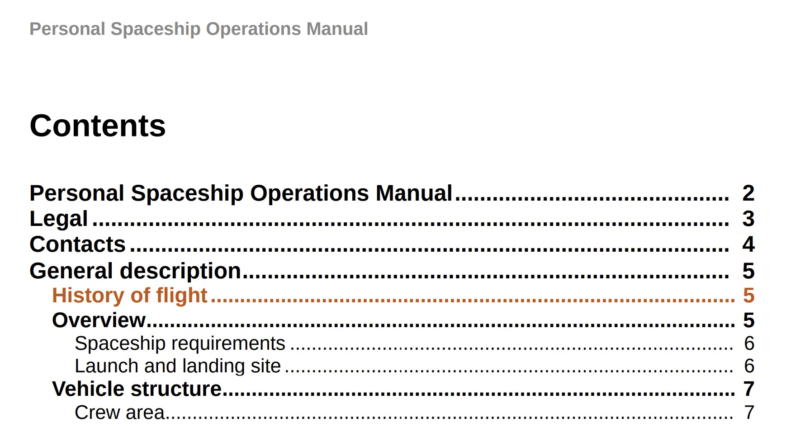

# 在目錄專案和主題內容套用自訂樣式

有時，您可能會想要在目錄專案或特定主題上套用自訂樣式。 這可透過將`outputclass`屬性與DITA map中的`<topicref>`元素建立關聯來達成。 此外，如果您想要將自訂格式套用至整個主題，也可以透過在CSS中擴充屬性的樣式定義來達成。

以您要傳送以供檢閱的新主題為例。 為方便識別更新的主題，您需要將`outputclass`屬性新增到DITA map中的`<topicref>`元素，然後在CSS中為相同專案定義自訂樣式。

在下列範例中，*航班歷史記錄*&#x200B;主題已指派值為`new-topic`的`outputclass`屬性。


CSS中`new-topic`的類別定義可讓您定義下列專案的樣式：
* 目錄或迷你目錄中的主要專案
* 主要內容中的主題標題
* 主題的整個內容，包括標題

讓我們看看如何在CSS中定義這些案例。 在以下`new-topic`類別的CSS定義中，文字顏色已變更。

```css
…
.new-topic {
  color: #CC5309
}
…
```

此定義控制目錄中的文字顏色和主題標題。 下列PDF輸出顯示目錄專案上套用的不同顏色：



主題的標題也會使用相同的顏色設定樣式。


如果您希望目錄專案和主題的標題有不同的樣式，可以分別定義它們，如下所示：

```css
...
/*for styling TOC entry */
.new-topic {
  color: #CC3509
}

/* for styling topic's title */
.new-topic.title {
  color: #092ACC
}
...
```

最後，您也可以在主題內的整個內容上套用樣式。 為此，您需要將尾碼&quot;`-content`&quot;新增至類別名稱。 在下列範例中，變更列已新增至主題的整個內容中：

```css
...
/* for styling the topic's content */
.new-topic-content {
  -ro-change-bar-color: #A609CC;
}
...
```

使用上述樣式屬性，變更列會新增至&#x200B;*航班歷史記錄*&#x200B;主題的左側，如下所示：


## 從目錄移除空白列

如果您尚未定義任何主題的標題，則此類主題的目錄會顯示空白列。

若要從目錄和迷你目錄移除空白列，請在`layout.css`中新增下列樣式：

```css
.toc-body a:empty,
.chaptoc-body a:empty {
    display: none;
} 
```

