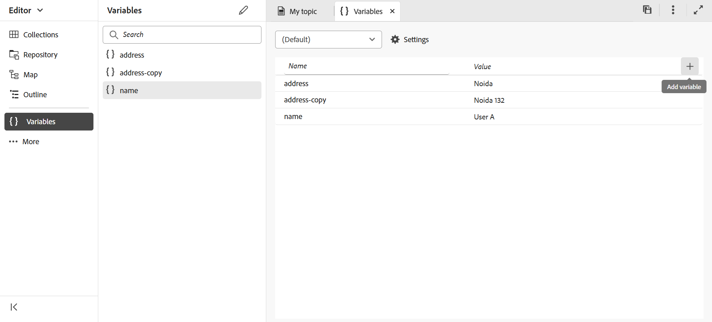
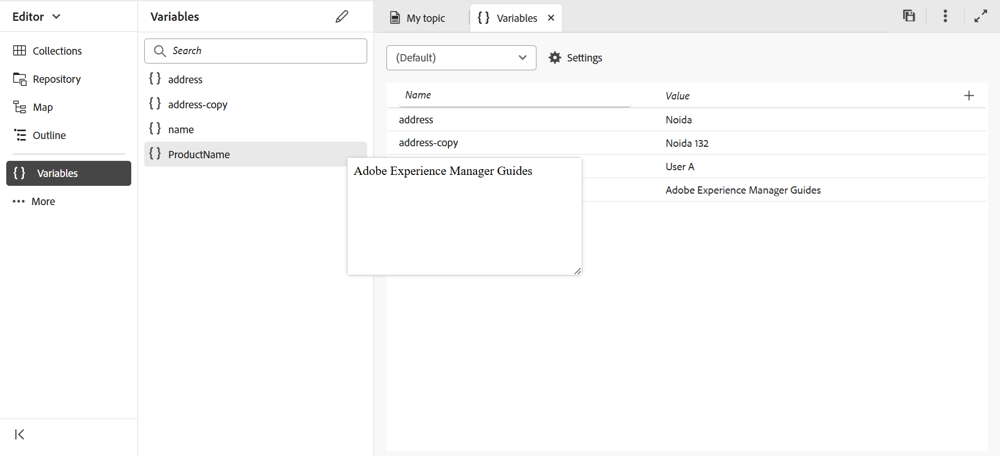
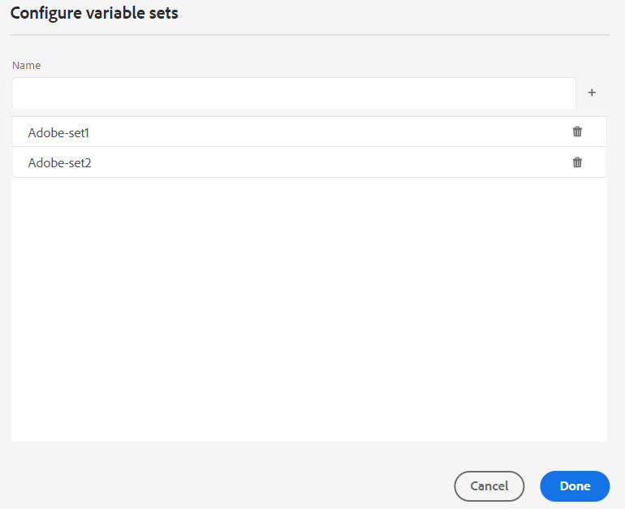
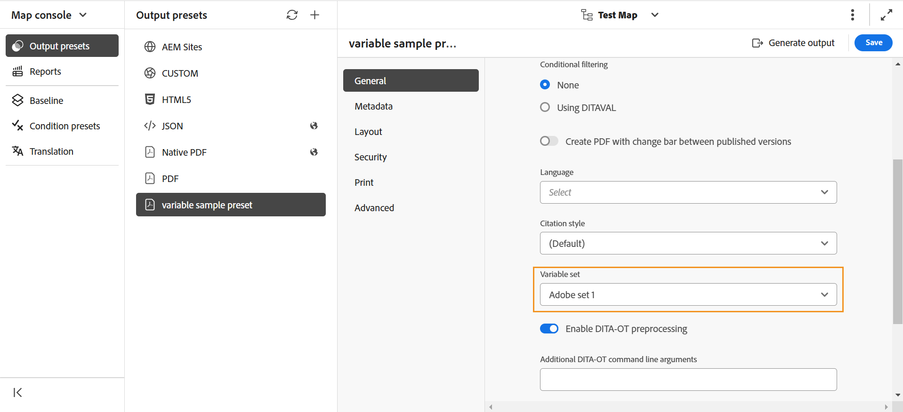

# PDF輸出中的變數

變數是一組名稱 — 值資料，可當作可重複使用的資訊使用。 如此一來，您的內容便攜、易於更新。 當您修改變數或其值時，該變數或值的每個例項都會更新。

## 建立新變數

執行以下步驟來建立變數：

{width="800" align="left"}

*建立變數並定義其值。*

1. 在編輯器中，導航到左側面板並選擇 **變數** 。此選項在「更多」部分下可用。
1. 選取 **編輯** 以開啟&#x200B;**變數**編輯器。
變數會依字母順序列出。
1. 在&#x200B;**Name**&#x200B;資料行中輸入變數名稱，並在&#x200B;**Value**&#x200B;資料行中輸入其值。
   >[!TIP]
   >
   >您可以使用任何HTML內容作為變數值，以特定格式顯示變數值。 例如，您可以將標記添加到 `<b>` 變數值，以粗體顯示該值 **Experience Manager指南** 。 您也可以將存放庫中的影像新增為值。

1. 選擇「 **添加變數」。** 以新增變數。 您無法建立與現有變數同名的變數。 顯示錯誤。

   >[!NOTE]
   >
   >如果您未選取&#x200B;**新增變數** ，未建立變數並將其新增至清單。

如此一來，您便可建立具有預設值的變數。 例如：
* 產品名稱：Experience Manager Guides
* 版本號碼：2300
* 發行日期： 2023年1月1日

### 編輯變數

編輯變數有兩個方法：

**從左側的[變數]面板**

1. 在&#x200B;**變數**&#x200B;面板中選取變數。
1. 將滑鼠停留在變數上以檢視&#x200B;**選項**&#x200B;功能表，然後選取&#x200B;**編輯**&#x200B;選項。
1. 在&#x200B;**編輯變數**&#x200B;對話方塊中，您可以編輯所選變數的預設值。
1. 選取「**完成**」。

**來自變數編輯器**

1. 選取&#x200B;**變數** 左側面板中的。
1. 選取&#x200B;**編輯** 以開啟&#x200B;**變數**&#x200B;編輯器。

1. 在&#x200B;**變數**&#x200B;編輯器中，您可以編輯所選變數的值。

您必須儲存從&#x200B;**變數**&#x200B;編輯器所做的任何變更，才能在左邊的&#x200B;**變數**&#x200B;面板中檢視這些變更。

>[!NOTE]
>
> 如果您編輯任何變數值，Adobe Experience Manager Guides會同時更新所有參照（如適用）。

### 搜尋和預覽變數

您可以搜尋及預覽變數的值。 在&#x200B;**變數**面板的搜尋方塊中輸入字串。 它會根據變數名稱及其值來搜尋。
您可以透過兩種方式預覽變數：

變數的預覽會顯示預設值。 例如，如果您已將ProductName變數的預設值定義為「Adobe Experience Manager Guides」，它會在預覽中顯示此值。

**從左側的[變數]面板**

1. 在&#x200B;**變數**&#x200B;面板中選取變數。
1. 將滑鼠停留在變數上以檢視&#x200B;**選項**&#x200B;功能表，然後選取&#x200B;**預覽**&#x200B;選項。

   從變數面板預覽{width="550" align="left"}

*預覽變數的預設值。*

**來自變數編輯器**

1. 將滑鼠停留在清單中的變數上以檢視&#x200B;**選項**&#x200B;功能表。
1. 選取&#x200B;**預覽**。

### 複製變數

您可以複製變數，並根據需求修改值。

1. 將滑鼠停留在清單中的變數上以檢視&#x200B;**選項**&#x200B;功能表。
1. 選取&#x200B;**複製**。

變數的預設名稱為`<selected variable name>` （如「範例」）。 您可以根據自己的需求變更名稱。

### 刪除變數

您可以透過兩種方式刪除變數：

**從左側的[變數]面板**

1. 在&#x200B;**變數**&#x200B;面板中選取變數。
1. 將滑鼠停留在變數上以檢視&#x200B;**選項**&#x200B;功能表，然後選取&#x200B;**刪除**&#x200B;選項。

**從變數編輯者**

1. 將滑鼠懸停在清單中的變數上以視圖 **選項** 功能表。
1. 選擇 **刪除** 選項。

變數會從所有變數集中刪除。

## 輸出預設集的變數集

Adobe Experience Manager Guides也支援變數集，可讓您指派變數替代值。 例如，一家公司可以銷售兩種產品：A和B。每一種都有不同的規格。 這些規格可能包括產品名稱、版本號和發行日期。 在品牌化上可能還有其他差異。 使用變數集，您可以為變數定義一組不同的值。 生成輸出時，選擇適當的變數集並生成所需的輸出。

### 設定變數集

您需要先設定變數集，然後再新增變數。

1. 選取&#x200B;**設定** 以開啟&#x200B;**設定變數集**對話方塊。
   {width="550" align="left"}
1. 在&#x200B;**Name**&#x200B;欄中輸入變數集名稱。
1. 選取&#x200B;**新增變數** 以新增變數集。 變數集會依字母順序列出。
1. 您可以選取&#x200B;**刪除**&#x200B;以移除變數集。

### 變數集作業

所有變數集都具有相同的變數，但可能有不同的值。

您可以檢視、編輯和預覽特定變數集的值。 從&#x200B;**變數集**下拉式清單中選取變數集。 值會根據所選變數集而顯示。
當您編輯特定變數集中的變數值時，它會覆寫預設值並變更所選變數集的值。
例如，您可以為變數集設定下列值，*Adobe-set1*&#x200B;和&#x200B;*Adobe-set2*。

**變數集1**： *Adobe-set1*

* ProductName： ProductA
* 版本號碼：2311
* 發行日期： 2023年11月2日

**變數集2**： *Adobe-set2*

* ProductName： ProductB
* 版本號碼：2310
* 發行日期： 2023年9月7日

每個新變數都會新增至所有變數集。 當您刪除或複製變數時，將會為所有變數集更新。

您也可以預覽變數集的值。
例如，針對變數集*Adobe-Set1*，您已將ProductName變數的值定義為「ProductA」，然後在「變數」編輯器的預覽中顯示此值。

從變數編輯器預覽{width="550" align="left"}

*預覽您在選取的變數集中定義的值。*

### 重設變數的值

如果您已編輯值，您也可以將變數重設為預設值。
重設 針對具有變更值的變數顯示。
例如，您可以將ProductName變數的值重設為預設值Experience Manager Guides。

## 在原生PDF範本中使用變數

您可以在產生產品檔案輸出時新增變數，使其可攜式且易於更新。 您可以將這些變數插入檔案中的不同頁面所顯示的頁面版面配置中。 例如，您可以新增出現在頁面配置圖頁首區域（或任何其他部分，如頁尾或內文）的變數ProductName。

若要在標頭區域中插入變數（如ProductName），請執行下列步驟：
1. 開啟編輯所需的版面配置。

   >[!NOTE]
   >
   > 檢視[自訂頁面配置](../native-pdf/components-pdf-template.md#customize-a-page-layout-customize-page-layout)區段，以開啟頁面配置以供自訂或編輯。

1. 選取標頭，將其設為使用中以插入變數。

1. 您可以兩種方式插入變數：

   **從左側的[變數]面板**

   * 從&#x200B;**變數**&#x200B;面板拖曳變數，並將其放置在標頭區域。

   **從工具列**

   1. 選取&#x200B;**插入變數/欄位** 。
   1. 在&#x200B;**變數**&#x200B;對話方塊中，選取變數的名稱，將其插入標頭區域。
   1. 您也可以在文字方塊中輸入搜尋字串。 包含指定字串的變數名稱會經過篩選，並顯示在清單中。 選取的變數會插入頁首區域中。 您可以檢視變數的預設值。
   1. 要替換變數，兩次按兩擊變數值，然後從 **“變數** ”對話框中選擇其他變數。 更換變數。

## 使用變數產生 PDF 輸出

您可以使用不同變數的值來產生PDF輸出。 產生版面之前，請從輸出預設集的&#x200B;**變數集**&#x200B;下拉式清單中選擇變數集以挑選其值。

{width="550" align="left"}

*從輸出預設集的下拉式清單中選取要用來產生PDF輸出的變數集。*

>[!NOTE]
>
> 您也可以從下拉功能表中選擇 （預設） 以發佈所有變數的預設值。

根據您選擇的變數集，您將獲得與變數集中定義的變數值相對應的輸出。 例如，如果選擇 變數 集 *Adobe Systems-set1*，則輸出將顯示此集中定義的變數值。

*使用頁面版面中的變數產生 PDF 輸出。*

您也可以在需要時快速更新任何變數集的值，並重新產生輸出。 例如，如果您需要更新版本的詳細資訊，可以在VersionNumber變數中更新版本的值並重新產生輸出。
