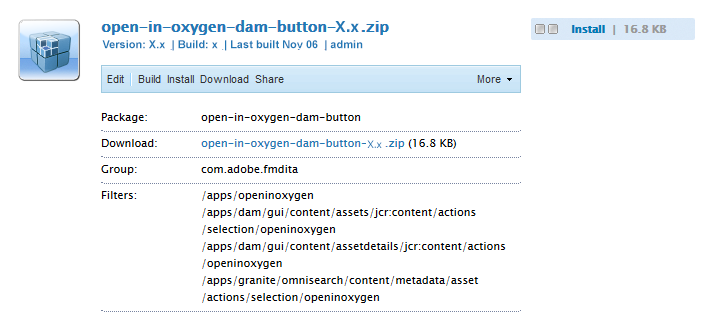
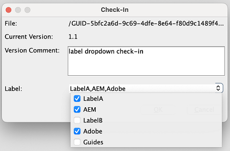

# Adobe Experience Manager Guides的氧氣外掛程式 {#id1645H6010Q5}

Adobe Experience Manager Guides的氧氣外掛程式\(稍後在指南中稱為AEM Guides的氧氣外掛程式\)可讓您連線氧氣XML作者與Adobe Experience Manager \(AEM\)存放庫，以製作和管理內容。 您可以使用外掛程式來瀏覽、搜尋和開啟檔案；取出和入庫檔案；在AEM存放庫中上傳資料夾和檔案。 案頭應用程式中的AEM Guides面板可讓您將所需的資料夾\(從AEM存放庫\)標示至我的最愛資料夾清單，以便快速存取。 此外，您可以在AEM網頁介面中安裝套件，並直接從AEM網頁介面在Oxygon XML Author中開啟DITA檔案。

## 下載並安裝 {#id1826M0L0PUI}

AEM Guides的氧氣外掛程式可透過您的Adobe軟體發佈入口網站取得。 在Experience Manager標籤中搜尋「氧氣」，然後從[Adobe軟體發佈入口網站](https://experience.adobe.com/#/downloads/content/software-distribution/en/general.html)下載外掛程式安裝程式。

>[!NOTE]
>
>請檢視特定Adobe Experience Manager Guides發行說明中的氧聯結器版本相容性。

安裝程式安裝完畢後，請將其安裝在安裝Oxygon XML Author的本機電腦上。 在開始安裝程式之前，您必須確定您的系統符合安裝AEM Guides氧氣外掛程式的技術需求。

### 技術需求

- Oxygon XML Author 26.1版

- Adobe Experience Manager Guides 4.6或更高版本

- Adobe Experience Manager 6.5版（含Service Pack 21、20和19）

- Oxyo XML Author 26.1版支援的作業系統

- Java Development Kit
   - oracleSE 8 JRE 1.8

### 在Windows上安裝外掛程式

>[!IMPORTANT]
>
>如果您的系統上安裝了舊版外掛程式，請務必先解除安裝該外掛程式，然後再開始安裝程式。 如需解除安裝指示，請參閱[如何使用套件](https://helpx.adobe.com/experience-manager/6-4/sites/administering/using/package-manager.html)文章中的&#x200B;**解除安裝套件**&#x200B;一節。

在安裝Oxygon XML Author的系統上執行下列步驟：

1. 啟動安裝程式的`.exe`檔案。

   安裝精靈的歡迎畫面隨即顯示。

1. 按一下[下一步]****，並瀏覽到可用Oxyo XML Author的.exe檔案的位置。

1. 選取檔案，然後按一下&#x200B;**開啟**。

   選取檔案的位置會新增至安裝精靈中。

1. 按一下「**下一步**」。

1. 按一下&#x200B;**安裝**。

1. 按一下&#x200B;**完成**&#x200B;以關閉安裝精靈。
1. 啟動Oxygon XML Author。

   AEM Guides面板會顯示在氧氣XML作者中。

   {width="800" align="left"}

   >[!NOTE]
   >
   >如果您沒有看到AEM Guides面板，請參閱疑難排解一節中的因應措施 — [缺少AEM Guides面板](#id192BH200ZAX)。


### 在Mac上安裝外掛程式

>[!IMPORTANT]
>
>如果您的系統上安裝了舊版外掛程式，請務必先解除安裝該外掛程式，然後再開始安裝程式。 請參閱[如何使用套件](https://helpx.adobe.com/experience-manager/6-4/sites/administering/using/package-manager.html)文章解除安裝指示中的&#x200B;**解除安裝套件**&#x200B;一節。

在安裝Oxygon XML Author的系統上執行下列步驟：

1. 在您的系統上找到外掛程式的.dmg檔案。

1. 連按兩下.dmg檔案以開啟檔案內容。

   .dmg檔案包含aem-connector-x.x資料夾和aem-connector-x.x-setup檔案。

   >[!NOTE]
   >
   >檔案名稱中的x.x是外掛程式的版本號碼。

1. 複製Oxygon XML Author的plugins資料夾中的aem-connector-x.x資料夾。
1. 按兩下aem-connector-x.x-setup檔案以啟動安裝程式。

1. 啟動Oxygon XML Author。

   AEM Guides面板會顯示在氧氣XML作者中。

    {width="800" align="left"}

   >[!NOTE]
   >
   >如果您沒有看到AEM Guides面板，請參閱疑難排解一節中的因應措施 — [缺少AEM Guides面板](#id192BH200ZAX)。


### 安裝可從AEM網頁介面啟用檔案編輯功能的套件 {#id182CE0Q0TY4}

身為作者，您可以直接從AEM網頁介面開啟並編輯Oxygon XML作者中的DITA map或主題。 若要在AEM網頁介面中啟用此功能，您的AEM管理員需要在您的AEM編寫執行個體中安裝套件。

以AEM管理員的身分，執行下列步驟來安裝套裝軟體：

1. 從您的IT團隊取得套件的.zip檔案。
1. 登入您的AEM執行個體&#x200B;*\（以管理員身分\）*，並瀏覽至CRX封裝管理員。 存取封裝管理器的預設URL為

   `http://<server name>:<port>/crx/packmgr/index.jsp`

   封裝管理員會管理本機AEM安裝上的封裝。 如需使用封裝管理員的詳細資訊，請參閱AEM檔案中的[如何使用封裝](https://experienceleague.adobe.com/docs/experience-manager-cloud-service/content/implementing/developer-tools/package-manager.html?lang=en)。

    {width="650" align="left"}

1. 若要上傳氧氣封裝，請按一下[上傳封裝]。****
1. 在「上傳封裝」對話方塊中，導覽至您在步驟1下載的Oxygon封裝檔案，然後按一下「確定」。

   套件會上傳到您的AEM執行個體。

1. 若要開始安裝程式，請按一下[安裝]。****

   {width="650" align="left"}

1. 在[安裝封裝]對話方塊中，按一下[安裝]。****
1. 安裝完成後，按一下CRX Package Manager左上角的「首頁」按鈕。
1. 在資產資料夾中選取DITA檔案。

   **在氧中編輯**&#x200B;選項在工具列中可用。 如需有關使用此選項的詳細資訊，請參閱[在AEM網頁介面的Oxygon XML Author中開啟DITA主題](#id182CE0I905Z)。

   >[!NOTE]
   >
   >當您選取一個DITA主題時，**在氧中編輯**&#x200B;選項是可見的。 如果您選取多個主題，則不會顯示選項。


## 設定AEM Guides的氧氣外掛程式 {#id1826KF00AHS}

下載並安裝外掛程式後，您需要設定下列專案才能使用外掛程式：

- **Web驗證設定**： AEM Guides外掛程式中SSO驗證的設定。
- **一般設定**：外掛程式的連線設定，例如AEM伺服器URL、登入詳細資料等。
- **在交叉參照中設定屬性自訂與檔案名稱的喜好設定**：檔案集的設定屬性配置需要此設定。

### Web驗證設定

氧聯結器外掛程式會將JxBrowser用於SSO驗證。 它是以chromium為基礎的瀏覽器。 若是Java 9+，需要非公用API的存取權，且您必須明確授與JxBrowser此存取權。 如需詳細資訊，請參閱[JxBrowser疑難排解](https://jxbrowser-support.teamdev.com/docs/guides/troubleshooting/issues.html)。

更新指定檔案，以設定AEM Guides氧氣外掛程式中的網頁驗證設定：

>[!NOTE]
>
>在更新檔案之前，請先備份檔案。

適用於Mac和氧氣26.1 ****

在env.sh中新增下列行

```java
--illegal-access=permit\
--add-opens=java.desktop/javax.swing.plaf.basic=ALL-UNNAMED\
--add-exports=javafx.controls/com.sun.javafx.scene.control=ALL-UNNAMED\
--add-exports=javafx.graphics/com.sun.javafx.stage=ALL-UNNAMED\
--add-exports=javafx.graphics/com.sun.javafx.scene=ALL-UNNAMED\
--add-exports=javafx.graphics/com.sun.javafx.scene.traversal=ALL-UNNAMED\
--add-exports=javafx.graphics/com.sun.javafx.tk=ALL-UNNAMED\
--add-exports=javafx.graphics/com.sun.glass.ui=ALL-UNNAMED\
--add-opens=javafx.graphics/com.sun.glass.ui=ALL-UNNAMED\
--add-opens=javafx.graphics/javafx.stage=ALL-UNNAMED\
--add-opens=javafx.graphics/com.sun.javafx.tk.quantum=ALL-UNNAMED\
--add-exports=java.desktop/sun.awt=ALL-UNNAMED\
--add-opens javafx.swing/javafx.embed.swing=ALL-UNNAMED
```

在oxyoAuthor.sh中新增下列行

```java
-Djdk.module.illegalAccess=permit\-Djava.ipc.external=true\
```

適用於Windows和氧氣的&#x200B;**26.1**

在env.bat中新增下列行

```java
--illegal-access=permit --add-opens=java.desktop/javax.swing.plaf.basic=ALL-UNNAMED --add-exports=javafx.controls/com.sun.javafx.scene.control=ALL-UNNAMED --add-exports=javafx.graphics/com.sun.javafx.stage=ALL-UNNAMED --add-exports=javafx.graphics/com.sun.javafx.scene=ALL-UNNAMED --add-exports=javafx.graphics/com.sun.javafx.scene.traversal=ALL-UNNAMED --add-exports=javafx.graphics/com.sun.javafx.tk=ALL-UNNAMED --add-exports=javafx.graphics/com.sun.glass.ui=ALL-UNNAMED --add-opens=javafx.graphics/com.sun.glass.ui=ALL-UNNAMED --add-opens=javafx.graphics/javafx.stage=ALL-UNNAMED --add-opens=javafx.graphics/com.sun.javafx.tk.quantum=ALL-UNNAMED --add-exports=java.desktop/sun.awt=ALL-UNNAMED --add-opens javafx.swing/javafx.embed.swing=ALL-UNNAMED
```

在oxyoAuthor.bat中新增下列行

```java
-Djdk.module.illegalAccess=permit -Djava.ipc.external=true
```

>[!NOTE]
>
>您必須以管理員身分，從Mac的oxygonAuthor.sh和Windows的oxygonAuthor.bat執行氧氣。

### 一般設定

執行以下步驟，在Adobe Experience Manager Guides的氧氣外掛程式中設定連線設定：

1. 在AEM Guides面板中，按一下設定圖示，然後選取&#x200B;**設定**。

   {width="800" align="left"}

1. 指定下列詳細資料：
   - **伺服器URL**： AEM伺服器的URL，例如：

     ```http
     http[s]://<host>:<port>
     ```

     在上述URL中，指定部署AEM伺服器的伺服器主機名稱和連線埠。

     >[!IMPORTANT]
     >
     >如果您的AEM伺服器部署在連線埠80或443上，則不需要在URL中指定。

   - **驗證：**&#x200B;從&#x200B;**基本\（使用者名稱/密碼\）**&#x200B;或&#x200B;**網頁驗證**&#x200B;中選擇。 如果您選取&#x200B;**基本**&#x200B;驗證，則需在[喜好設定]對話方塊中輸入&#x200B;**使用者名稱**&#x200B;和&#x200B;**密碼**。

     如果您選取「Web驗證」，則會顯示「AEM登入」畫面。 輸入您的登入認證，然後按一下&#x200B;**登入**&#x200B;按鈕。 成功登入後，「AEM登入」畫面會關閉，「AEM Guides」面板會顯示AEM伺服器的檔案清單。

   - **連線逾時**：指定使用者端等待AEM伺服器回應的時間（以秒為單位）。 如果在指定的時間內未收到來自伺服器的回應，則請求會終止。 預設值為20秒。

   - **本機資料夾**：您本機電腦上簽出後儲存AEM存放庫檔案的位置。 如果您指定的位置不存在磁碟機上，外掛程式會建立該位置。
   - **簽出時開啟檔案**：如果選取，會在簽出時開啟檔案。
   - **簽入時關閉檔案**：如果選取，則在簽入時關閉檔案。 在關閉檔案之前，會顯示一個快顯視窗，您可以在其中指定版本註解。
   - **關閉檔案時顯示簽入對話方塊**：如果選取，關閉檔案時會顯示快顯視窗。 從快顯視窗中，您可以選擇入庫檔案或關閉檔案而不入庫。
   - **開啟時自動簽出檔案**：如果選取，連按兩下檔案會自動簽出，並開啟檔案進行編輯。 如果檔案已經簽出，則開啟檔案進行編輯。 如果未選取此選項，則開啟沒有鎖定的檔案會在唯讀模式下將其開啟。
1. 按一下&#x200B;**「確定」**。

### 在交叉參照中設定屬性自訂和檔案名稱的偏好設定 {#id1827K0D0OHT}

您需要在Oxygon XML Author中設定偏好設定，以使用與AEM存放庫中的DITA主題相關的設定屬性。 您還需要設定偏好設定，以在交叉參照中顯示檔案名稱，取代GUID。

執行以下步驟來設定效能分析屬性和互動參照：

1. 在氧氣XML作者中，按一下&#x200B;**選項** \> **偏好設定**。
1. 在&#x200B;**檔案型別關聯**&#x200B;索引標籤中，選取&#x200B;**DITA**，然後按一下&#x200B;**延伸**。

   {width="650" align="left"}

1. 在&#x200B;**類別路徑**&#x200B;索引標籤中，選取&#x200B;**從具有ID**&#x200B;的外掛程式使用父類別載入器`com.adobe.o2.connector`下拉式清單。

   {width="650" align="left"}

1. 在&#x200B;**擴充功能**&#x200B;標籤中進行下列變更：

   - 按一下&#x200B;**擴充功能組合**&#x200B;旁的&#x200B;**選擇**&#x200B;並選取   **類別**&#x200B;清單中的`LinkResolverExtensionBundle - com.adobe.o2.framework.extn`。 按一下&#x200B;**「確定」**。
      {width="650" align="left"}
   - 按一下&#x200B;**個別延伸模組**&#x200B;下的&#x200B;**作者延伸模組狀態接聽程式**&#x200B;旁的&#x200B;**選擇**，並選取&#x200B;**類別**&#x200B;清單中的`CustomAuthorExtensionStateListener - com.adobe.o2.framework.extn`。 按一下&#x200B;**「確定」**。
   - 按一下&#x200B;**個別擴充功能**&#x200B;下的&#x200B;**作者自訂屬性值編輯器**&#x200B;旁的&#x200B;**選擇**，並在&#x200B;**類別**&#x200B;清單中選取`CustomValueEditor - com.adobe.o2.framework.extn`。 按一下&#x200B;**「確定」**。
   - 按一下&#x200B;**個別副檔名**&#x200B;下的&#x200B;**作者外部物件插入處理常式**&#x200B;旁的&#x200B;**選擇**，並在&#x200B;**類別**&#x200B;清單中選取`CustomURLInsertionHandler - com.adobe.o2.ui `。 按一下&#x200B;**「確定」**。


   下列熒幕擷圖顯示為DITA主題設定的&#x200B;**擴充功能**標籤：
   
1. 在所有對話方塊上按一下&#x200B;**確定**&#x200B;以儲存變更。

### 設定DITA map擴充功能

必須有DITA map擴充功能組態，才能直接從AEM網頁介面開啟Ourney XML Author中的對應檔案。 這些組態類似於在前一程式中完成的設定屬性組態。

執行以下步驟來設定DITA map擴充功能：

1. 在氧氣XML作者中，按一下&#x200B;**選項** \> **偏好設定**。
1. 在&#x200B;**檔案型別關聯**&#x200B;索引標籤中，選取&#x200B;**DITA Map**，然後按一下&#x200B;**延伸**。
1. 在&#x200B;**類別路徑**&#x200B;索引標籤中，選取&#x200B;**使用父類別載入器來自外掛程式，識別碼為**&#x200B;的下拉式清單中的com.adobe.o2.connector。
1. 在&#x200B;**擴充功能**&#x200B;標籤中進行下列變更：
   - 按一下&#x200B;**擴充功能組合**&#x200B;旁的&#x200B;**選擇**&#x200B;並選取   **類別**&#x200B;清單中的`com.adobe.o2.framework.extn.LinkResolverDITAMapExtensionBundle`。 按一下&#x200B;**「確定」**。

   - 按一下&#x200B;**個別延伸模組**&#x200B;下的&#x200B;**作者延伸模組狀態接聽程式**&#x200B;旁的&#x200B;**選擇**，並選取&#x200B;**類別**&#x200B;清單中的`CustomDITAMapAuthorExtensionStateListener - com.adobe.o2.framework.extn`。 按一下&#x200B;**「確定」**。

   - 按一下&#x200B;**個別副檔名**&#x200B;下的&#x200B;**作者外部物件插入處理常式**&#x200B;旁的&#x200B;**選擇**，並在&#x200B;**類別**&#x200B;清單中選取`CustomURLInsertionHandler - com.adobe.o2.ui `。 按一下&#x200B;**「確定」**。

   - 按一下&#x200B;**個別擴充功能**&#x200B;下的&#x200B;**作者自訂屬性值編輯器**&#x200B;旁的&#x200B;**選擇**，並在&#x200B;**類別**&#x200B;清單中選取`CustomValueEditor - com.adobe.o2.framework.extn`。 按一下&#x200B;**「確定」**。

   - 按一下&#x200B;**個別延伸模組**&#x200B;下的&#x200B;**參考解析程式**&#x200B;旁的&#x200B;**選擇**，並在&#x200B;**類別**&#x200B;清單中選取`CustomDITAMapReferenceResolver - com.adobe.o2`。 按一下&#x200B;**「確定」**。
   - *\(Optional\)*&#x200B;如果您在開啟對應檔案時不想解析參照，則需要執行下列其他設定：

   下列熒幕擷圖顯示設定的&#x200B;**擴充功能**標籤：
   

1. 在所有對話方塊上按一下&#x200B;**確定**&#x200B;以儲存變更。

## 使用AEM Guides的氧氣外掛程式 {#id1826JG00WY4}

### AEM Guides面板

下列畫面會顯示AEM Guides面板。

{width="550" align="left"}

**A**\)顯示搜尋列。

**B**\)顯示我的最愛資料夾。 預設為空白。 您可以從AEM存放庫新增資料夾作為我的最愛，我的最愛資料夾會顯示在這裡。

**C**\) DAM資料夾會顯示AEM存放庫。 您可以展開和收合資料夾檢視。

**D**\)設定\（齒輪\）圖示包含下列選項：

- **連線**：選取此選項以連線到AEM伺服器。 當Oxygon XML Author連線至AEM伺服器時，會停用選項。
- **重新整理**：選取此選項以從AEM存放庫取得檔案和資料夾的最新狀態。

  >[!NOTE]
  >
  >在重新整理檔案之前，請務必先儲存檔案。 當您選取&#x200B;**重新整理**&#x200B;選項時，您會收到一則警告，要求您在重新整理檔案之前先儲存檔案。 如果您尚未儲存檔案，可以按一下[取消] **並儲存檔案。**

- **設定**：您可以使用此選項開啟外掛程式的一般偏好設定對話方塊。
- **登出**：選取此選項以關閉AEM伺服器連線。 此選項只有在使用Web驗證模式時才可用。

### 內容功能表功能

在AEM存放庫中的資料夾或檔案上按一下滑鼠右鍵，即可使用AEM Guides適用的氧氣外掛程式。 資料夾可用的功能與檔案不同。 以下是適用於AEM Guides快顯選單的氧氣外掛程式中的完整功能清單：

- **開啟**：開啟選取的檔案或展開選取的資料夾。
- **在**&#x200B;中開啟：您可以選擇在AEM Guides的網頁編輯器、地圖儀表板或地圖編輯器中開啟選取的檔案。 如需這些選項的詳細資訊，請參閱[在AEM Guides編輯器中開啟檔案](#id195GH0V30KX)。
- **簽出**：從AEM存放庫簽出檔案。 如需詳細資訊，請參閱[簽出檔案](#id195HC020TS4)。
- **使用相依專案簽出**：簽出包含其直接參照的檔案。 如需詳細資訊，請參閱[簽出檔案](#id195HC020TS4)。
- **以唯讀相依專案簽出**：將選取的檔案與其相依專案一起簽出。 您無法在相依檔案中進行任何變更。 如需詳細資訊，請參閱[簽出檔案](#id195HC020TS4)。
- **取消簽出**：取消簽出的檔案，從編輯器關閉檔案，並還原對伺服器上儲存之檔案最新版本的變更。
- **重新整理**：若是檔案，會從AEM存放庫擷取檔案的最新復本。 對於資料夾，它會擷取資料夾結構和檔案的狀態。 這表示只要新增檔案，就會在AEM Guides檢視中顯示。 此外，如果檔案在AEM伺服器上出庫，在Oxygon Author中執行「重新整理」會將檔案顯示為已出庫。 但是，這不會更新AEM Guides *檢視中取出的*&#x200B;檔案中的檔案清單。
- **重新整理簽出的檔案**：重新整理AEM Guides *檢視中籤出的*&#x200B;檔案中的簽出檔案清單。 如果檔案已在AEM伺服器上簽出，則執行「重新整理」將會更新AEM Guides *檢視中*&#x200B;已簽出檔案的簽出檔案清單。 但是，如果新增了新檔案或檔案狀態已變更，則不會在AEM Guides樹狀檢視中更新檔案。 若要更新AEM上檔案的狀態，您必須執行「重新整理」。
- **簽入**：簽入您已簽出的檔案。 如需詳細資訊，請參閱[簽入檔案](#id182CF0J0FHS)。
- **使用相依專案簽入**：如果您已簽出包含相依專案的檔案，則此選項會一併簽入主檔案及其相依專案。 如需詳細資訊，請參閱[簽入檔案](#id182CF0J0FHS)。
- **建立資料夾**：在AEM存放庫中建立資料夾。 此選項僅在資料夾層級可用。
- **上傳檔案\(s\)**：上傳單一或多個檔案。 如需詳細資訊，請參閱[上傳檔案和資料夾](#id195HC03F03J)。
- **上載相依專案**：上載DITA檔案\（XML、DITA、Book map或DITA map\）及其相依專案。 如需詳細資訊，請參閱[上傳檔案和資料夾](#id195HC03F03J)。
- **上傳資料夾**：在AEM存放庫中上傳資料夾。 如需詳細資訊，請參閱[上傳檔案和資料夾](#id195HC03F03J)。
- **新增至我的最愛**：將資料夾新增至AEM Guides面板中的&#x200B;*我的最愛*&#x200B;資料夾。 建議在此新增您的工作資料夾，如此將可讓您更輕鬆地從AEM同步檔案和檔案狀態。
- **從我的最愛移除**：從&#x200B;*我的最愛*&#x200B;移除資料夾。 如需詳細資訊，請參閱[新增或移除我的最愛](#id195HC04405P)。
- **檢視中繼資料**：顯示中繼資料，例如DITA類別、檔案的標題、型別、UUID和與檔案相關的其他資訊。 如需詳細資訊，請參閱[檢視檔案的中繼資料](#id195GHN0H05C)。
- **檢視版本**：顯示檔案的版本記錄。 如需詳細資訊，請參閱[檢視檔案的版本記錄](#id195GI000D5Q)。

### 在Oxygon XML Author中開啟檔案 {#id195GHJ0A0UB}

連線到AEM存放庫後，您就可以在Oxygon XML Author中開啟要編輯的檔案。 執行以下步驟來開啟檔案，以便在Oxyo XML Author中進行編輯：

1. 以滑鼠右鍵按一下您要開啟以進行編輯的AEM Guides面板中的檔案。

1. 從內容功能表選取&#x200B;**開啟**。

   檔案會在Oxygon XML作者的編輯器中開啟。

    {width="800" align="left"}

   當您將滑鼠指標停留在檔案的索引標籤上時，會顯示伺服器路徑及其UUID。 在上述熒幕擷圖中，檔案的UUID會反白顯示。


如果您已選取&#x200B;**開啟時自動簽出檔案**&#x200B;選項\（在「偏好設定」對話方塊中\），則開啟檔案時，會自動簽出該檔案並可供編輯。 若要開啟檔案，您可以連按兩下檔案名稱，或是在檔案名稱上按一下滑鼠右鍵，然後從內容功能表中選擇&#x200B;**開啟**。 如果未選取此選項，則會以唯讀模式開啟檔案。

>[!NOTE]
>
>您也可以連按兩下檔案以開啟它。

### 在AEM Guides的編輯器中開啟檔案 {#id195GH0V30KX}

如果您想要使用AEM Guides中可用的編輯器，您可以從內容選單中選取所需選項來執行此操作。 執行以下步驟，使用AEM Guides的編輯器來取代Oxyo XML作者的編輯器：

1. 以滑鼠右鍵按一下您要開啟以進行編輯的AEM Guides面板中的檔案。

1. 從內容功能表選取&#x200B;**開啟於**，然後從下列選項中選擇：

   - **網頁主題編輯器**：如果您要開啟的檔案是.xml或.dita檔案，則您可以在網頁編輯器中開啟它以進行編輯。 選擇&#x200B;**網頁主題編輯器**&#x200B;選項，以開啟選取的檔案，以便在網頁編輯器中編輯。

   - **對應儀表板**：您可以選擇在對應儀表板中編輯.ditamap檔案，您可以在其中對對應檔案執行各種作業。 這些作業取決於您所屬的角色/群組。

   - **Web DITA Map編輯器**：如果要開啟.ditamap檔案以在Map編輯器中編輯，請選擇此選項。 使用DITA Map編輯器選項，您可以新增或移除主題、新增關係表格以及在地圖上執行其他作業。


### 簽出檔案 {#id195HC020TS4}

出庫檔案時，檔案會儲存在系統本機，並鎖定在AEM存放庫中供編輯。 執行以下步驟來簽出檔案：

1. 您可以透過下列其中一種方式出庫檔案：
   - 在AEM Guides面板中的檔案上按一下滑鼠右鍵。
   - 在「DITA地圖管理員」面板中的「地圖」標籤上按一下滑鼠右鍵。
   - 在「DITA地圖管理員」面板中的檔案上按一下滑鼠右鍵。
   - 在編輯器中開啟地圖或主題時，以滑鼠右鍵按一下檔案標籤。

1. 選取下列其中一個選項：
   - **簽出：**&#x200B;從AEM存放庫簽出檔案，並使其可供編輯。
   - **使用相依專案簽出**：簽出包含其直接參照的檔案。 您可以使用此選項在父頁面和子頁面中進行變更。 AEM Guides的氧氣外掛程式支援出庫一個層級的相依專案。 例如，對應A參考主題A和主題A參考主題B。出庫對應A將會出庫主題A，無論其在目錄階層中的層級為何。 不過，它不會簽出主題B，因為它未直接從地圖A連結。
   - **以唯讀相依專案簽出**：簽出檔案並將其相依專案下載到本機電腦，做為唯讀復本。 您無法在相依檔案中進行任何變更。

如果您已選取&#x200B;**簽出時開啟檔案**&#x200B;選項\（在「偏好設定」對話方塊中\），則在簽出檔案時，會自動開啟檔案以進行編輯。

如果您已選取&#x200B;**開啟時自動簽出檔案**&#x200B;選項\（在「偏好設定」對話方塊中\），則開啟檔案時，會自動簽出檔案並可供編輯。 若要開啟檔案，您可以連按兩下檔案名稱，或是在檔案名稱上按一下滑鼠右鍵，然後從內容功能表中選擇&#x200B;**開啟**。

當檔案出庫時，檔案的圖示會變更為顯示其鎖定狀態。

{width="650" align="left"}

在上述熒幕擷圖中，由其他使用者簽出的檔案會顯示一個黑色鎖定圖示\(A\)。 目前使用者簽出的檔案會以綠色鎖定顯示\(B\)。

>[!NOTE]
>
>如果出庫的檔案被刪除或移至AEM中的任何其他資料夾，則入庫檔案時會收到一則錯誤訊息。 確保簽出檔案沒有使用AEM網頁介面移動或刪除。

### 簽入檔案 {#id182CF0J0FHS}

當您入庫檔案時，您系統中的本機副本會儲存在AEM存放庫中，且檔案上的鎖定也會移除。 執行以下步驟來入庫檔案：

1. 按一下&#x200B;**檔案** \> **儲存**&#x200B;以儲存您的檔案。

1. 以滑鼠右鍵按一下出庫檔案或位於下列其中一個位置的地圖：
   - AEM Guides面板
   - DITA Map管理員面板
   - 在編輯器中開啟地圖或主題時的檔案標籤。
   - 「DITA地圖管理員」面板中的「地圖」標籤。

1. 從下列兩個選項中選擇：

   - **簽入**：將選取的檔案從您的本機系統簽入AEM存放庫。
   - **以相依專案簽入：**&#x200B;如果您已簽出檔案及其相依專案，則使用此選項可在一次操作中籤入所有相依檔案。 選取此選項時，會顯示包含所有相依檔案的「入庫」對話方塊。 按一下「確定」，一次簽入所有檔案。

   如果您尚未出庫相依檔案，然後選擇此選項，則只有您已出庫的\（個別\）相依檔案才會入庫。 您將會看到無法簽入的檔案清單：

   {width="800" align="left"}

   強烈建議不要移動已出庫的檔案。 不過，如果出庫的檔案移至其他位置，則必須取消對該檔案的出庫。 如果您要更新該檔案，請再次取出該檔案，進行變更，然後將其簽回。 如果您嘗試入庫已從其原始位置移動的檔案，則會發生錯誤。

   如果在AEM中出庫了相依檔案，則「以相依檔案入庫」不會在「入庫」對話方塊中顯示相依檔案。 若要取得在AEM中出庫的相依檔案清單，您必須執行資料夾重新整理。

   同樣地，如果您已透過AEM入庫相依檔案，在您執行資料夾「重新整理」和「重新整理出庫檔案」之前，檔案清單不會在Oxyo Author中重新整理。 如果您對某些透過AEM簽入的檔案進行「依存性簽入」，則會出現錯誤，列出無法簽入的檔案。

1. \(Optional\)在&#x200B;**簽入**&#x200B;或&#x200B;**以相依專案簽入**&#x200B;對話方塊中，在&#x200B;**版本註解**&#x200B;文字方塊中新增註解。

   >[!NOTE]
   >
   >此註解會顯示在檔案的AEM版本記錄中。

1. 在&#x200B;**簽入**&#x200B;或&#x200B;**與相依專案簽入**&#x200B;對話方塊的&#x200B;**標籤**&#x200B;文字方塊中新增標籤。 輸入標籤，然後按Enter。 例如，*2307版本*。

   如果您的管理員已預先定義標籤清單，並將標籤上傳至`label.json`檔案，則這些標籤會顯示為下拉式清單。 您可以從下拉式清單中選擇一或多個標籤。

   {width="550" align="left"}

   您可以將多個標籤（以逗號分隔）新增至主題的相同版本。  例如，*Adobe*、*AEM*、*指南*。
不過，您無法將相同的標籤新增至主題的不同版本。 如果您新增已新增至舊版的標籤，則會新增至最新版本並從舊版中移除。

   >[!NOTE]
   > 
   > 這些標籤會顯示在檔案的AEM版本記錄中。


1. 按一下&#x200B;**「確定」**。

>[!NOTE]
>
>如果出庫的檔案被刪除或移至AEM中的任何其他資料夾，則入庫檔案時會收到一則錯誤訊息。 確保簽出檔案沒有使用AEM網頁介面移動或刪除。

### 在AEM Guides檢視中籤出的檔案

當您在多個資料夾中時，要找出在一個檢視中出庫了多少檔案並不容易。 AEM Guides提供AEM Guides檢視中籤出的檔案，可提供目前簽出的檔案的完整快照。 使用此檢視，您可以輕鬆找出已在AEM存放庫中使用AEM Guides檢查哪些檔案。 執行以下步驟來存取及使用此檢視：

1. 按一下「**視窗**」\>「**顯示檢視**」\>「**在AEM Guides中籤出的檔案**」。

   隨即顯示AEM Guides檢視中取出的「檔案」。

   {width="550" align="left"}

1. 在此檢視中的檔案上按一下滑鼠右鍵，以取得下列選項：

   - [開啟](#id195GH0V30KX)
   - [開啟方式](#id195GH0V30KX)
   - 取消簽出
   - [簽入](#id182CF0J0FHS)
   - [與相依物件一起簽入](#id182CF0J0FHS)
   - [檢視中繼資料](#id195GHN0H05C)
   - [檢視版本](#id195GI000D5Q)

在AEM Guides檢視中取出檔案的&#x200B;**附註：**

- AEM Guides *檢視中取出的*&#x200B;檔案會維護使用者的工作階段。 這表示目前使用者出庫的檔案會跨相同使用者的工作階段\（或cache\）儲存並維護在檢視中。

- 如果使用者變更登入憑證或AEM伺服器，則檢視中的取出檔案資料\（或cache\）會重設。 使用者必須在先前取出檔案的每個資料夾上手動執行&#x200B;*重新整理取出檔案*&#x200B;命令。 若要簡化程式，建議您將工作資料夾新增至&#x200B;*我的最愛*，以便快速重新整理資料夾。

- 您可以根據檔案名稱、標題或路徑來排序檔案清單。 如果新檔案已出庫，則檔案會以排序的順序顯示在檢視中。


### 上傳檔案和資料夾 {#id195HC03F03J}

執行以下步驟來上傳檔案或資料夾：

1. 在AEM Guides面板中的資料夾上按一下右鍵。
1. 選取下列其中一個選項：
   - **上傳檔案\(s\)**：選取此選項可將單一或多個檔案上傳至AEM存放庫中選取的資料夾。 在[選取要上載的檔案] \(s\)對話方塊中，選取檔案並按一下[開啟] ****。
   - **上載相依專案**：選取此選項可上載DITA檔案及其相依專案。 在[選取要上載的檔案]對話方塊中，選取檔案並按一下[開啟]。****
   - **上傳資料夾**：選取此選項即可在AEM存放庫中上傳資料夾。 在[選擇]對話方塊中，選取資料夾並按一下[選擇]。****

**使用UUID檔案的其他附註**：

將內容從本機系統移動或複製到AEM存放庫時，必須考量以下幾點：

- 上傳一或多個檔案時，系統會為不含任何UUID的檔案產生新的UUID。 此UUID已新增至DITA檔案的`topic id`中。

- 複製資料夾時，所有參考該資料夾中檔案的DITA map中\（在資料夾內\）的參照都會自動更新。

- 複製DITA map檔案時，不會變更map檔案中的UUID參照。

- 如果檔案或資料夾有衝突或重複，則會針對要複製或移動的新檔案產生唯一的檔案名稱。

- 沒有兩個檔案可以有相同的UUID。 會將唯一的UUID指派給所有新檔案。

- 如果檔案由兩個不同的使用者同時上傳，則稍後處理的檔案會覆寫較早的檔案。 不過，應避免此類作法。

- 當您從AEM存放庫簽出內容並在本機系統上變更時，請確保在上傳檔案時檔案名稱未變更。

- 當您在DITA Map管理員或編輯器中插入參照時，會顯示檔案的標題而非UUID。 如果標題不存在，則會顯示檔案名稱。

### 新增或移除我的最愛 {#id195HC04405P}

執行以下步驟，將資料夾新增或移除至AEM Guides面板中的「我的最愛」資料夾：

- 用滑鼠右鍵按一下資料夾，然後選取&#x200B;**新增至我的最愛**。 如果資料夾不在我的最愛中，您可以將它新增到我的最愛。
- 您可以透過下列方式從我的最愛移除資料夾：
   - 用滑鼠右鍵按一下&#x200B;**我的最愛**&#x200B;資料夾中的資料夾，然後選取&#x200B;**從我的最愛移除**。
   - 用滑鼠右鍵按一下已新增為我的最愛的&#x200B;**DAM**&#x200B;資料夾下AEM存放庫中的資料夾，並選取&#x200B;**從我的最愛移除**。

### 檢視檔案的版本記錄 {#id195GI000D5Q}

執行以下步驟來檢視檔案的版本記錄：

1. 在AEM Guides面板中的檔案上按一下滑鼠右鍵。

1. 從內容功能表選取&#x200B;**檢視版本**。

   檔案的版本記錄會顯示在「版本」對話方塊中。

   {width="550" align="left"}


### 檢視檔案的中繼資料 {#id195GHN0H05C}

執行以下步驟來檢視檔案的中繼資料：

1. 在AEM Guides面板中的檔案上按一下滑鼠右鍵。

1. 從內容功能表選取&#x200B;**檢視中繼資料**。

   檔案的中繼資料（例如DITA類別、檔案狀態、修改日期、大小、標題和UUID）會顯示在「中繼資料」對話方塊中。

   {width="550" align="left"}


## 搜尋AEM存放庫中的主題 {#id1826J20405Z}

您可以使用AEM Guides面板中的搜尋列搜尋AEM存放庫中的主題。 您可以在整個DAM資料夾中搜尋，或選取資料夾，然後在該資料夾中搜尋主題。 搜尋結果會顯示文字元合搜尋查詢的主題。

執行以下步驟來搜尋主題：

1. 在AEM存放庫中選取您要搜尋主題的資料夾。
1. 在AEM Guides氧氣外掛程式的搜尋列中輸入搜尋查詢\（例如，`introduction`\）。
1. 按一下搜尋按鈕或按Enter鍵。

   在「搜尋結果」標籤中，結果會以清單形式顯示，並帶有檔案路徑。 如果您的搜尋查詢沒有相符的結果，系統不會顯示&lt;path of the selected folder\>訊息的結果。

   {width="550" align="left"}

1. \（可選\）在搜尋結果中按兩下檔案，以透氧XML作者開啟該檔案。
1. 若要返回「AEM存放庫」檢視，請執行下列任一項作業：
   - 若要檢視AEM存放庫檢視而不清除搜尋結果，請按一下&#x200B;**瀏覽**&#x200B;標籤。
   - 若要清除搜尋結果並檢視「AEM存放庫」，請按一下刪除搜尋圖示。

## 從AEM網頁介面在Oxygon XML Author中開啟DITA主題 {#id182CE0I905Z}

您可以從AEM網頁介面在Oxygon XML Author中開啟及編輯DITA主題。 您必須在AEM中安裝套件才能啟用此選項。 如需封裝安裝的詳細資訊，請參閱[安裝封裝，以從AEM網頁介面啟用檔案編輯功能](#id182CE0Q0TY4)。

>[!NOTE]
>
>**在氧中編輯**&#x200B;選項可從AEM中的各個位置存取：選取主題時、預覽主題時，或從DITA map主控台的「主題與報表」索引標籤存取。 如果您選取多個主題，則工具列中不會顯示選項。

**開啟DITA主題**

執行以下步驟，在Oxyor XML Author中開啟DITA主題：

1. 在資產中選取主題，然後按一下工具列中的[在氧氣中編輯] **選項。**

   >[!NOTE]
   >
   >如果主題未出庫，則會先出庫主題，然後在編輯模式下以Oxygon開啟。

1. 在&#x200B;**Launch Application**&#x200B;訊息方塊中選取Oxyo XML Author *&lt;version\>*。 您可以選取&#x200B;**記住我對AEM連結的選擇**&#x200B;選項，以儲存您的喜好設定。

**編輯DITA主題**

執行以下步驟，在Oxygon XML Author中編輯DITA主題：

1. 選取並簽出資產中的主題。
1. 按一下工具列中的&#x200B;**[在氧中編輯]**&#x200B;選項。

   >[!NOTE]
   >
   >如果主題未出庫，則會先出庫主題，然後在編輯模式下以Oxygon開啟。

1. 在&#x200B;**Launch Application**&#x200B;訊息方塊中選取Oxyo XML Author *&lt;version\>*。 您可以選取&#x200B;**記住我對AEM連結的選擇**&#x200B;選項，以儲存您的喜好設定。
1. 在Oxygon XML Author中編輯主題。
1. 檢視AEM Guides氧氣外掛程式的主題。

   如需使用AEM Guides的氧氣外掛程式簽入主題的詳細資訊，請參閱[簽入檔案](#id182CF0J0FHS)。

   >[!NOTE]
   >
   >請確定您使用AEM Guides的氧氣外掛程式來簽入主題，如果您從AEM網頁介面簽入，您在氧氣XML作者中所做的變更不會儲存在主題的簽入版本中。

**從Experience Manager Guides存放庫插入主題的參考**

您也可以拖放主題，將參照插入主題或DITA map中。
>[!NOTE]
>
> 在新增任何對檔案的參照之前，您必須先出庫檔案。

會根據參照型別新增下列元素：

如果您拖曳至編輯器並開啟主題：
- 已新增影像的`<image>`元素參考。
- 會為視訊或音訊新增物件元素。
- 已針對所有其他參照(如主題、對應、DITAVAL、PDF、ZIP和XML)新增`<xref>`元素。

如果您使用開啟的對映拖放至編輯器或DITA Map管理員：
- 已針對對應參考新增`<mapref>`元素，其中包括DITA map、書籤對應或主旨配置。
- 已針對所有其他參照(如主題、對應、DITAVAL、PDF、ZIP和XML)新增`<topicref>`元素。


## 使用屬性設定檔 {#id1827JA002YK}

AEM Guides可讓您使用相關DITA屬性輕鬆建立及關聯條件屬性。 您可以在全域層級或檔案夾層級定義條件屬性。 全域定義的條件會出現在所有專案中，而資料夾層級的條件只會出現在指定資料夾內建立的專案中。 內容作者可以使用這些條件屬性來條件化其DITA主題中的內容，或是他們建立或使用的對映。 若要進一步瞭解如何使用AEM Guides在AEM中建立條件屬性，請參閱安裝和設定Adobe Experience Manager Guides中的&#x200B;*為全域或資料夾層級設定檔設定條件屬性*&#x200B;一節。

>[!NOTE]
>
>在將條件屬性加入內容之前，請確定您已在AEM中新增條件屬性，並設定了[設定屬性自訂的偏好設定](#id1827K0D0OHT)。

執行以下步驟，將條件屬性新增至Oxygon XML Author中的內容：

1. 從AEM Guides *的*&#x200B;氧氣外掛程式，取出並開啟主題。
1. 選取要套用條件屬性的內容部分。
1. 連按兩下Oxyo XML Author的「屬性」面板中的條件屬性。

   {width="300" align="left"}

1. 在[編輯屬性]對話方塊的&#x200B;**可用**&#x200B;欄中，選取屬性\(s\)並按一下[新增]。****

   下列畫面顯示`audience`屬性。

   {width="550" align="left"}

1. 按一下&#x200B;**「確定」**。

   屬性會新增至內容。


## 疑難排解常見問題 {#id188ABC00RY4}

此主題涵蓋您使用外掛程式時最常遇到的一些問題，以及外掛程式的解決方案。

### 缺少AEM Guides面板 {#id192BH200ZAX}

**問題** — 如果您在Oxygon XML Author中看不到AEM Guides面板，請嘗試下列解決方案：

解決方案1：

1. 在Oxygon XML Author中，啟用外掛程式。

   按一下&#x200B;**選項** \> **偏好設定** \> **外掛程式**，然後選取&#x200B;**適用於Adobe Experience Manager Guides的氧氣外掛程式。**

1. 重新啟動Oxygon XML Author。


解決方案2：

1. 如果您還是看不到AEM Guides面板，請啟用AEM Guides視窗。

   在氧氣XML作者中，按一下&#x200B;**視窗** \> **顯示檢視** \> **AEM Guides**。

解決方案3：

1. 解除安裝並重新安裝Adobe Experience Manager Guides的氧氣外掛程式。

   - 在Windows上，從&#x200B;**新增或移除程式**&#x200B;清單解除安裝外掛程式。 接著，重新安裝外掛程式。

   - 在Mac上，存取Oxygon XML Author的plugins資料夾中的aem-connector-x.x資料夾，並將其移至&#x200B;**垃圾桶**。 然後，清空&#x200B;**垃圾桶**&#x200B;資料夾。


### 設定DITA-OT轉換的連線埠

**問題** — 當您在外掛程式處理的檔案上執行任何DITA-OT轉換時，轉換會失敗，並出現下列錯誤：

{width="800" align="left"}

**解決方案** — 此問題已透過在DITA-OT和外掛程式之間新增Proxy伺服器來修正。 此Proxy伺服器會處理並共用DITA-OT要求的所有檔案以進行轉換。 已設定此伺服器的預設連線埠為： `5972`。 如果您將此連線埠用於其他伺服器，則可以為Proxy伺服器指定不同的連線埠。

執行以下步驟來變更Proxy伺服器的預設連線埠：

1. 瀏覽至您的\(user&#39;s\)主目錄。
1. 建立名為aem\_connector\_proxy的檔案。
1. 在任何文字編輯器中開啟檔案，並在檔案的第一行新增可用的連線埠號碼。
1. 儲存並關閉檔案。
1. 重新啟動Oxyo XML Author並執行DITA-OT轉換。


### AEM Guides面板未瀏覽至開啟的檔案位置

問題：當您選擇從AEM伺服器開啟要以Oxyo XML Author編輯的檔案時，該檔案會以Oxyo XML Author開啟以供編輯。 不過，AEM Guides面板不會顯示檔案在導覽樹狀結構中的位置。

解決方案：在檔案路徑中包含/content/dam兩次的案例中，已發現此問題。 依預設，AEM中的所有資產都儲存在/content/dam資料夾下。 如果您上傳或建立的資料夾結構也包含/content/dam，則會發現此問題。 您可以在此類檔案上執行所有一般作業，但依預設不會顯示它們在導覽樹狀結構中的位置。 若要在導覽樹狀結構中存取此類檔案，您必須手動瀏覽至檔案的位置。 請注意，在導覽樹狀結構中，重複的/content/dam路徑會取代為/content/assets。

### 設定記錄

問題：依預設，AEM Guides的氧氣外掛程式不會產生任何記錄，因此很難對任何錯誤案例進行偵錯。

解決方案：執行下列步驟，設定Xygen和JxBrowser的記錄器：

1. 關閉氧氣XML作者

1. 使用下列內容建立名為`logback.xml`的檔案：

   ```xml
   <configuration>
       <appender name="R2" class="ch.qos.logback.core.rolling.RollingFileAppender">
           <file>${user.home}/Desktop/oxygenLog/oxygen.log</file>
           <rollingPolicy class="ch.qos.logback.core.rolling.FixedWindowRollingPolicy">
               <fileNamePattern>${user.home}/Desktop/oxygenLog/oxygen%i.log.gz</fileNamePattern>
               <minIndex>1</minIndex>
               <maxIndex>20</maxIndex>
           </rollingPolicy>
           <triggeringPolicy class="ch.qos.logback.core.rolling.SizeBasedTriggeringPolicy">
               <maxFileSize>100MB</maxFileSize>
           </triggeringPolicy>
           <encoder>
               <pattern>%r %marker %p [ %t ] %c - %m%n</pattern>
           </encoder>
       </appender> 
   
       <root level="debug">
           <appender-ref ref="R2" />
       </root>
   </configuration>   
   ```

1. 將檔案儲存在`Oxygen Author 26`目錄中。 （例如，路徑會是： `C:\Program Files\Oxygen XML Author 26\logback.xml`）

1. 關閉檔案。 這將啟用Xygen記錄檔，其路徑為： `${user.home}/Desktop/oxygenLog/oxygen.log`
1. 在文字編輯器中開啟`oxygenAuthor.bat`檔案。
1. 新增引數以設定JxBrowser相關的記錄
   `-Denable.aem.jx.log=true`。這會啟用JxBrowser相關記錄，您可以在下列路徑檢視： `${user.home}\AppData\Local\Temp\Oxygen_Plugin_Javax_Log.log`：


   ```java
   SET OXYGEN_JAVA=java.exe
   if exist "%JAVA_HOME%\bin\java.exe" set OXYGEN_JAVA="%JAVA_HOME%\bin\java.exe"
   if exist "%~dp0\jre\bin\java.exe" SET OXYGEN_JAVA="%~dp0\jre\bin\java.exe"
   rem Set environment variables
   call "%~dp0\env.bat"
   %OXYGEN_JAVA% -XX:-OmitStackTraceInFastThrow -XX:SoftRefLRUPolicyMSPerMB=10 -Djdk.module.illegalAccess=permit -Djava.ipc.external=true 
   -Denable.aem.jx.log=true -Dsun.java2d.noddraw=true -Dsun.awt.nopixfmt=true -Dsun.java2d.dpiaware=true -Dsun.io.useCanonCaches=true -Dsun.io.useCanonPrefixCache=true 
   -Dsun.awt.keepWorkingSetOnMinimize=true -Dcom.oxygenxml.app.descriptor=ro.sync.exml.AuthorFrameDescriptor
    -Dcom.oxygenxml.ApplicationDataFolder="%APPDATA%" -cp %CP% ro.sync.exml.Oxygen %*
   ```


使用先前的步驟，將啟用記錄並您可以使用它們來偵錯問題。
