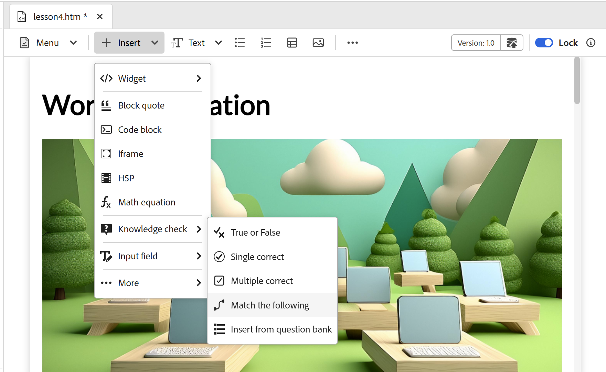
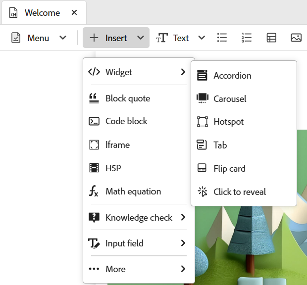
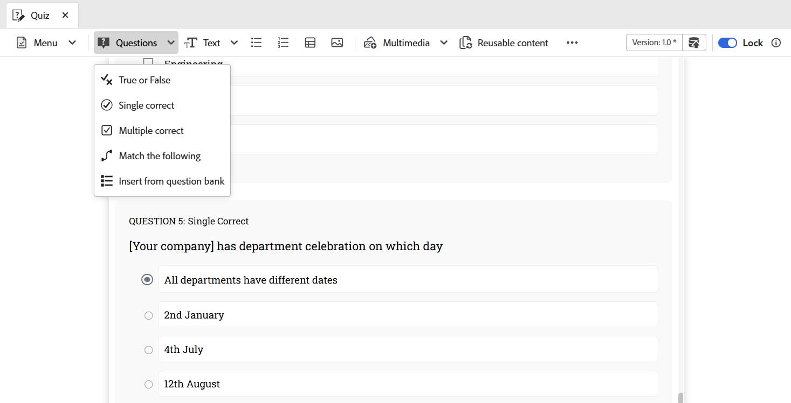
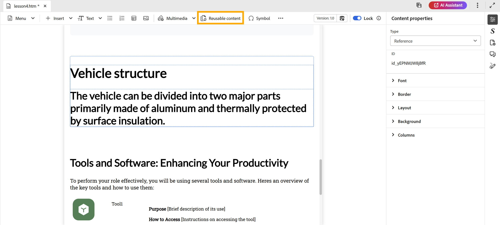

# 2025年12月版本產品培訓和學習內容

本發行說明涵蓋2025年12月產品培訓與學習內容發行版本中推出的新功能和增強功能。 此外，本版本中所有的回報問題和錯誤均已解決，確保穩定性和效能獲得改善。

## 製作

- **「插入」功能表的新選項**：在編輯器工具列的「插入」功能表中引入新選項，以豐富您的學習內容：

   - **MathML方程式**：為技術或科學主題無縫插入MathML方程式。
   - **知識檢查**：在學習主題中新增快速、未評分的測驗，以驗證學習者的理解。
   - **H5P**：內嵌互動式H5P套件，以提供進階學習體驗。

  如需詳細資訊，請檢視[插入]功能表中的[其他選項](../learning-content/lc-other-insert-options.md)。

  {width="650" align="left"}

- **新的互動小工具**：您可以使用一些新的互動小工具與學習者互動，讓內容更引人入勝： **按一下以顯示**、**翻轉卡片**&#x200B;和&#x200B;**標籤**。

  如需詳細資訊，請檢視[使用互動式Widget](../learning-content/lc-widgets.md)。

  {width="350" align="left"}

- **符合下列專案**：有新的問題型別&#x200B;**符合下列專案**&#x200B;可供測驗。 學習者可以比對兩個清單中的專案來連線相關想法，鼓勵批判性思考。

  如需詳細資訊，請檢視[測驗問題型別](../learning-content/quiz-insert-questions.md#question-types)。

  {width="650" align="left"}

## 檢閱

- **建立稽核任務**：您現在可以為您的學習課程建立稽核任務，並將其指派給稽核者，以徵求他們的意見。 這可確保內容品質、簡化共同作業，並讓追蹤檢閱更容易。

  如需詳細資訊，請檢視[建立稽核工作](../learning-content/manage-course.md#create-review-task)。

  {width="650" align="left"}

## 內容管理

- **可重複使用的內容**：您可以跨多個課程重複使用現有的內容。 此功能有助於維持一致性並減少重複。

  如需詳細資訊，請檢視[新增基本建置區塊](../learning-content/lc-basic-blocks.md)。

  {width="650" align="left"}

