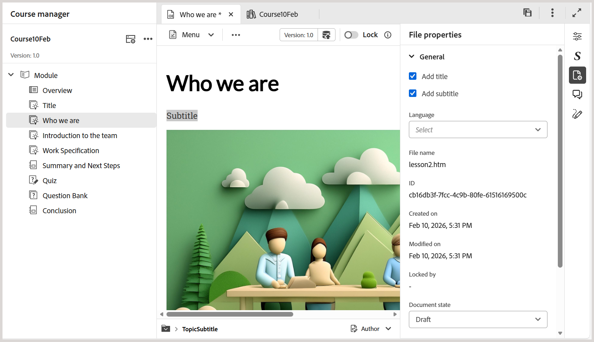
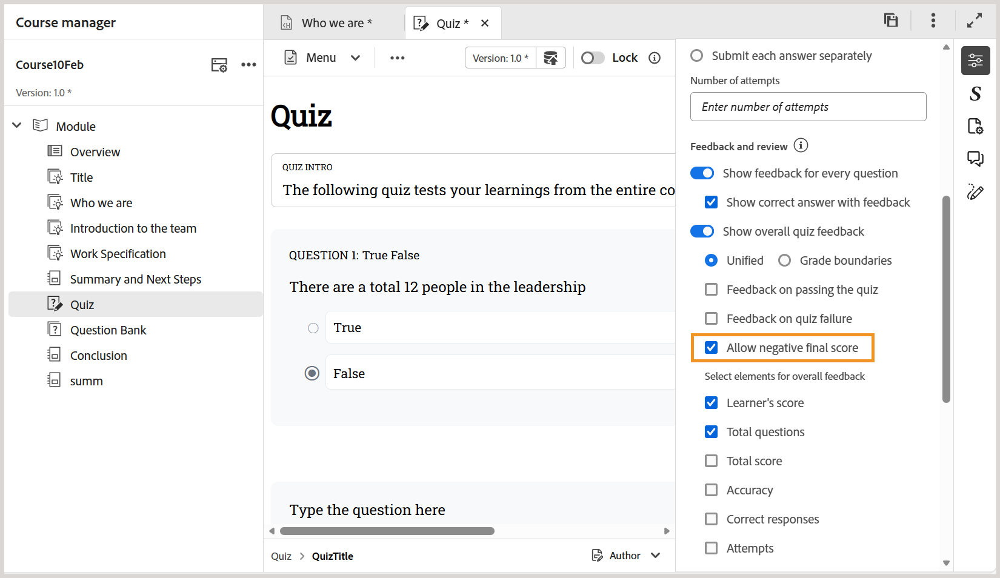
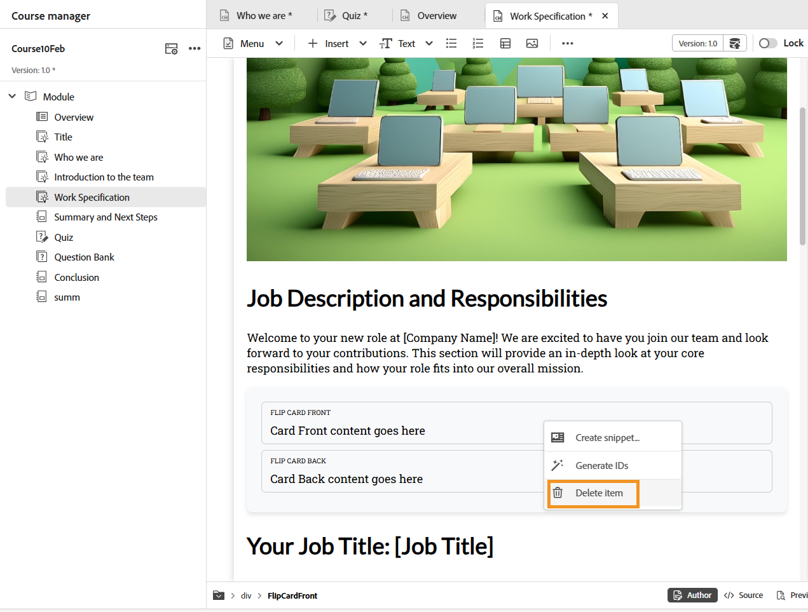
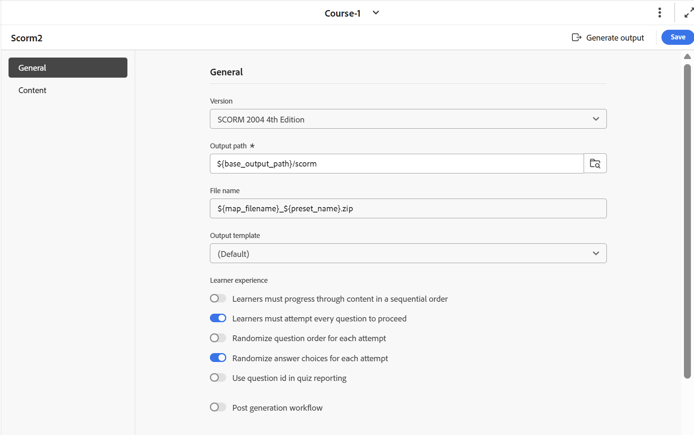

# 2026年2月產品培訓和學習內容發佈

本發行說明涵蓋2026年2月版本產品培訓與學習內容中修正的新功能增強和問題。

## 新功能增強功能

以下功能將在2026年2月版本的產品培訓和學習內容中介紹：

- **字幕支援**：您現在可以在&#x200B;**檔案屬性**&#x200B;中使用新的&#x200B;**新增字幕**&#x200B;選項，新增字幕至您的學習內容。 這能增強清晰度並改善課程內容的可搜尋性。

  如需詳細資訊，請檢視[新增標題和副標題至學習內容](../learning-content/lc-basic-blocks.md#add-title-and-subtitle-to-learning-content)。

  

- **啟用或停用最終負面評分**：在設定測驗屬性時，您可以使用&#x200B;**允許負面最終評分**&#x200B;選項來控制負面評分。 啟用時，即使套用負數標籤，學習者也會收到最低最終分數零。 如此一來，學習者可確保分數永遠保持在零以下。

  深入瞭解[測驗屬性](../learning-content/quiz-properties.md)。

  

- **按一下滑鼠右鍵即可刪除Widget**：除了刪除測驗問題之外，您現在還可以使用&#x200B;**按一下滑鼠右鍵>刪除專案**&#x200B;來刪除Accordions、Flip卡片等Widget。 此增強功能將現有的&#x200B;*刪除問題*&#x200B;功能延伸至Widget，讓您只需較少的點按次數及最少量的導覽即可移除問題。

  深入瞭解[使用互動式Widget](../learning-content/lc-widgets.md)。

  
- **釘選答案選項**：您現在可以釘選特定的答案選項，即使在SCORM輸出產生期間隨機產生答案，其位置仍保持不變。 這尤其適合用於&#x200B;*以上所有*&#x200B;或&#x200B;*以上無*&#x200B;等選項。

  深入瞭解[問題屬性](../learning-content/quiz-insert-questions.md#question-properties)。

  
- **簡短答案型別**：簡短答案問題型別可讓學習者使用簡短的描述性英數字元答案來回應，而不用選取預先定義的選項。 此問題型別鼓勵學習者主動用自己的詞匯回憶並表達其理解，讓評估對學習者更有吸引力。

  深入瞭解[問題型別](../learning-content/quiz-insert-questions.md#question-types)。

  
- **測試問題的循序嘗試**：您現在可以使用&#x200B;**學習者必須嘗試每個問題才能繼續SCORM輸出預設集中的**&#x200B;選項，對SCORM輸出強制執行循序測試嘗試。 啟用後，學習者必須先回答每個問題，才能移至下一個問題，目前問題完成前，導覽會受到限制。 這可確保引導式、逐步的評估流程和一致的學習體驗。

  如需詳細資訊，請檢視[設定SCORM輸出預設集](../learning-content/config-scorm-preset.md)。

  

## 已修正的問題

以下問題已在2026年2月版本的產品培訓和學習內容中修正：

- 發佈SCORM輸出並將其部署在ALM時，L2測驗報告顯示使用多次嘗試和隨機問題庫選擇的測驗總數和最高分數不正確。 (GUIDES-38855)
- 在雲端伺服器上產生任何課程時，由於`coralui3.css`樣式表，版權頁尾下方會出現意外的空白字元，導致版面不一致。 (GUIDES-38853)
- 使用鍵盤導覽具有摺疊式功能表的學習課程時，+符號或索引標籤標題未反白顯示，導致無法透過視覺識別作用中元素。 (GUIDES-38852)
- 針對使用SCORM碳素範本或預設範本產生的課程，當以橫向模式在行動裝置上存取時，目錄（課程選單）無法顯示模組連結以防止導覽。 (GUIDES-38851)
- 在Experience Manager Guides中復寫課程的階層時，建立學習物件需要先建立學習群組，因為不支援物件層級的新增。 (GUIDES-38849)
- 嘗試使用鍵盤存取符合以下問題型別中的下拉式清單選項失敗，因為這些選項沒有回應Tab鍵或箭頭鍵而阻止導覽。 (GUIDES-38985)
- 套用標題樣式預設集會造成選取的文字消失，可能是因為字型顏色變更為白色，使文字無法選取且無法顯示。 (GUIDES-39981)
- 在Mozilla Firefox上使用Experience Manager Guides時，翻轉卡片會在翻轉後的背面以相反的方向顯示正面文字。 (GUIDES-39983)
- 當您按一下課程左窗格中的目錄(TOC)時，即使測驗失敗，課程仍會繼續顯示完成狀態。 (GUIDES-40398)
- 嘗試在ALM中錯誤比對測驗中的以下問題型別，會導致報告中未出現選定的選項。 (GUIDES-38640)
- 產生PDF輸出時，不會保留套用的製作樣式，導致設計不一致。 (GUIDES-38642)

