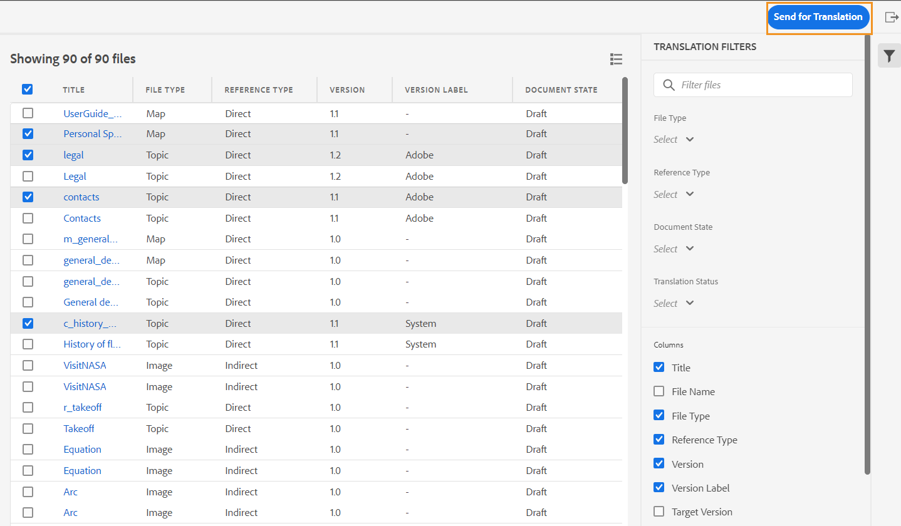

# 11月發行的Adobe Experience Manager Guides as a Cloud Service

## 升級至11月版

請升級您目前的Adobe Experience Manager Guides as a Cloud Service (稍後稱為&#x200B;*AEM Guides as a Cloud Service*)安裝程式，方法是執行下列步驟：
1. 請檢視雲端服務的Git程式碼，並切換至雲端服務管道中設定且與您要升級的環境對應的分支。
1. 將Cloud Services Git程式碼的`<dox.version>`檔案中的`/dox/dox.installer/pom.xml`屬性更新為2022.11.198。
1. 確認變更並執行雲端服務管道，以升級至11月版的AEM Guides as a Cloud Service。

## 索引現有內容的步驟(僅限使用9月之前的AEM Guides as a Cloud Service版本時)

執行以下步驟來索引現有內容，並在地圖層級使用新的尋找和取代文字：

* 對伺服器執行POST要求（使用正確的驗證） - `http://<server:port>/bin/guides/map-find/indexing`。
(選用：您可以傳遞地圖的特定路徑來編列索引，預設情況下，所有地圖都會編列索引 || 範例： `https://<Server:port>/bin/guides/map-find/indexing?paths=<map_path_in_repository>`)

* 此API將傳回jobId。 若要檢查工作的狀態，您可以將具有工作識別碼的GET要求傳送至相同的端點 — `http://<server:port>/bin/guides/map-find/indexing?jobId={jobId}`
(例如： http://&lt;_localhost:8080_>/bin/guides/map-find/indexing？jobId=2022/9/15/7/27/7dfa1271-981e-4617-b5a4-c18379f11c42_678)

* 工作完成後，上述GET要求將回應為成功，並提及是否有任何地圖失敗。 可以從伺服器記錄檔確認已成功編制索引的對應。

## 相容性矩陣

本節列出AEM Guides as a Cloud Service 2022年11月版本支援之軟體應用程式的相容性矩陣。

### FrameMaker和FrameMaker Publishing Server

| FMPS | FrameMaker |
| --- | --- |
| 不相容 | 2020 Update 4及更新版本 |
| | |

*從2020.2開始的FMPS版本支援AEM中建立的基準和條件。

### 氧氣聯結器

| AEM Guides雲端版 | 氧氣聯結器視窗 | 氧氣聯結器Mac | 在氧氣視窗中編輯 | 在氧氣Mac中編輯 |
| --- | --- | --- | --- | --- |
| 2022.11.0 | 2.7.13 | 2.7.13 | 2.3 | 2.3 |
|  |  |  |  |  |

## 新功能和增強功能

AEM Guides as a Cloud Service在11月版本中提供增強功能和新功能：

### 從存放庫面板刪除檔案

現在您可以從存放庫面板中選取檔案的&#x200B;**選項**功能表輕鬆刪除檔案（一次刪除一個檔案）。

刪除檔案前會顯示確認提示。 如果檔案未從任何其他檔案參照，則會刪除檔案並顯示成功訊息。

如果選取的檔案已出庫，則無法將其刪除，且會顯示錯誤訊息。 如果選取的檔案新增至我的最愛收藏集，或從任何其他檔案參照，AEM Guides會檢查您的確認，並提供您強制刪除它的選項。 如果刪除參照主題並開啟包含要編輯參照的檔案，將會顯示參照檔案的斷開連結。

**注意**：您也可以使用鍵盤的Delete鍵來刪除選取的檔案。

### 正在清除檔案的所選版本

當您建立和維護內容時，可能會為存放庫中的DITA檔案建立許多版本。 AEM Guides可讓您從儲存庫中清除舊版的DITA檔案，並釋放磁碟空間。

AEM Guides不會刪除檔案的第一個版本，或是包含在基準中的版本，或是套用標籤的版本。 清除作業甚至不會刪除翻譯或稽核工作流程中包含的檔案。 您可以選擇要保留的版本數目，也可以決定刪除早於定義天數的檔案。

在開始永久刪除作業之前，您可以預覽報表以檢視要永久刪除的版本。 然後，您可以決定啟動或取消整個清除作業。

永久刪除作業完成後，您可以檢查永久刪除報表，以檢視已永久刪除的檔案。

### 管理全域和資料夾設定檔輸出預設集

AEM Guides提供您為全域和資料夾設定檔建立和管理輸出預設集的功能。 然後，您就可以輕鬆地使用這些輸出預設集，針對與該全域或資料夾設定檔相關的所有地圖產生輸出。

**注意**&#x200B;只有資料夾層級的系統管理員使用者可以建立全域和資料夾設定檔預設集。

這些全域預設集出現在所有相關地圖的&#x200B;**輸出**&#x200B;標籤下。 您可以使用它們來產生所有相關地圖的輸出。 您可以選取預設集作為預設PDF預設集，以產生PDF輸出。 您也可以從&#x200B;**選項**&#x200B;功能表&#x200B;**編輯**、**重新命名**、**複製**&#x200B;或&#x200B;**刪除**&#x200B;現有的輸出預設集。

### 版本標籤欄已新增到翻譯儀表板

在翻譯控制面板中，您也可以看到「版本標籤」欄。 這會顯示來源檔案所選版本的標籤。 這可協助您選取所有具有特定標籤的檔案，並一次完成翻譯。

### 原生PDF | PDF，其變更列顯示檔案版本之間的差異

現在您可以使用變更列建立PDF，顯示兩個版本之間的內容差異。 您可以選擇將目前版本與先前版本的基準進行比較，或比較兩個選取的基準版本。

PDF中會出現變更列，指出已修改、插入或刪除的內容。 您也可以選擇執行下列動作：
* 以綠色和底線顯示插入的內容
* 以紅色顯示刪除的內容並加上刪除線

### 原生PDF | 輸出路徑和PDF檔案名稱的變數支援

現在您也可以使用下列現成可用的變數來定義輸出路徑和PDF檔案。 您可以使用單一變數或變陣列合來定義這些選項：
* `${map_filename}`
* `${map_title}`
* `${preset_name}`
* `${language_code}`
* `${map_parentpath}` （僅適用於輸出路徑）
* `${path_after_langfolder}` （僅適用於輸出路徑）

### 原生PDF | 產生DITA map的目錄並重新排序頁面配置

現在您也可以使用範本的進階PDF設定在DITA map中產生TOC。 您可以選擇啟用或停用各種頁面配置圖的顯示，也可以重新排列它們的位置。

## 已修正的問題

以下列出各種區域中修正的錯誤：

* 原生PDF | 在產生的PDF輸出中未解析`conkeyref`。 (10564)
* 原生PDF | 存取PDF輸出中的地圖中繼資料時發生問題。 (10556)
* 原生PDF | 內嵌樣式是用來產生標籤，而非類別名稱。  (10498)
* Web編輯器會間歇性地載入空白頁面。 (10678)
* 如果我們透過複製現有預設集來建立預設集，PDF發佈會失敗。 (10584)
* 預設集的PDF產生失敗時，**檢視記錄**&#x200B;按鈕無法運作。 (10576)
* 預覽中不會顯示屬於conref的para標籤內的備註。 (10559)
* 在清單專案結尾點選退格鍵會移除整個清單。 (10540)
* 使用原生PDF匯出時，巢狀`<indexterm>`未巢狀內嵌在索引中。 (10521)
* Source檢視中缺少工具列中的&#x200B;**自動縮排**&#x200B;按鈕。 (10448)
* 在編輯器中編寫清單時，清單專案的第一個字元會遺失。 (10447)
* 如果在基準線編輯視窗中變更並儲存任何DITA資產版本，則會出現多個快顯視窗。 (10399)
* 從「快速產生」面板選取所有輸出預設集後，按一下&#x200B;**編輯**&#x200B;按鈕時發生應用程式錯誤。 (10388)
* 從Assets UI執行複製貼上動作時，不會保留DITA主題的自訂中繼資料。 (10367)
* 若整個語言資料夾的資產位於使用中的翻譯專案中，其後處理會遭到封鎖。 (10332)
* 資料夾設定檔管理員看不到XML編輯器中的範本索引標籤。 (10266)
* Web編輯器在4.0升級後發生導覽問題。 (10159)
* SVG檔案不會在預覽模式中顯示。 (10010)
* 如果編輯器的輸出索引標籤包含更多預設集，則預設集區段無法捲動，並且不會顯示所有預設集。 (9787)
* 影像的&#x200B;**編輯**&#x200B;和&#x200B;**註釋**&#x200B;選項在欄檢視中無法正常運作。 (8758)
* 對等連結未解析，並在產生的輸出中顯示為一般文字。 (7774)
