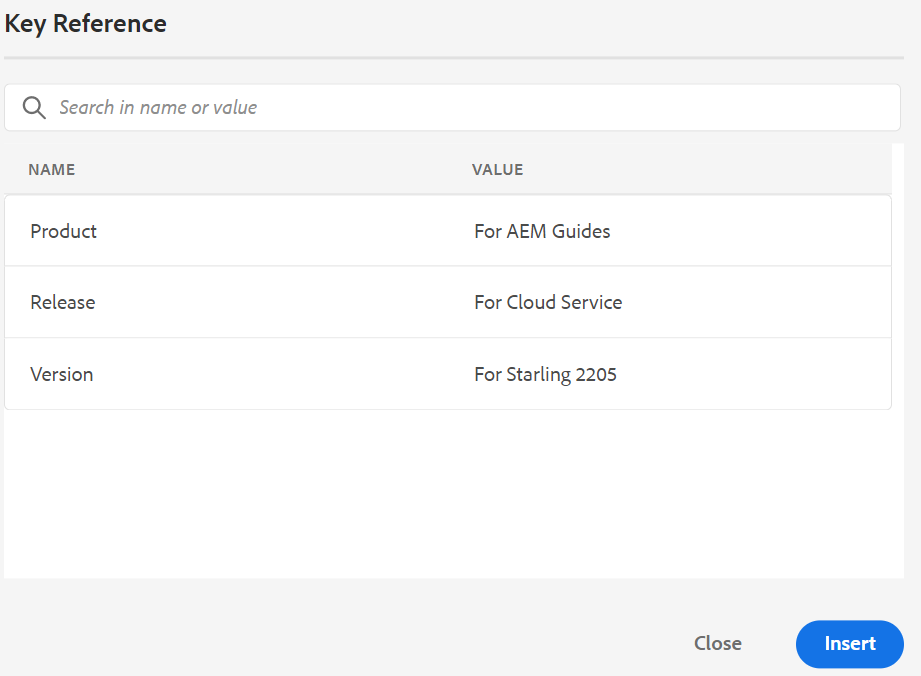
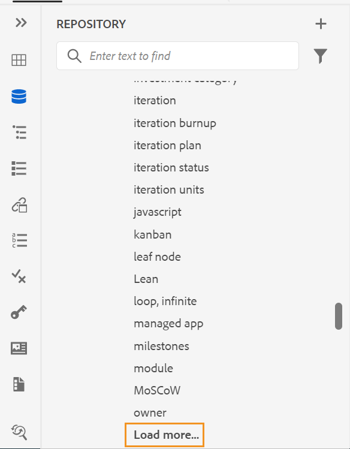

# 5月發行的Adobe Experience Manager Guides as a Cloud Service

## 升級至5月發行版本

請升級您目前的Adobe Experience Manager Guides as a Cloud Service (稍後稱為&#x200B;*AEM Guides as a Cloud Service*)安裝程式，方法是執行下列步驟：
1. 請檢視雲端服務的Git程式碼，並切換至雲端服務管道中設定且與您要升級的環境對應的分支。
1. 將Cloud Services Git程式碼的`<dox.version>`檔案中的`/dox/dox.installer/pom.xml`屬性更新為2022.5.144。
1. 提交變更並執行雲端服務管道，以升級至AEM Guides as a Cloud Service的五月版本。

## 相容性矩陣

本節列出AEM Guides as a Cloud Service 2022年5月發行版本支援之軟體應用程式的相容性矩陣。

### FrameMaker和FrameMaker Publishing Server

| FMPS | FrameMaker |
| --- | --- |
| 不相容 | 2020 Update 4及更新版本 |
| | |

*從2020.2開始的FMPS版本支援AEM中建立的基準和條件。

### 氧氣聯結器

| AEM Guides雲端版 | 氧氣聯結器視窗 | 氧氣聯結器Mac |
| --- | --- | --- |
| 2022.5.0 | 2.6.9 | 2.6.9 |
|  |  |  |

## 新功能和增強功能

AEM Guides as a Cloud Service在5月發行版本中提供許多增強功能和新功能：

### 增強型網頁編輯器

* **根據自訂範本建立地圖**

現在您有了建立自訂地圖範本的強大功能。 您可以使用它們來建立DITA map，以及主題範本和對映範本中參照的對映範本。

您也可以參照自訂對應範本中的其他對應範本和主題範本。 參照的對映範本可參照各種對映範本、主題範本、主題、對映、影像、影片和其他資產。

自訂的對映範本可以幫助您輕鬆複製對映範本和整個參照的資料夾結構。 這些自訂範本對於建立和重新建立具有遞回結構和參照的多個對映特別有用。

* 已改善&#x200B;**插入關鍵字**&#x200B;功能。 現在，您可以更輕鬆地找到要插入的關鍵字，因為關鍵字會依字母順序列出。 您也可以在「搜尋」方塊中輸入搜尋字串來搜尋關鍵字。

* 現在在存放庫檢視中，檔案會批次載入。 一次載入75個檔案。 批次載入相當有效率，而且相較於載入資料夾中的所有檔案，您可以更快存取檔案。

* 您可以在所有XML編輯器畫面（包括但不限於預覽和作者檢視）中轉譯包含內嵌資料或連結的SVG影像。

* 預設XSD/DTD可更新至最新版本

### 翻譯流程改善

* **能夠建立範圍設定翻譯專案**
如果您只需要為要翻譯的專案建立範圍，可以選取&#x200B;**建立新的範圍設定翻譯專案**。 這不會傳送副本以供翻譯，並且會維護檔案的原始翻譯狀態。

* 如果您拒絕翻譯工作中一個或多個主題的翻譯，則所有已拒絕主題的進行中翻譯狀態將恢復到其原始狀態。

* **語言**&#x200B;清單會顯示語言資料夾及其語言代碼。 例如法文(fr)和德文(de)。

* 翻譯功能現在也支援包含國家/地區和語言的語言代碼。 例如，`fr-fr`，`en-us`。

* 載入語言資料夾以外的DITA map時，後端不會記錄任何例外狀況。

如需翻譯的詳細資訊，請參閱使用Adobe Experience Manager Guides as a Cloud Service中的&#x200B;*從網頁編輯器翻譯檔案*&#x200B;區段。

### 增強型發佈

* 您也可以在從地圖儀表板產生輸出時，從[輸出]索引標籤存取&#x200B;**發佈儀表板**。 發佈儀表板中提供所有作用中發佈任務的清單。

* 從地圖圖示板中，您可以選取多個DITAVAL檔案來產生條件式內容。 您可以透過新增或刪除檔案來維持檔案順序。 您也可以將游標停留在檔案名稱上，以檢視儲存檔案的AEM存放庫中的路徑。

* **已棄用的功能**
AEM as a Cloud Service不再支援為FrameMaker檔案產生DITA輸出格式。 此DITA選項也已從Map圖示板的輸出預設集中移除。

### 改善以文章為基礎的發佈

XML編輯器提供在發佈至Salesforce設定檔時，將多個產品類別對應至文章的功能。

### 其他功能增強功能

* 預覽模式也支援DITA中的`deliveryTarget`條件處理屬性。 它可與&#x200B;**對象**、**平台**、**產品**、prop、**otherprops**&#x200B;一起作為下拉式篩選器中的選項。
* 提供在Oxyo中的AEM伺服器與本機系統之間強制同步的選項。

## 已修正的問題

以下列出各種區域中修正的錯誤：

* 在網頁編輯器的稽核面板上，使用者無法回複稽核註釋。 (9667)
* 透過「選項」功能表重新整理空白資料夾後，按一下空白資料夾時，應用程式會變空白。 (9639)
* 我們&#x200B;**儲存並關閉**&#x200B;簽入的檔案時，正在建立新版本。 (9638)
* 啟用&#x200B;**另存為新版本**&#x200B;核取方塊時，未顯示關閉按鈕。 (9637)
* 如果首先透過每個章節的個別PDF發佈PDF，然後是單一PDF檔案(取消勾選建立個別PDF檔案)，則不會發佈正確的。 (9632)
* 地圖儀表板對非管理員使用者造成中繼資料問題。 (9620)
* 建立基準後，如果伺服器擁有超過10000個檔案，則會在UI上將狀態設定為失敗（取得狀態呼叫失敗）。 (9608)
* 在屬性中儲存大型資料會導致發佈錯誤，因為分割發佈工作流程失敗。 (9586)
* 在預覽模式切換到Source並再次在預覽模式時，未保留條件屬性篩選器狀態。 (9553)
* 若未透過`mainbooktitle`標籤指定名稱，則存放庫檢視中的書籤地圖名稱會變成空白。 (9538)
* 開啟使用Oxyor上傳的檔案時發生HTTP 400錯誤。 (9535)
* 開啟未定義預設集的地圖時，先前開啟的地圖的預設集仍顯示在「輸出」標籤中。 (9523)
* 在「大綱」面板中，「標籤」和「屬性」的搜尋功能無法運作。 (9506)
* 在瀏覽器重新整理瀏覽器之前，不會顯示新建立的集合。 (9505)
* 透過「新增所有prop」選項新增所有條件時，條件屬性標籤（不是值）會出現在來源模式中。 (9501)
* 檔案會在還原成任何版本時自動簽出。 (9482)
* 還原檔案版本時，Assets UI中顯示錯誤的時間戳記差異。 (9480)
* 在DITA map的topicref元素中插入專案時，會新增搜尋結果中的多個專案。 (9474)
* 如果設定&#x200B;**為已上傳的檔案建立新版本**&#x200B;為「開啟」，則會在還原並儲存於任何凍結節點時建立新版本。 (9473)
* 如果在定義索引鍵參考時沒有新增顯示文字，則變更連結URL時不會維護「索引鍵參考」和「內容索引鍵參考」的顯示文字。 (9458)
* 在「版本記錄」中，不會顯示目前版本的版本編號和標籤。 (9446)
* 在編輯器中開啟某些內容檔案時，編輯器會凍結。 (9443)
* 在「存放庫」面板中搜尋，且topicref瀏覽對話方塊會在內容較大時凍結畫面。 (9432)
* 傳遞至AEM網站輸出的中繼資料不會遵循內容的基準線。 (9416)
* 氧氣在AEM中的版本還原後會簽出不正確的主題版本。 (9411)
* 基準線失敗會在地圖控制面板的「預設」標籤中停用編輯功能。 (9403)
* 建立新內容時一律會記錄錯誤。 (9388)
* 新建立的DITA資產一律會由其他使用者出庫。 (9387)
* 將topicref轉換為glossref時，重新命名元素無法正常運作。 (9380)
* 在&#x200B;**另存為新版本**&#x200B;對話方塊中，版本標籤不是下拉式清單。 (9379)
* 從&#x200B;**顯示差異**&#x200B;下拉式清單切換不同版本時，未套用條件。 (9366)
* 使用預覽篩選器時發生多個問題。 (9365)
* 無法在topicref中插入非DITA和DITAVAL資產。 (9363)
* 當目標語言代碼包含5個字元（如`fr_ca`）時，核准的翻譯不會整合到目標語言。 (9357)
* 無法使用&#x200B;**更多選項**&#x200B;功能表的&#x200B;**在資料夾**&#x200B;中尋找檔案來搜尋檔案，應用程式會停止回應。 (9337)
* 如果出現大量金鑰，瀏覽對話方塊會擱置。 (9332)
* 進行以文章為基礎的發佈時，DITAVAL檔案無法運作。 (9330)
* AEM網站輸出中的註腳順序不正確。 (9327)
* 變更選取路徑時，不會自動執行搜尋。 (9323)
* 翻譯完成後，系統會為翻譯的資產建立其他版本。 (9310)
* 無法刪除資料夾設定檔中的管理員使用者。 (9306)
* 在重新整理頁面之前，不會設定從內容索引鍵參考更新的根對應。 (9302)
* Web驗證在Oxyor中無法運作。 (9296)
* 含有已編碼字元的網頁連結無法正常運作。 (9227)
* 在Oxygon中開啟時，檔案未出庫。 (9217)
* 重新整理簽出的檔案無法用於透過Ourney的網頁驗證登入。 (9179)
* 「地圖」控制面板上會顯示「轉譯」和「基線」標籤一段時間。 (9146)
* 重新載入資料夾設定檔時出現體驗或功能問題。 (9103)
* 刪除頁面配置編輯器不會從作者檢視的中心面板將其關閉。 (9087)
* 移除影像並儲存檔案新版本時，網頁編輯器發生驗證錯誤。 (8985)
* 無法檢視字彙表面板中的所有`glossrefs` （內容特定）。 (8886)
* 文章式發佈輸出中未顯示不含文字的`xref`。 (8764)
* 在檔案名稱中有空格的移動影像或多媒體檔案上，參照會中斷。 (8624)
* 選擇`Select All`並將多媒體檔案或DITA內容移動到另一個資料夾時，參照中斷。 (8622)
* 發佈儀表板不會清理狀態為「等待」或「正在執行」的輸出工作。  (8569)
* 如果存在大量剩餘的輸出歷史記錄節點，則輸出清除功能會失敗。 (8568)
* DITA附加套件可防止DAM重複資產偵測。 (8417)
* 啟用非DITA檔案的建立稽核工作按鈕。 (8401)
* 使用UI將subjectref新增至地圖時，插入參照對話方塊會開啟。 (8212)
* 將outputclass屬性新增到`entry`元素時，在每一個空白`tgroup`元素中找到未預期的空間。 (7532)
* 動作一完成，「存放庫」面板就不會顯示已存回或已存回的檔案鎖定圖示。 (5817)
* 即使從編輯器簽入檔案，儲存庫檢視中也會顯示鎖定圖示。  (5756)
* 「輸出」標籤下方的AEM預設集中缺少網站。 (9567)
* XML編輯器在嘗試編輯某些DITA檔案時擱置。 (9537)
* 在XML編輯器中執行搜尋會導致頁面凍結。 (9452)
* 如果內容移至其他資料夾，下載具有基準線的對應將無法運作。 (9331)
* 當檔案已存在於AEM的相同位置時，在Oxyor中重新上傳失敗。 (9328)
* 並排檢視中的反白位置不正確。 (9305)
* 將檔案從氧氣簽入至AEM後，檔案中的日文內容會取代為問號(???)。 (9276)
* 從Oxyor上傳檔案至AEM失敗。 (9157)
* 在收件匣中重新指派稽核任務時，未傳送電子郵件通知。 (8376)

## 已知問題

開啟編輯器時會斷斷續續顯示空白頁面。
