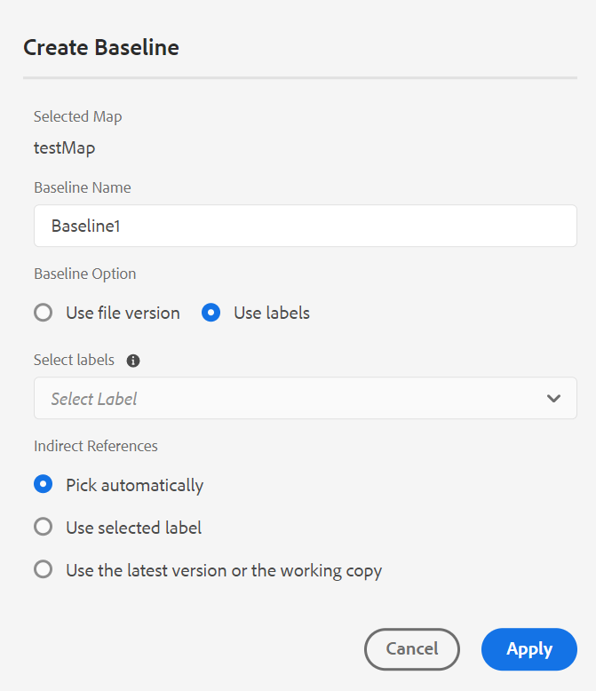
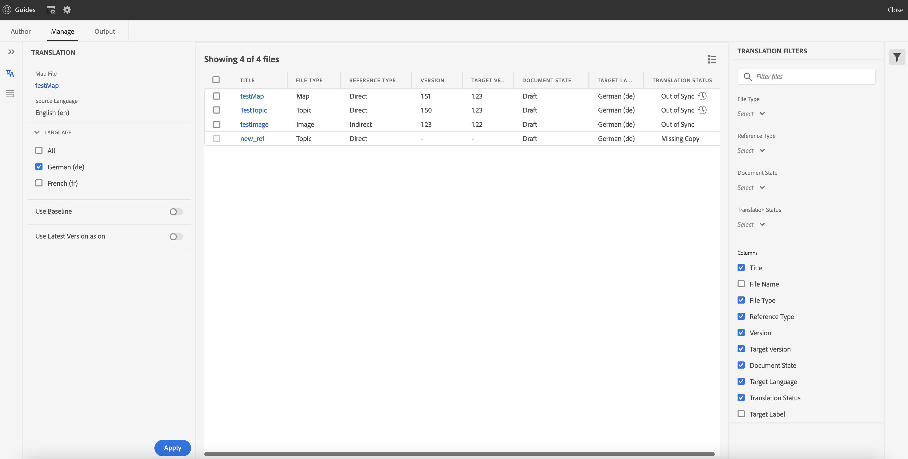

# 9月發行的Adobe Experience Manager Guidesas a Cloud Service

## 升級至9月版

若要升級您目前的Adobe Experience Manager Guidesas a Cloud Service(稍後稱為&#x200B;*AEM Guidesas a Cloud Service*)安裝程式，請執行下列步驟：
1. 檢視Cloud Service的Git程式碼，並切換到在Cloud Service管線中設定的分支，該分支與您要升級的環境相對應。
1. 將Cloud Service Git程式碼的`/dox/dox.installer/pom.xml`檔案中的`<dox.version>`屬性更新為2022.9.178。
1. 提交變更並執行Cloud Service管道，以升級至9月版的AEM Guidesas a Cloud Service。

## 索引現有內容的步驟

執行以下步驟來索引現有內容，並在地圖層級使用新的尋找和取代文字：
* 對伺服器執行POST要求（使用正確的驗證） - `http://<server:port>/bin/guides/map-find/indexin`。
(選用：您可以傳遞地圖的特定路徑來編列索引，預設情況下，所有地圖都會編列索引 ||  範例：   `https://<Server:port>/bin/guides/map-find/indexing?paths=<map_path_in_repository>`)
* 此API將傳回jobId。 若要檢查工作的狀態，您可以將具有工作識別碼的GET要求傳送至相同的端點 — `http://<server:port>/bin/guides/map-find/indexing?jobId={jobId}`
(例如： `http://<_localhost:8080_>/bin/guides/map-find/indexing?jobId=2022/9/15/7/27/7dfa1271-981e-4617-b5a4-c18379f11c42_678)`
* 工作完成後，上述GET要求將回應為成功，並提及是否有任何地圖失敗。 可以從伺服器記錄檔確認已成功編制索引的對應。

## 相容性矩陣

本節列出AEM Guides as a Cloud Service 2022年9月發行版本支援之軟體應用程式的相容性矩陣。

### FrameMaker和FrameMaker Publishing Server

| FMPS | FrameMaker |
| --- | --- |
| 不相容 | 2020 Update 4及更新版本 |
| | |

*從2020.2開始的FMPS版本支援AEM中建立的基準和條件。

### 氧氣聯結器

| AEM Guides雲端版 | 氧氣聯結器視窗 | 氧氣聯結器Mac | 在氧氣視窗中編輯 | 在氧氣Mac中編輯 |
| --- | --- | --- | --- | --- |
| 2022.9.0 | 2.7.13 | 2.7.13 | 2.3 | 2.3 |
|  |  |  |  |

## 新功能和增強功能

AEM Guidesas a Cloud Service在9月版本中提供了許多增強功能和新功能：

### 根據標籤建立動態基準線

現在，AEM Guides提供您根據標籤建立動態基準線的功能。 如果您產生基準線、下載基準線或使用基準線建立翻譯專案，系統會根據更新的標籤動態挑選檔案。 此功能相當實用，因為更新標籤時不需要修改基準線。
您也可以將基準線的快照匯出為CSV。

### 在地圖層級尋找和取代文字

您現在可以在地圖中搜尋包含特定文字的檔案。 搜尋的文字會在檔案中反白顯示。 您也可以將搜尋到的字詞或片語取代為檔案中的其他字詞或片語。
選取&#x200B;**取代**&#x200B;圖示以取代目前的專案，選取&#x200B;**全部取代檔案**&#x200B;圖示以取代選取檔案中的所有專案。

依預設，已選取&#x200B;**取代前簽出檔案**&#x200B;和&#x200B;**取代後建立新版本**&#x200B;選項，因此會在您取代文字之前簽出檔案，並在取代文字之後建立新版本。

### 從翻譯儀表板檢視不同步檔案的版本差異

您現在可以選擇根據兩個版本之間的主題變更來翻譯&#x200B;**不同步**&#x200B;檔案。\

從翻譯圖示板中，您可以輕鬆檢視上次翻譯版本與所選檔案目前版本之間的差異。

根據差異，您可以決定是否要翻譯主題。

### 中繼資料UI可用於PDF預設集

您可以從DITA map的輸出預設集設定中繼資料。 您可以設定「標題」、「作者」、「主旨」和「關鍵字」中繼資料。 此中繼資料會對應至輸出PDF之檔案屬性中的中繼資料。
此中繼資料會覆寫在書籍層級定義的中繼資料。 您可以具體定義每個輸出預設集中的中繼資料，並將其傳遞給輸出PDF。

預設集中的

## 已修正的問題

以下列出各種區域中修正的錯誤：

* 網頁編輯器 | 在主題中移動元素時，元素上的已指派ID會由自動指派的ID覆寫。 (7895)
* 追蹤變更 | 使用Enter鍵輸入新元素時，內容會遺失。 (10246)
* 未建立dita-templates中參照到主對映的子對映。 (10231)
* XML編輯器 | 在製作模式中複製貼上無法運作。 (10309)
* 選取多個版本標籤後，就不會取消選取。 (9561)
* 在網站瀏覽對話方塊中自動導覽至路徑的方式與檔案瀏覽不同。 (9920)
* 從&#x200B;**作者**&#x200B;切換到&#x200B;**Source**&#x200B;模式時，大綱面板未顯示內容。 (10319)
* 使用主題範本中的內容建立的新主題中的Conref無法運作。 複製的雜湊ID不會在內容副本中更新。 (9890)
* Web編輯器 | 從對應範本建立對應時，沒有載入器存在。 (9891)
* 新增地圖編輯器 | 如果我們從&#x200B;**作者**&#x200B;切換到&#x200B;**配置**&#x200B;檢視，就不會保留在地圖示題中新增的粗體或斜體文字。 (10218)
* 新增地圖編輯器 | 套用到任何參考的條件無法從版面檢視中移除。 (10213)
* 新增地圖編輯器 | 在「版面」檢視中，套用條件參考無法運作，例如「作者」檢視。 (10198)
* 新增地圖編輯器 | 如果參照無法向左移動，則從快顯選單向左移動會移除該參照。 (10219)
* 新增地圖編輯器 |在使用「版面」檢視建立的地圖中，參照的圖示顯示不正確。 (10197)
* 存放庫面板 | 在存放庫面板中按一下滑鼠右鍵會出現應用程式錯誤。 (10123)
* 尋找和取代 | 網頁編輯器中的搜尋結果無法讀取深色模式。 (9978)
* 翻譯 | 中繼資料和標籤不會傳播至翻譯的副本。 (4696)
* 複製貼上(ctrl+c/ctrl+v)內容會在製作模式中擲回錯誤。 (10304)
* PDF範本 | 將背景影像新增至任何頁面版面時，絕對會顯示影像路徑，且影像不會顯示在輸出PDF中。 (10297)
* 原生PDF | 章節標題和章節標題在PDF發佈中無法運作。 (9947)
* 原生PDF | 未正確解析特定DITA主題概念的`xref`。 (10229)
* 原生PDF | 無法在產生的PDF輸出中檢視表格的標題文字。 (9827)
* 原生PDF | 附錄中的參照不會在PDF輸出中顯示為附錄。 (10182)
* 原生PDF | 資料表的框架屬性不會傳播至暫時HTML（以類別形式）。 (10353)
* 原生PDF | 臨時HTML檔案會將colsep和rowsep類別新增至td和th，即使它們在來源DITA中的值為0。 (10352)
* 原生PDF |  頁面配置中新增之條件的中繼資料不會接受。 (10377)
* 原生PDF |  特定內容的PDF產生失敗。 (9927)
* 原生PDF | 透過conkeyref的內容未顯示在PDF輸出中。 (9836)
* 原生PDF | 具有影像或外部連結的Keydef的關鍵參考資料無法解析。 (10063)
* 地圖的「作者」檢視不會顯示表格清單和資料清單的預留位置文字。 (10330)
* 建立新基準線時，不會套用已選取的基準線篩選。 (9954)
* 如果父資料夾名稱含有空格字元，基準線中會遺失視訊檔案。 10031)
* 當使用者時區與伺服器時區不同時，建立基準線不會挑選最新版本。 (10190)
* 在AEM 6.5.12上安裝AEM Guides 4.1後，Control + F捷徑沒有在Assets主控台上開啟瀏覽器搜尋強制回應視窗。 (10189)

## 已知問題

Adobe已確認AEM Guides 2022年9月as a Cloud Service版本的下列已知問題。

* 動態基準線未與知識庫發佈整合。

* 翻譯 | 由於目標內容的任何變更，來源內容會出現版本差異圖示。
