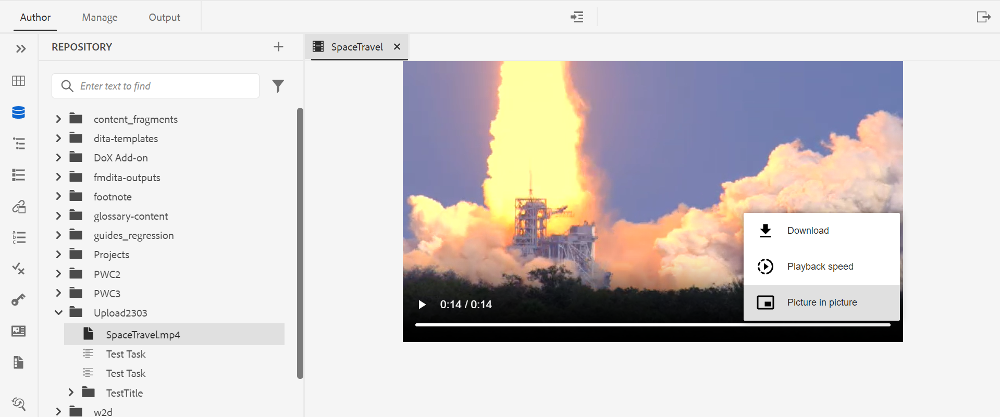

# 2023年3月版Adobe Experience Manager Guides as a Cloud Service的新增功能

本文介紹2023年3月版Adobe Experience Manager Guides （以後稱為&#x200B;*AEM Guides as a Cloud Service*）中的新功能和增強功能。

如需有關升級指示、相容性矩陣，以及此版本中修正問題的詳細資訊，請參閱[發行說明](release-notes-2023-3-0.md)文章。

## 在網頁編輯器中開啟並播放視訊或音訊檔案

AEM Guides現在提供在網頁編輯器中開啟和播放音訊或視訊檔案的功能。 您可以變更音量或視訊檢視。 在捷徑功能表中，您也有&#x200B;**下載**、變更&#x200B;**播放速度**&#x200B;或檢視&#x200B;**子母畫面**&#x200B;的選項。

