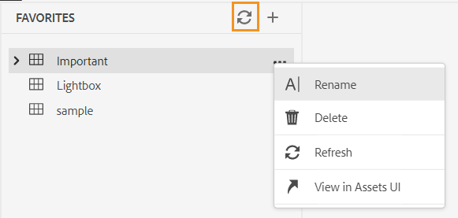

# 2023年6月發行的Adobe Experience Manager Guides as a Cloud Service的新功能

本文介紹2023年6月版Adobe Experience Manager Guides （以後稱為&#x200B;*AEM Guides as a Cloud Service*）中的新功能和增強功能。

如需有關升級指示、相容性矩陣，以及此版本中修正問題的詳細資訊，請參閱[發行說明](release-notes-2023-6-0.md)。

## 網頁編輯器中的中斷連結報表

AEM Guides可讓您檢查技術檔案的整體完整性，以及從網頁編輯器產生報告。現在於2023年6月發行AEM Guides，提供您檢視及修正失效連結的功能。此報表可協助您管理中斷的連結。您可以輕鬆地檢視DITA map中存在的中斷連結並加以修正。
{width="800"}

修正連結後，該連結不會顯示在失效連結清單下。

如需詳細資訊，請參閱[檢視和修正中斷的連結](../user-guide/reports-web-editor.md#report-broken-links)。

## 在存放庫檢視中重新命名和移動檔案

現在您也可以從存放庫面板重新命名或移動檔案。 此功能很實用，並可協助您從「存放庫」面板輕鬆管理檔案。 您可以選取檔案，然後使用選取檔案的&#x200B;**選項**&#x200B;功能表重新命名或移動檔案。 當您移動或重新命名檔案時，AEM Guides會顯示成功訊息。

{width="650"}

如需檔案之[選項]功能表的詳細資訊，請參閱[左側面板](../user-guide/web-editor-features.md#id2051EA0M0HS)區段中的&#x200B;**存放庫檢視**&#x200B;功能說明。

## 原生PDF增強功能

### 為草稿檔案在PDF輸出中新增浮水印

現在，您可以在尚未核准檔案的PDF輸出中新增浮水印。 如果您在「已核准」檔案狀態下產生檔案的PDF，此浮水印就不會出現。 例如，您可以為PDF輸出新增浮水印「草稿」 。

如需更多詳細資料，請參閱[將浮水印新增至草稿檔案的PDF輸出](../native-pdf/use-javascript-content-style.md#watermark-draft-document)。

### 支援語言變數

AEM Guides支援語言變數。您可以使用語言變數來定義PDF輸出中的現成可用標籤（例如「注意」、「警告」和「警告」或靜態文字）本地化版本。
您可以將語言變數或當地語系化的標籤版本新增至PDF輸出和輸出範本中的適當區段。

#### PDF輸出中的語言變數

您可以使用語言變數來定義「注意」、「警告」等元素的本地化標籤。您可以更新一或多個語言中這些變數的值，然後系統會自動在PDF輸出中挑選當地語系化的值。
例如，您可以在PDF輸出中以下列方式呈現標籤「附註」：

* 英文：備註
* 法文：雷馬克
* 德文：欣威文

#### 輸出範本中的語言變數

如果您想要以各種語言建立PDF輸出，則必須建立不同的PDF範本，其中包含每種語言的本地化文字。現在有了語言變數功能，您只需要建立範本一次。然後針對您需要當地語系化的任何靜態文字，您可以建立對應的語言變數，並在範本中使用這些變數。
您可以為較長的文字建立語言變數，例如整個句子或甚至段落。您也可以套用樣式，並使用HTML標籤來格式化這些語言變數。

如需詳細資訊，請檢視[語言變數的支援](../native-pdf/native-pdf-language-variables.md)。

### 能夠在PDF版面配置中使用AEM中繼資料

中繼資料是內容的說明或定義。 此中繼資料會儲存在您的來源DITA map內容中。

現在在AEM Guides中，您也可以選取資產的中繼資料屬性，並將其新增至頁面配置。 接著AEM Guides會挑選資產的這些中繼資料屬性，並發佈到PDF輸出中。

{width="550"}

>[!NOTE]
>
> AEM Guides也支援DITA map的中繼資料屬性。

如需詳細資訊，請參閱[新增欄位和中繼資料](../native-pdf/design-page-layout.md#add-fields-metadata)。

## Schematron增強功能

### 使用報表陳述式來檢查Schematron中的規則

AEM Guides現在也支援使用Schematron的報告陳述式。 當測試陳述式評估為true時，報表陳述式會產生訊息。 例如，如果您希望簡短說明少於或等於150個字元，可以定義報表陳述式，以檢查簡短說明超過150個字元的主題。

如需詳細資訊，請參閱[使用判斷提示和報表陳述式來檢查規則](../user-guide/support-schematron-file.md#schematron-assert-report)。

### 使用規則運算式

您也可以使用Regex運算式定義具有matches()函式的規則，然後使用Schematron檔案執行驗證。

如需詳細資訊，請參閱[使用規則運算式](../user-guide/support-schematron-file.md#schematron-assert-report)。

### 定義抽象模式

AEM Guides也支援Schematron中的抽象模式。 您可以定義一般抽象模式並重複使用這些抽象模式。 抽象模式可以簡化您的Schematron結構，也有助於您管理和更新驗證邏輯。

如需詳細資訊，請參閱[定義抽象模式](../user-guide/support-schematron-file.md#schematron-abstract-patterns)。

## 從網頁編輯器導覽至AEM首頁

現在您可以輕鬆從網頁編輯器導覽至AEM首頁。

{width="800"}

* 按一下&#x200B;**指南**&#x200B;圖示()以返回AEM導覽頁面。

如需詳細資訊，請參閱[AEM導覽頁面](../user-guide/web-editor-launch-editor.md#id2056BG00RZJ)。

## 處理主旨定義和分項清單的階層定義

AEM Guides隨附強大的功能，可建立主旨配置對應，這是一種專門的DITA對應，可用來定義分類主旨和控制值。現在，AEM Guides也可讓您定義對應中的主旨定義，以及另一個對應中的分項清單定義。然後，您可以新增地圖參照並使用主旨配置。
主旨 — 列舉參照是在相同對應或參照的對應中進行解析。

如需處理主旨定義與列舉之階層定義的詳細資訊，請參閱[左側面板](../user-guide/web-editor-features.md#id2051EA0M0HS)區段中的&#x200B;**主旨配置**&#x200B;功能說明。

## 支援翻譯中的XLIFF格式

AEM Guides也支援翻譯中的XML本地化交換檔案格式(XLIFF)格式。現在您也可以選擇&#x200B;**建立新的XLIFF翻譯專案**，將XML內容轉換成XLIFF格式。
使用此格式，您可以將內容匯出為業界標準XLIFF格式，然後提供相同的內容給翻譯廠商。如需詳細資訊，請參閱[建立翻譯專案](../user-guide/translate-documents-web-editor.md#create-translation-project)。

{width="350"}

## 已改進我的最愛面板

AEM Guides可協助您建立檔案和資料夾的收藏集或我的最愛清單，並輕鬆加以使用。 現在&#x200B;**我的最愛**&#x200B;面板中也提供&#x200B;**選項**&#x200B;功能表。 您可以重新命名選取的集合，或從&#x200B;**選項**&#x200B;功能表刪除集合。 您可以選取&#x200B;**重新整理**&#x200B;選項，從存放庫取得新的檔案或資料夾清單。 您也可以在Assets UI中檢視資料夾內容。

{width="650"}

>[!NOTE]
>
> 您也可以使用頂端的&#x200B;**重新整理**&#x200B;圖示來重新整理清單。

如需我的最愛集合&#x200B;**選項**&#x200B;功能表的詳細資訊，請參閱[左側面板](../user-guide/web-editor-features.md#id2051EA0M0HS)區段中的&#x200B;**我的最愛**&#x200B;功能說明。

## 切換至系統主題

您現在也可以使用裝置主題。 使用&#x200B;**使用者偏好設定**，您可以設定AEM Guides以根據裝置的主題自動在淺色和深色主題之間切換。

{width="550"}

如需詳細資訊，請參閱[主工具列](../user-guide/web-editor-features.md#id2051EA0G05Z)區段中的&#x200B;**使用者偏好設定**&#x200B;功能說明。
