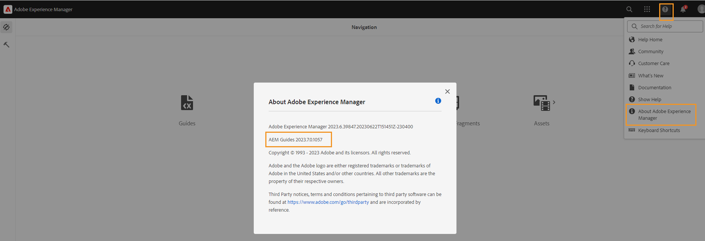

# 2023年7月發行的Adobe Experience Manager Guides as a Cloud Service的新增功能

本文介紹2023年7月版Adobe Experience Manager Guides （後來稱為&#x200B;*AEM Guides as a Cloud Service*）中的新功能和增強功能。

如需有關升級指示、相容性矩陣，以及此版本中修正問題的詳細資訊，請參閱[發行說明](release-notes-2023-7-0.md)。

## 連線至資料來源並將資料插入您的主題

現在您可以使用AEM Guides的現成可用聯結器快速連線至資料來源。 連線至資料來源可讓您將資訊與來源保持同步，且資料的任何更新都會自動反映在網站上，讓AEM Guides成為真正的內容中心。 此功能可協助您節省手動新增或複製資料的時間和精力。

現在，AEM Guides可讓您的管理員為JIRA和SQL (MySQL、PostgreSQL、SQL Server、SQLite)資料庫設定現成的聯結器。 它們也可以藉由擴充預設介面來新增其他聯結器。

新增後，您可以在網頁編輯器的&#x200B;**資料來源**&#x200B;面板下檢視已設定的聯結器。

{width="300"}

您可以建立內容片段產生器，從連線的資料來源擷取資料。 然後，您可以將資料插入主題並進行編輯。

建立內容片段產生器後，您可以重複使用它來將資料插入任何主題。 如需詳細資訊，請檢視[插入資料來源的內容片段](../user-guide/web-editor-content-snippet.md)。

## 檢閱面板可顯示檢閱專案和作用中的檢閱任務

現在，AEM Guides可讓您的評論更順暢。 它提供網頁編輯器中的評論面板。 檢閱面板會顯示您所屬的檢閱專案中的所有檢閱專案和作用中檢閱任務。

身為作者，此功能可協助您輕鬆開啟稽核工作、檢視評論，並在集中式檢視中快速處理評論。
{width="800"}
如需詳細資訊，請檢視[左側面板](../user-guide/web-editor-features.md#id2051EA0M0HS)區段中的&#x200B;**檢閱**&#x200B;功能說明。

## 地圖集合增強功能

地圖集合可協助您組織多個地圖並批次發佈。 已對地圖集合進行許多新增強功能：

- 現在，您也可以將原生PDF輸出預設集新增至地圖集合，並使用它們來產生PDF輸出。
- 您可以檢視管理員建立的全域和資料夾設定檔預設集，並使用它們來產生PDF輸出。
- 現在，您不僅可以選取個別預設集，還可以一次為DITA map啟用所有資料夾設定檔預設集。
  {width="800"}

如需詳細資訊，請檢視[輸出產生](../user-guide/generate-output-use-map-collection-output-generation.md)的[使用地圖集合]。

## 可在產生原生HTML輸出的同時存取暫存PDF檔案

現在，AEM Guides可讓您下載在產生原生HTML輸出時建立的臨時PDF檔案。 在輸出預設集設定中，選取下載暫存檔的選項。  然後，AEM Guides可讓您下載使用該預設集產生輸出時建立的暫存檔。

此功能可讓您透過存取臨時樣式和版面來更深入分析產生流程，並協助您根據需求修正或變更CSS樣式。

{width="800"}

如需詳細資訊，請檢視[建立PDF輸出預設集](../web-editor/native-pdf-web-editor.md#create-output-preset)。

## 微服務式發佈以產生HTML5和自訂輸出

新的發佈微服務可讓您在AEM Guides as a Cloud Service上同時執行大型發佈工作負載，並利用業界領先的Adobe I/O Runtime無伺服器平台。 現在使用微服務，您還可以產生HTML5和自訂輸出。
您可以執行多個發佈請求，並獲得更好的效能來產生這些輸出格式。
如需詳細資訊，請檢視[設定AEM Guides as a Cloud Service的微服務式發佈](../knowledge-base/publishing/configure-microservices.md)。

## 檢視「關於」資訊中的AEM Guides版本詳細資料

現在除了AEM **關於**&#x200B;資訊外，您還可以檢視AEM Guides版本詳細資料。 您可以在AEM導覽頁面上&#x200B;**說明**&#x200B;的&#x200B;**關於**&#x200B;選項中檢視目前的版本詳細資料。

{width="800"}
