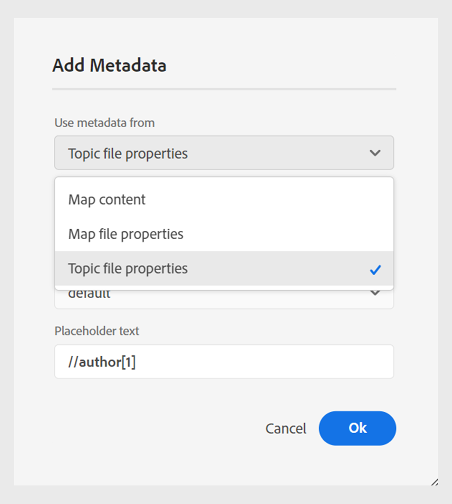

# 2024.06.0版的新增功能

本文介紹2024.06.0版Adobe Experience Manager Guides的新增和增強功能。

有關此版本中的問題修正清單，請查看 [2024.06.0 版本中修正的問題](fixed-issues-2024-06-0.md)。

瞭解 [2024.06.0版的升級指示](upgrade-instructions-2024-06-0.md).

## 發佈主題或其元素至體驗片段

體驗片段是Adobe Experience Manager中的模組化內容單位，整合了內容和版面。 體驗片段有助於建立一致且吸引人的體驗，這些體驗可以跨多個管道進一步重複使用。

Experience Manager指南現在可讓您將主題或其元素發佈到體驗片段。 您可以在主題與其體驗片段中的元素之間建立JSON型對應。 例如，您可以為頁首或頁尾建立體驗片段，並搭配品牌元素、促銷橫幅、客戶口號和活動促銷活動。

如需詳細資訊，請檢視 [發佈體驗片段](../user-guide/publish-experience-fragment.md).

## 內容片段發佈中的增強功能

Experience Manager指南也在內容片段中提供一些實用的增強功能：

- 使用DITAVAL檔案或條件屬性，您可以在發佈至內容片段時輕鬆篩選具有條件的內容。

- 您也可以從以下網址發佈及檢視主題的內容片段： **輸出** 中的區段 **檔案屬性**.

{width="300" align="left"}

如需詳細資訊，請檢視 [發佈內容片段](../user-guide/publish-content-fragment.md).

## 能夠將中繼資料從主題檔案屬性傳遞至原生PDF輸出

現在，Experience Manager指南可讓您在產生原生PDF輸出時，將中繼資料從主題的檔案屬性新增到頁面配置。 使用此功能可將特定主題的中繼資料（例如標題、標籤和說明）新增至頁面配置。 您也可以根據主題的中繼資料來自訂已發佈的PDF，例如根據主題的檔案狀態在主題背景加入浮水印。

 {width="300" align="left"}

*將中繼資料新增至頁面配置中的欄位。*

瞭解如何 [新增欄位和中繼資料](../native-pdf/design-page-layout.md#add-fields-metadata) 在版面配置中。

## 在作業的元素之間選取部分內容

「Experience Manager指南」可增強您在網頁編輯器中跨元素選取內容的體驗。 您可以輕鬆選取不同元素的內容，並執行操作，例如使其粗體、斜體和加底線。 此功能可讓您順暢地套用或移除部分選取內容的格式。 您也可以快速刪除您跨元素選取的內容。 刪除內容後，如有需要，其餘內容會自動合併至單一有效元素下。

您也可以跨元素選取部分內容，然後以有效的DITA元素包住內容。
 {width="300" align="left"}

*以有效元素包住選取的內容。*

整體而言，這些增強功能可提供更好的體驗，並協助您在編輯檔案時提高效率。

如需詳細資訊，請檢視 [跨元素的部分內容選取](../user-guide/web-editor-edit-topics.md#partial-selection-of-content-across-elements).

## 原生PDF發佈支援Markdown檔案

Experience Manager指南也支援原生PDF發佈中的Markdown檔案。 此功能相當實用，可協助您在DITA map中產生Markdown檔案的PDF。 原生PDF發佈中的Markdown支援可協助您輕鬆建立、管理和共用檔案。

如需詳細資訊，請檢視 [支援Markdown檔案](../web-editor/native-pdf-web-editor.md#support-for-markdown-documents).

## 改善大型翻譯專案的效能與擴充性

翻譯功能比以往更快且更可擴充。 它隨附全新的架構，提供更優異的效能。 專案建立時間現在比之前快，而且處理過程中的衝突幾乎不存在。 如此提升的效能可協助您更快速地翻譯，確保即使對於大型翻譯專案也能順暢地運作。

這項改善非常有益，因為它可提升生產力和整體體驗。

進一步瞭解如何 [從網頁編輯器翻譯檔案](../user-guide/translate-documents-web-editor.md).
