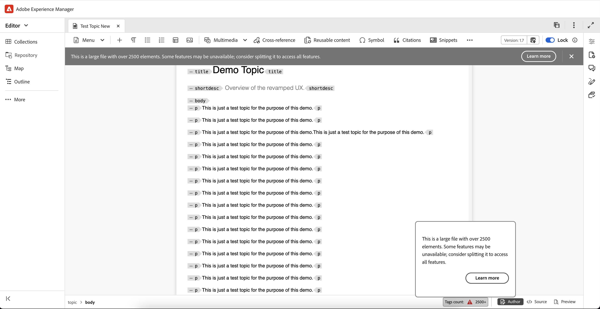

# 2025.04.0版的新增功能（2025年4月）

本文介紹2025.04.0版Adobe Experience Manager Guides as a Cloud Service所推出的新功能和增強功能。

有關此版本中的問題修正清單，請查看 [2025.04.0 版本中修正的問題](fixed-issues-2025-04-0.md)。

瞭解2025.04.0版[&#128279;](../release-info/upgrade-instructions-2025-04-0.md)的升級指示。

## 已針對參考連結新增「Format」屬性

Adobe Experience Manager Guides現在為編輯器中的參考連結新增&#x200B;**format**&#x200B;屬性。 此屬性會顯示在&#x200B;**Source檢視**&#x200B;中，並清楚指出檔案型別，例如：

- 對於副檔名為&#x200B;**.pdf**&#x200B;的檔案，格式將設為&#x200B;**pdf**
- 對於副檔名為&#x200B;**.html**&#x200B;的檔案，格式將設為&#x200B;**html**
- 對於具有&#x200B;**.dita**&#x200B;或&#x200B;**.ditamap**&#x200B;檔案的檔案，格式將設定為&#x200B;**dita**

此外，副檔名為&#x200B;**.xml**&#x200B;的檔案的格式也會設為&#x200B;**dita**。 對於沒有任何副檔名的檔案，格式將保留空白。 此外，對於範圍設定為&#x200B;**external**&#x200B;的任何參考連結，無論參考連結中的副檔名為何，格式將設定為&#x200B;**html**。

## 在編輯器中大型檔案的精確通訊

Experience Manager Guides現在會通知您檔案已分類為大型檔案，而某些功能（例如還原、重做、大綱面板及已變更的標籤）可能無法如預期運作。 大型檔案的介面頂端會顯示警示訊息，如下列程式碼片段所示，表示根據&#x200B;**uiconfig.json**&#x200B;檔案中的&#x200B;**largeFileTagCount**&#x200B;引數所計算的元素數目。

此外，標籤計數會顯示在底部列，當您將滑鼠游標停留在頂端列上時，會出現工具提示。 選取&#x200B;**深入瞭解**&#x200B;索引標籤可提供處理大型檔案的詳細資訊。 此警報僅適用於DITA檔案，且在所有檢視中皆可見：作者、Source和版面。

如需詳細資訊，請檢視[在編輯器中處理大型檔案](../user-guide/web-editor-other-features.md#handling-large-files-in-the-editor)。

{width="800" align="left"}

## 匯出的基準線現在包含檔案狀態

「匯出基準線」功能現在包含&#x200B;**檔案狀態**&#x200B;以及基準線快照中的標題、檔案名稱、檔案型別和版本編號等索引鍵詳細資料。 此增強功能提供更完整的基準概觀，可改善基準管理。

如需詳細資訊，請檢視[從地圖主控台建立和管理基準線](../user-guide/web-editor-baseline.md#manage-baselines)。

## 可重複使用內容面板的增強搜尋體驗

Experience Manager Guides在可重複使用的內容面板中引進了增強的搜尋體驗。 透過此更新，搜尋任何關鍵字現在會掃描所有新增為可重複使用內容的檔案，而不只是開啟的檔案，確保您在所有發生次數（無論容器是開啟或摺疊）中都能找到關鍵字的精確位置。 此外，當您清除搜尋列時，會保留所有容器的原始狀態，提供更有效率且方便使用的搜尋功能。

如需詳細資訊，請檢視[可重複使用的內容](../user-guide/web-editor-features.md#reusable-content)。

## 微服務容器的DITA OT版本更新

針對啟用微服務的雲端環境，我們將轉換為使用Java 21，確保現有的DITA-OT及原生PDF產生程式不受影響。 DITA-OT 3的現有工作流程可繼續透過Java 21順暢運作。  此外，DITA-OT 4將可完全運作，讓使用者能夠使用DITA-OT和原生PDF產生PDF，並為原生AEM網站和其他格式產生輸出。